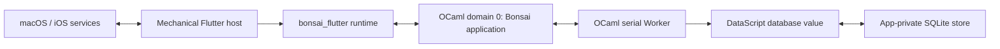
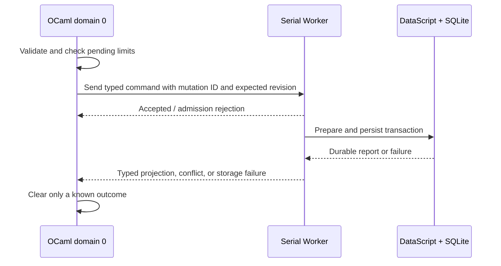

# Logseq Journal Architecture

## Status

This is the single authoritative architecture document for this repository.
It describes the implemented system and the constraints that future work must
preserve. Product requirements, UI/UX specifications, visual references,
implementation plans, and acceptance reports do not belong in this document.

Last reconciled with the working tree on 2026-08-13.

The source code and dependency manifests remain authoritative when this
document and the implementation disagree. Update this document in the same
change that intentionally changes an architectural boundary.

## Architectural decision summary

1. The application is **OCaml-first**. OCaml owns product state, domain rules,
   routes, actions, semantics, declarative views, persistence coordination,
   and recovery policy.
2. `bonsai_flutter` is the application runtime and rendering bridge. Bonsai on
   OCaml domain 0 owns the application component; Flutter renders the emitted
   widget protocol.
3. Flutter is a mechanical host. Project-local Dart may bootstrap the runtime
   and implement explicit platform adapters, but it must not duplicate product
   state, repositories, navigation, or product widgets.
4. One serial OCaml Worker exclusively owns the current DataScript database and
   the SQLite session. Domain 0 never performs DataScript or SQLite work.
5. The database is app-private. The current SQLite store is not a native Logseq
   graph and must not be presented, imported, or exported as one.
6. All cross-boundary data is typed, immutable, bounded, and fenced by stable
   identities or generations. Database handles, DataScript values, and entity
   integers never cross the Worker boundary.
7. Durable state wins over optimistic state. Mutations use stable mutation IDs,
   expected revisions, typed outcomes, and reconciliation after uncertain
   runtime or storage outcomes.
8. Obsolete paths are removed. The project does not retain compatibility
   layers, aliases, fallback implementations, or migrations for superseded
   internal designs.

## Technology baseline

The exact dependency manifests are
[`dune-project`](../../dune-project),
[`logseq_journal.opam`](../../logseq_journal.opam),
[`bonsai-flutter.sexp`](../../bonsai-flutter.sexp), and
[`flutter/pubspec.yaml`](../../flutter/pubspec.yaml). They are the source of
truth for version changes.

| Layer | Current baseline |
|---|---|
| OCaml | `5.1.1` |
| Dune | `3.23.1` |
| Jane Street stack | Bonsai `v0.17.0`, Base `v0.17.3`, Core `v0.17.2` |
| `bonsai_flutter` | `0.1.0~dev`, pinned in `logseq_journal.opam` |
| DataScript | `datascript_ocaml` and `datascript-ocaml-native`, pinned in `logseq_journal.opam` |
| SQLite | `sqlite3` `5.4.0`, system SQLite linked for native targets |
| Dart | `^3.12.2` |
| Flutter | `>=3.44.0` |
| macOS target | arm64, deployment target from `bonsai-flutter.sexp` |
| iOS target | arm64, iOS 15.0 or newer |

The OCaml `5.1.1` constraint is deliberate. Host and iPhoneOS closures must use
the same compiler version. The application must not work around target closure
problems by moving product logic into Dart or by modifying `bonsai_flutter`
sources from this repository.

## System context



There is one application runtime and one Worker service for the active store.
The host constructs the runtime bootstrap payload, supplies platform facts, and
renders the runtime output. The OCaml application owns all product decisions.

## Ownership model

### OCaml domain 0

[`app/application.ml`](../../app/application.ml) composes the Bonsai
application with `App.create_with_worker`. Domain 0 owns:

- route and back-navigation state;
- timeline state, sparse-window state, stable slot keys, and focus restoration;
- capture and detail editor state;
- mutation admission and pending-operation presentation;
- event dispatch and semantic actions;
- declarative widgets, layout tokens, accessibility semantics, and localization
  requests;
- request generations and rejection of stale asynchronous results; and
- interpretation of typed Worker responses.

Domain 0 may hold bounded projections returned by the Worker. It must not own a
DataScript database value, a SQLite connection, storage callbacks, or repository
queries.

### Serial Worker

[`app/journal_worker.ml`](../../app/journal_worker.ml) defines one
`Worker.Service.Serial` service. The Worker exclusively owns:

- the canonical DataScript database value;
- the only live `Datascript_sqlite` session;
- schema admission, repository queries, and transaction preparation;
- mutation serialization and durable result construction;
- store basis, access mode, and calendar generation attached to responses; and
- shutdown and storage quarantine.

Every response is a bounded application projection. No `Datascript.db`,
connection, entity handle, storage callback, or raw database payload is sent to
domain 0.

### Flutter host

[`flutter/lib/main.dart`](../../flutter/lib/main.dart) is generated runtime
bootstrap code. [`flutter/lib/application_host_adapter.dart`](../../flutter/lib/application_host_adapter.dart)
is the application-specific mechanical adapter. Dart is limited to:

- discovering and validating the Application Support root;
- producing the `LJR1` startup payload nested in the framework runtime payload;
- supplying current instant, local calendar day, locale, time-zone, and
  lifecycle changes through the platform bridge;
- hosting `BonsaiFlutterRoot`; and
- platform integration that cannot be implemented in portable OCaml.

Dart must not contain a journal model, reducer, repository, SQLite client,
product navigation stack, or project-local product widget hierarchy. The
source-boundary test enforces the allowed Dart files and rejects obsolete or
deferred product paths.

## Source boundaries

| Area | Responsibility |
|---|---|
| `app/application.*` | Bonsai composition, events, Worker client, and top-level state |
| `app/journal_model.*` | Validated immutable block projection |
| `app/journal_schema.*` | Exact app-private DataScript schema and store identity |
| `app/journal_repository.*` | Pure database reads and transaction planning |
| `app/journal_storage.*` | SQLite-backed DataScript session lifecycle |
| `app/journal_worker.*` | Serial service, request protocol, mutation execution, response budgets |
| `app/journal_process_recovery.*` | Process-lifetime quarantine and pending mutation registry |
| `app/journal_startup.*` | Bounded startup envelope and bootstrap policy |
| `app/journal_platform.*` | Bounded calendar request/event codec |
| `app/journal_routes.*` | OCaml-owned route state |
| `app/journal_timeline_state.*` | Bounded logical feed and sparse renderer projection |
| `app/journal_capture.*`, `app/journal_detail.*` | Editor state machines and mutation commands |
| `app/journal_*` view modules | Declarative Bonsai/Flutter widgets and semantics |
| `flutter/lib/*` | Generated runtime bootstrap and mechanical platform adapter only |

Repository constraints are architectural guardrails:

- Do not modify OCaml files under `spec/` unless an explicit request permits
  changes to the relevant `.mli` contract.
- Do not modify Dune files unless explicitly requested.
- Do not modify OCaml files in the `bonsai_flutter` repository from this
  project.
- If a `spec/*.mli` contract blocks implementation because it is unclear or
  unreasonable, stop and report the contract issue instead of bypassing it.

## Domain model and invariants

The app-private store has schema version `1` and store identity
`logseq-journal-timeline`. [`app/journal_schema.mli`](../../app/journal_schema.mli)
defines the exact accepted schema; missing, additional, or structurally changed
attributes are rejected.

Journal pages and blocks use stable string IDs. DataScript entity integers stay
inside the Worker and are never UI identity. A block contains:

- stable block, page, and optional parent IDs;
- a stable sibling-order value;
- UTF-8 source text;
- task state: `Not_a_task`, `Todo`, or `Done`;
- direct child count;
- an immutable creation-time snapshot;
- journal day;
- durable revision; and
- last mutation ID.

The repository preserves these invariants:

- each journal day has at most one page;
- a top-level block belongs directly to its journal page;
- a child stays on the same page as its ancestors;
- parent relationships are acyclic;
- siblings have deterministic order using sibling order and stable block ID;
- every durable content, task, or structural change advances the affected
  revision exactly once;
- expected revisions implement compare-and-set conflict detection;
- mutation IDs make accepted mutations idempotent and reconcilable; and
- source text is valid UTF-8, contains no NUL, and is at most 65,536 bytes.

`timeline_entry` is a bounded top-level projection containing a block and an
optional first-direct-child summary. Child pages and detail pages use separate
bounded projections. Repository reads construct these projections from one
canonical database snapshot and do not issue one query per rendered row.

## Persistence architecture

The application stores its database below the canonical Application Support
root at `logseq_journal/store.sqlite3`. It uses the generic DataScript SQLite
backend enabled by `(features sqlite)`.

Startup follows one path:

1. The host supplies a canonical Application Support root, not an arbitrary
   database path.
2. OCaml resolves the fixed relative database name and rejects traversal,
   symlinks, non-regular leaves, or non-canonical parents.
3. The Worker opens exactly one SQLite session.
4. An empty backend receives the exact application schema and initial metadata
   in its first stored snapshot.
5. An existing backend is restored and admitted only when store identity,
   schema version, and exact schema match.
6. Corrupt, unsupported, or failed stores do not silently initialize over the
   existing data.

Transactions are prepared against the Worker-confined current database. The
new database value becomes canonical only after the DataScript/storage call
returns successfully. A surfaced persistence failure changes the store to
`Terminal`, disables mutations, and quarantines the canonical path for the
remainder of the OS process.

On a clean close, the storage layer publishes an atomic basis-keyed backup in a
`backups` directory and retains the latest three backups. A backup failure is
reported after the canonical session is already closed; it does not reinterpret
the closed canonical store as corrupt.

The current database is deliberately app-private. Native Logseq `db.sqlite`
compatibility would require a separately designed schema, codec, import/export,
backup, and cross-runtime verification boundary. Renaming or copying the
generic app store is not interoperability.

## Worker protocol and data budgets

Worker requests cover status, calendar observation, capture, direct-child
creation, content update, task update, subtree deletion, reconciliation, block
lookup, feed paging, day paging, and detail paging.

Responses carry:

- store identity and DataScript basis;
- access mode;
- calendar snapshot, calendar generation, and local day;
- a typed payload; and
- the request generation for paged reads.

The application ignores stale read responses. Mutations are admitted only
after `Worker.send` returns `Accepted`. The process-level pending registry is
bounded to eight accepted mutations globally and one mutation touching a given
block. It retains enough immutable command data to reconcile an accepted
mutation after runtime replacement or an outer outcome that is not known.

The maximum estimated Worker response size is 256 KiB. Oversized results are
rejected as typed failures rather than truncated into a misleading projection.
Inputs and protocol fields also have explicit count and byte bounds; an item
count alone is never treated as sufficient protection against an unbounded
string.

## Mutation and recovery semantics



Optimistic presentation never becomes the durability source of truth. A typed
successful Worker response supplies the authoritative post-transaction block
and, when relevant, the updated top-level timeline projection.

Conflicts return the latest durable block. An outer Worker failure,
cancellation, shutdown, or runtime replacement may leave durability unknown.
In that case the application retains the pending mutation, marks its outcome
unknown, and reconciles by stable mutation ID before allowing a blind retry.

`Recovery_only` is an application mutation gate. It does not claim that the
underlying SQLite handle was opened in filesystem read-only mode. A storage or
lifecycle failure installs a process-lifetime tombstone because the pinned
backend cannot prove that every failed native close released all resources.
The tombstone is removed only by an OS process restart.

## Presentation architecture without UI design

This section defines ownership and resource bounds, not visual appearance or
interaction design.

OCaml owns routes, view composition, semantics, actions, adaptive tokens, and
the logical timeline. Flutter owns protocol rendering and renderer-local
mechanics supplied by `bonsai_flutter`. There must not be parallel Dart and
OCaml implementations of a screen or reducer.

The timeline uses `Sparse_extent_list` with known profile extents. The logical
state is independently bounded from the mounted renderer window:

- at most 512 retained logical slots;
- at most 40 supplied rows per renderer window;
- overscan of 4 rows;
- stable slot keys derived from domain identity rather than list position; and
- generation- and epoch-fenced paging/expansion responses.

The application requests at most 31 journal days per feed page, 64 top-level
entries per day page, and three direct children for an inline bounded preview.
Full content belongs in a bounded detail projection. Arbitrary-height or
unbounded nested content must not be inserted into the known-extent feed.

Visual styling, measurements, reference screenshots, animation choices, and
feature-specific interaction specifications are intentionally excluded from
the architecture documentation.

## Platform and startup boundary

The framework owns the outer runtime bootstrap envelope. The application host
encodes a byte-exact `LJR1` payload containing only bounded bootstrap facts:

- canonical Application Support root;
- initial instant and local calendar day/minute;
- locale and time-zone ID;
- UTC offset; and
- calendar and lifecycle generations.

The payload is limited to 1 MiB; the root is limited to 4,096 UTF-8 bytes; and
calendar strings have smaller field-specific limits. Reserved bytes, trailing
bytes, invalid UTF-8, NULs, inconsistent calendar facts, unsupported envelope
versions, and non-canonical roots are rejected.

Live resume, significant-time, time-zone, and locale changes travel through the
application platform bridge. Host-formatted journal-day headings are requested
in distinct batches of at most 64 days and are accepted only for the current
calendar generation. Journal identity remains the numeric proleptic-Gregorian
`YYYYMMDD` day; localized text is presentation data, not identity.

## Security, privacy, and diagnostics

- Journal content stays in the app-private store unless a future explicit
  export boundary is implemented.
- Startup accepts a trusted root plus a fixed relative name, not an arbitrary
  file selected by product UI.
- Paths are canonicalized and checked against symlink and traversal attacks.
- Diagnostics expose operational state, identifiers, sizes, generations, and
  typed error classes; they must not log journal source text.
- Invalid or oversized input is rejected before it can become an unbounded
  Worker, SQLite, FFI, or renderer workload.

## Verification architecture

The verification layers mirror the ownership boundaries:

- pure OCaml tests cover model validation, time, routes, editor state machines,
  timeline state, and recovery bookkeeping;
- repository tests cover schema admission, deterministic ordering, paging,
  idempotence, revision conflicts, subtree operations, and bounded projections;
- storage and Worker tests cover restore/initialize, transaction outcomes,
  response budgets, quarantine, reconciliation, and serial service behavior;
- Bonsai logical-view tests cover emitted widgets, semantics, actions, stable
  keys, bounded windows, and adaptive contracts;
- Flutter tests cover only the generated/mechanical host, platform adapter, and
  compiled-runtime rendering or integration behavior; and
- `test/source_boundary_test.ml` prevents product logic from migrating into
  Dart and rejects obsolete architecture paths.

The standard automated gates are:

```text
opam exec -- dune runtest
opam exec -- bonsai-flutter sync-project --check
opam exec -- bonsai-flutter sync-host --check
cd flutter
opam exec -- bonsai-flutter exec --profile=debug -- flutter analyze --no-pub
opam exec -- bonsai-flutter exec --profile=debug -- flutter test --no-pub test
```

Signed physical-iPhone execution remains required when a change affects the
native dependency closure, SQLite behavior, lifecycle handling, safe areas, or
other device-only behavior.

## Current scope and explicit non-goals

The implemented architecture supports an offline journal timeline, bounded
paging and direct-child projections, capture, content and task updates, detail
editing, child creation, subtree deletion with staged Undo, durable conflict
handling, and same-process mutation reconciliation.

The following are not part of the current architecture:

- direct native Logseq graph interoperability;
- live multi-writer access to a database opened by Logseq;
- Logseq RTC, sync, E2EE, plugins, whiteboards, or complete markup execution;
- arbitrary-depth inline outliner rendering;
- search, date selection, attachments, or graph/file picker ownership;
- Android, Windows, Linux, or web delivery; and
- a Dart product application parallel to the OCaml application.

Adding one of these capabilities requires an explicit architectural update and
the corresponding typed, bounded, tested boundary. It must replace obsolete
paths rather than adding compatibility fallbacks.

## Maintenance rule

Keep one architecture document. Future UI/UX proposals, implementation plans,
visual assets, and acceptance reports must not be accumulated here. When an
architecture decision changes, edit this file and delete the superseded text in
the same change.
