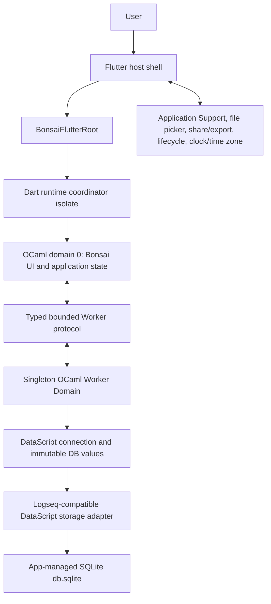
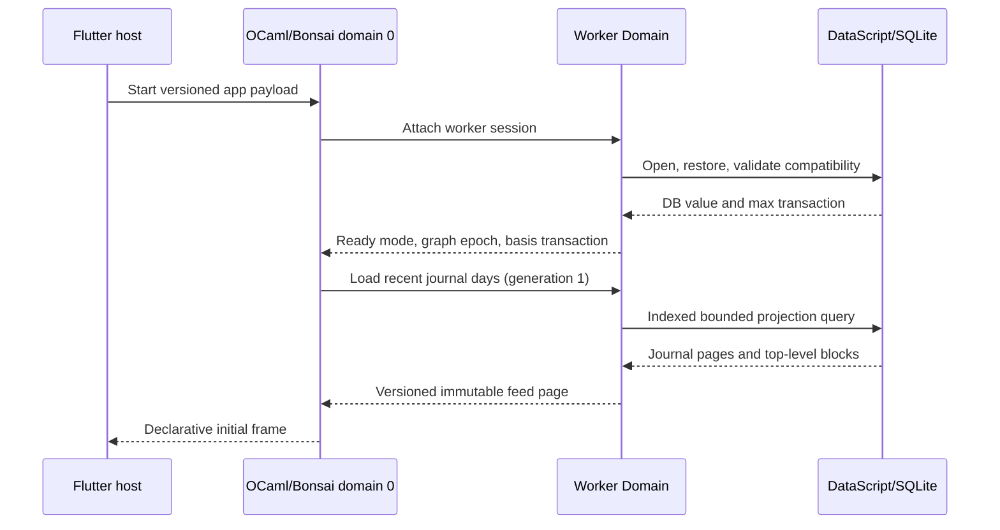
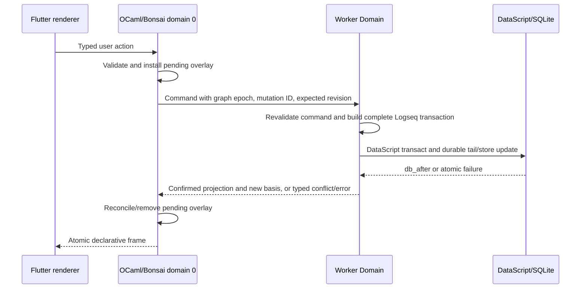

# Journal Mobile App Architecture

## Document status

| Field | Value |
| --- | --- |
| Status | Superseded as the implementation baseline by [`002-journal-rewrite.md`](002-journal-rewrite.md) |
| Date | 2026-08-04 |
| Scope | Standalone, local-first mobile client for Logseq journal pages and their top-level blocks |
| UI runtime | `bonsai_flutter` |
| Database | `datascript-ocaml` with Logseq-compatible SQLite storage |
| Primary mobile target | Physical iPhoneOS arm64; macOS arm64 is the development and integration target |
| Repository state | Historical snapshot from 2026-08-04; see the successor for the current implemented baseline |

This document is retained for its native Logseq interoperability research.
Its repository, dependency, and Worker API assumptions are historical; use
[`002-journal-rewrite.md`](002-journal-rewrite.md) for implementation decisions.

This document defines the target architecture, its validation strategy, and
the order in which architectural risk should be retired. It is not a
task-by-task implementation plan and does not authorize changes to project
specifications or build files.

## Executive summary

The application should combine two established patterns from
`bonsai_flutter`:

1. Use the Mail example's UI ownership model: OCaml/Bonsai owns application
   state, routing, handlers, query projections, and the declarative widget
   tree. Flutter owns rendering, retained controllers, layout, gestures,
   animation interpolation, accessibility mapping, and platform integration.
2. Use the SQLite Worker example's runtime model: a singleton OCaml Worker
   Domain exclusively owns the DataScript connection, SQLite connection,
   storage handles, queries, and transactions. The Bonsai UI domain receives
   only immutable, typed projections.

The primary screen is a Gmail-like chronological feed, but its information
architecture is journal-specific. The feed is flattened into stable keyed
slots consisting of journal-day headers and top-level block cards. A bounded
window is rendered with `Sparse_extent_list`; a bounded inline preview can use
`Morphing_surface`, while full block-tree reading and editing belongs on a
separate detail route.

The canonical graph is a Logseq-compatible DataScript database persisted in a
SQLite `kvs` store. The app must own its writable database file exclusively.
It must not directly co-write a live database with Logseq. On mobile, only a
checkpointed export, a graph confirmed closed, or a SQLite backup snapshot is
admitted into Application Support as the app-managed working copy; copying a
live `db.sqlite` file can omit committed WAL content. Export is an explicit,
atomic operation. Remote/RTC Logseq graphs are read-only until Logseq sync and
outliner-operation semantics are implemented.

Two dependency gaps must be resolved before implementation starts:

- `bonsai_flutter` currently pins OCaml `5.1.1`, while
  `datascript-ocaml-native` requires OCaml `>= 5.2.1`. A single embedded OCaml
  runtime cannot contain both baselines as they stand.
- The Logseq-compatible SQLite adapter currently lives in
  `datascript-ocaml/examples/logseq_sqlite_storage.ml` without an installed
  public package boundary. It must be promoted and hardened; the generic
  `datascript-ocaml-native.sqlite` package uses a different physical table
  layout and is not a drop-in adapter for a Logseq `db.sqlite` file.

These are Phase 0 compatibility gates, not details to defer until feature
work.

## Goals

- Present recent journal pages as a fast, chronological mobile feed grouped by
  `:block/journal-day`.
- Show the ordered top-level blocks for each journal page and preserve stable
  block identity while paging, filtering, and navigating.
- Support quick capture into today's journal, safe block title editing, and a
  full block detail route without making Flutter a second application runtime.
- Keep the app fully useful offline.
- Preserve Logseq-compatible entity identity, ordering, schema, and storage
  semantics so a managed graph can be exported back to Logseq.
- Keep all DataScript and SQLite work off the Flutter UI isolate and off the
  OCaml Bonsai domain.
- Make stale results, conflicting edits, incompatible schemas, corrupt graphs,
  and uncertain writes explicit states rather than silently accepting them.
- Bound memory, cross-domain payloads, and mounted Flutter rows independently
  of graph size.
- Establish package boundaries that allow the UI, domain model, Logseq
  compatibility layer, and storage adapter to be tested separately.

## Non-goals

- Reimplementing the complete Logseq application.
- Live multi-writer access to the same `db.sqlite` file.
- Logseq RTC, remote sync, E2EE, plugin APIs, whiteboards, graph visualization,
  publishing, or Markdown file mirroring in the initial product.
- Running DataScript, SQLite, or application reducers in Dart.
- Rendering an unbounded nested outliner inside every feed row.
- Copying Gmail's Mail/Chat/Spaces/Meet taxonomy, archive/trash semantics, or
  placeholder destinations.
- Automatically migrating arbitrary Logseq schema versions.
- Treating a successful unsigned iPhoneOS build as proof of signed physical
  device behavior.
- Android delivery until `bonsai_flutter` has a validated Android native
  runtime and packaging path.

## Architectural drivers and constraints

### Upstream maturity

`bonsai_flutter` is explicitly under active construction and is not
production-ready. At the pinned reference commit, macOS arm64 is tested end to
end, physical iPhoneOS arm64 has an unsigned packaging path, iOS Simulator is
unsupported, and Android is only an architectural target. The application
must therefore treat framework stabilization, signed device tests, and the
pinned iPhoneOS deployment target as release gates.

`datascript-ocaml` is also under active development. It aims for DataScript
semantic parity and already includes cross-runtime tests, but the app must pin
an exact commit and carry compatibility fixtures for the Logseq graph versions
it accepts.

### Single runtime and worker topology

`bonsai_flutter` supports one active embedded OCaml runtime, one Driver, and at
most one Worker session per process. The app must use one
`BonsaiFlutterRoot`. Switching graphs replaces the worker-backed application
session; it does not create a second root or a second SQLite owner.

### Repository rules

The target repository currently has no `spec/`, Dune, source, or test files.
Future work must obey the repository rules:

- Do not modify OCaml files under `spec/` unless an explicit request permits
  changes to the relevant `.mli` files.
- Do not modify Dune files unless explicitly requested.
- If a future `.mli` contract is unclear or unreasonable enough to block
  implementation, stop and report the exact issue, proposed change, and
  rationale.

### App-level assumptions

- The initial product is a standalone client, not a Logseq plugin embedded in
  the existing Logseq process.
- A writable graph is an app-managed copy under Application Support.
- Imported Logseq graphs remain portable; app-only UI preferences do not
  become graph datoms.
- The default feed shows existing journal pages up to the user's local
  calendar day. Future journal pages are available through an explicit
  navigation or filter action.
- A graph with unsupported schema or remote/RTC flags opens read-only rather
  than being mutated optimistically.

## System context

Events travel from Flutter to OCaml as typed, revision-scoped batches. Bonsai
effects may enqueue typed Worker requests. Worker responses become visible
only at an accepted domain-0 pump boundary. OCaml emits an immutable widget
tree; `bonsai_flutter` reconciles it and sends an atomic binary frame to
Flutter. No database handle, DataScript entity, OCaml closure, Dart object, or
Flutter controller crosses an ownership boundary.

## State and resource ownership

| Owner | Canonical responsibilities | Must not own |
| --- | --- | --- |
| Flutter UI isolate | Flutter widgets/elements/render objects, scroll and text controllers, focus, IME session, animations, gesture-arena state, accessibility bridge, platform plugins | Business routes, journal data, DataScript state, mutation reducers |
| Dart runtime coordinator isolate | Serialized native calls, runtime lease, frame presentation, event batching, copied native buffers | Application state or SQLite |
| OCaml domain 0 | Bonsai graph, route stack, drawer/search/filter state, calendar semantics, immutable feed projections, edit buffers, pending mutation overlays, handlers and effects | SQLite handles, DataScript connection, long-running queries |
| OCaml Worker Domain | Graph session, DataScript connection, current DB value, Logseq compatibility profile, SQLite connection, query execution, transaction construction, persistence, backup coordination | Flutter, Dart, Bonsai Driver, UI widget construction |
| SQLite | Durable DataScript root, tail, and index nodes | UI state, navigation, transient edit selection |

The durable graph is canonical. Domain-0 feed snapshots are versioned
projections. Pending UI edits are explicit overlays identified by mutation ID;
they never silently become a second canonical database.

## Proposed package boundaries

The names below describe logical libraries. Exact filenames and public names
belong in a later implementation plan.

| Boundary | Responsibility | Allowed dependencies |
| --- | --- | --- |
| `journal_domain` | Typed journal day, block identity, block tree, commands, invariants, validation errors | Base/Core-compatible primitives only |
| `journal_application` | Use cases, ports, projection models, command orchestration, conflict policy | `journal_domain` |
| `journal_logseq` | Logseq attributes, compatibility profiles, journal UUID rules, fractional order keys, safe read parser/projection, content-derived datoms, query plans, transaction builder | `journal_domain`, `datascript-ocaml` |
| `journal_storage` | Production Logseq-compatible SQLite storage, session lifecycle, atomic entry batches, backup/checkpoint operations | `datascript-ocaml`, native SQLite |
| `journal_worker_protocol` | Immutable request, response, push, error, generation, epoch, and revision envelopes | `journal_domain`, projection DTOs only |
| `journal_worker` | Worker service, graph session, queries, serialized mutations, recovery | `journal_application`, `journal_logseq`, `journal_storage`, `journal_worker_protocol` |
| `journal_ui` | Bonsai shell, feature components, route reducer, handlers, projection cache, pending overlays | `journal_application`, `journal_worker_protocol`, `bonsai_flutter.ui/runtime` |
| `journal_native` | App registration and complete-object entrypoint | `journal_ui`, `journal_worker` |
| Flutter host package | Path discovery, import/export picker, startup envelope, `BonsaiFlutterRoot`, injected platform services | `bonsai_flutter` plus a narrow allowlist of path, file-picker, share, settings, lifecycle, clock, and time-zone adapters |

Dependency rules are strict:

- `journal_domain` cannot depend on DataScript, Bonsai, Flutter, SQLite, or
  wire-protocol types.
- `journal_ui` cannot call DataScript or SQLite directly.
- `journal_worker_protocol` cannot contain `db`, `conn`, entity handles,
  callbacks, lazy sequences, or mutable collections.
- Flutter code cannot contain a journal reducer or a block repository.
- Host adapters can resolve paths, select or share files, persist UI settings,
  and report lifecycle/clock/time-zone changes, but cannot interpret blocks or
  open SQLite.
- Only `journal_storage` can issue SQLite calls.
- Only `journal_logseq` can translate domain commands to DataScript
  transactions.

## Application composition

The native app is created with `App.create_with_worker`, using the current
`ocaml/runtime/app.mli` contract as the authority. The startup configuration is
decoded on domain 0, the service and service state run on the Worker Domain,
and the Bonsai component remains on domain 0.

The root startup envelope is versioned and contains only immutable
bootstrap data:

| Field | Purpose |
| --- | --- |
| Envelope version | Reject incompatible Flutter/native application bundles |
| Managed graph path | Absolute sandbox-resolved path, never a hard-coded home path |
| Access mode | Managed read-write or external read-only |
| Expected graph identity | Detect selecting or replacing the wrong graph |
| Locale and time-zone snapshot | Establish initial journal-day formatting and boundaries |
| Diagnostic mode | Enable content-free tracing in debug builds |

`BonsaiFlutterRoot` reads this payload during `initState` and does not apply a
new `config` in place. A graph switch therefore changes the root key and
remounts it with a new startup envelope. A host runtime controller must expose
and await completion of the old `RuntimeSession.dispose` before starting the
new root; the stock root initiates disposal asynchronously, so merely placing
two keyed roots in adjacent frames is not a sufficient ownership handoff. The
new bootstrap uses `RuntimeLaunchPolicy.replaceExisting` as serialized orphan
recovery, never as permission for overlapping roots. `Worker.Service.shutdown`
closes the old SQLite session before the replacement becomes usable. This
handoff is a Phase 0 integration gate.

The locale and time-zone value in the startup envelope is only a bootstrap
snapshot. A narrow host calendar adapter subsequently reports wall-clock and
time-zone changes as typed events; it does not own the meaning of `Today`.

## Domain model

### Stable identifiers

| Type | Durable representation | Rule |
| --- | --- | --- |
| `Graph_id` | Logseq graph UUID/local graph UUID when available, otherwise an import-generated app registry ID | Never infer identity from a mutable file path alone |
| `Journal_day` | Calendar date encoded by Logseq as `YYYYMMDD` integer | Never add or subtract these integers arithmetically; convert through a calendar/time-zone service |
| `Block_uuid` | `:block/uuid` | Primary application identity and Flutter/Bonsai key |
| `Entity_id` | DataScript entity integer | Session-local query detail; never persisted in routes or UI restoration state |
| `Order_key` | Logseq base-62 fractional index in `:block/order` | Compared lexicographically and generated only by the compatibility layer |
| `Graph_epoch` | The `bonsai_flutter` runtime epoch associated with one graph session | Fences responses from a closed or replaced graph session |
| `Basis_tx` | `db.max_tx` from the accepted DataScript value | Fences projections and stale mutations within one graph epoch |
| `Mutation_id` | Random stable command identifier | Correlates optimistic overlays and recovery checks; it is not a durable exactly-once receipt |

Routes and row keys use `Block_uuid`, not DataScript entity IDs or list
indexes. A new block UUID is allocated before the create command is sent so a
recovery check addresses the same logical entity after an uncertain outcome.

### Journal page

A journal page projection contains:

- DataScript entity ID for worker-local joins;
- deterministic Logseq journal page UUID;
- `:block/journal-day`;
- display title and normalized page name;
- graph/schema compatibility metadata; and
- an ordered top-level block projection.

The standard Logseq journal UUID is derived from the day and has the form
`00000001-YYYY-MMDD-0000-000000000000`. Page creation must also preserve the
configured journal title format and the `:logseq.class/Journal` tag.

### Block

The initial domain projection uses only fields needed by the journal UI:

- entity ID and stable block UUID;
- title/content string;
- page and parent identity;
- fractional order key;
- collapsed state;
- created and updated timestamps;
- latest title/document transaction revision;
- whether direct children exist;
- a bounded descendant preview when requested; and
- compatibility flags indicating whether the content is safely editable.

Properties, refs, tags, links, and other Logseq attributes remain in the
database even when absent from a projection. An update must retract or add
only attributes owned by the command; it must never replace an entity from a
partial projection.

### Structural invariants

- A journal page has exactly one valid `:block/journal-day` value.
- Duplicate pages for the same journal day are treated as an integrity error;
  the app does not silently choose the first entity.
- A top-level block has `:block/parent` equal to the journal page entity and
  `:block/page` equal to that same page entity.
- A descendant's `:block/page` remains the journal page while
  `:block/parent` points to its immediate parent block.
- A block has a unique `:block/uuid`, a title, a parent, a page, and a valid
  fractional order key before it is writable.
- Siblings are ordered by `:block/order`, with UUID as a deterministic
  diagnostic tie-breaker only. Duplicate sibling order keys are corruption to
  report, not normal ordering.
- A parent relationship must be acyclic and remain inside one page.
- Moving a subtree across pages must update `:block/page` for the root and
  every descendant in the same validated transaction.
- Entity IDs are not stable across import/export or graph rebuilds.
- Derived `:block/refs`, tags, property datoms, timestamps, and outliner
  metadata must be updated by the Logseq transaction builder when the edited
  title requires them.

## Logseq compatibility boundary

### Required schema facts

The hot journal path relies on these Logseq attributes:

| Attribute | Expected semantics |
| --- | --- |
| `:block/uuid` | Unique identity |
| `:block/journal-day` | Indexed journal date on page entities |
| `:block/title` | Indexed page/block text |
| `:block/name` | Normalized page name |
| `:block/parent` | Indexed ref to immediate parent |
| `:block/page` | Indexed ref to containing page |
| `:block/order` | Indexed fractional ordering key |
| `:block/tags` | Many-valued refs, including the Journal class |
| `:block/created-at`, `:block/updated-at` | Indexed timestamps |
| `:block/tx-id` | Latest transaction affecting a block |
| `:db/ident`, `:kv/value` | Graph metadata and built-in entity lookup |

The local Logseq reference checkout reports schema version `65.33`. That value
is a compatibility baseline, not a promise that every `65.x` graph is
writable.

### Compatibility profiles

`journal_logseq` owns explicit profiles keyed by Logseq graph schema version.
Each profile defines required attributes, value types and cardinalities,
journal creation rules, title formatting, fractional order rules, derived
content behavior, and supported commands.

Graph opening follows this policy:

| Condition | Result |
| --- | --- |
| Known profile and all required schema facts match | Enable commands supported by that profile |
| Known profile but required facts are missing or malformed | Open diagnostics only; do not write |
| Newer or unknown schema version | Open read-only after successful restore and projection validation |
| `:logseq.kv/db-type` is not `"db"` | Reject as the wrong graph type |
| Remote/RTC or E2EE metadata is enabled | Open read-only in the initial product |
| Duplicate journal day, invalid order, cross-page parent, or cycle detected in the requested scope | Keep unaffected data readable and disable unsafe writes for the affected scope |

The app does not run Logseq migrations. A graph needing migration is returned
to a compatible Logseq version, migrated there, and then re-imported.

### Content semantics

Changing `:block/title` can affect page references, block references, tags,
properties, task state, and sync/outliner metadata. UI code must never issue a
raw title datom. All writes go through a `Logseq_transaction_builder` that
accepts a domain command and produces the complete, validated transaction.

Until parser and transaction parity exists for a construct, the compatibility
profile marks that block read-only or restricts editing to a proven plain-text
subset. Silently storing a new title while leaving derived refs stale is not
acceptable.

Reading is also a compatibility boundary. `journal_logseq` preserves the raw
title for editing and export, but projects supported syntax into a typed,
non-executable view model before it reaches `journal_ui`. The initial profile
uses this policy:

- feed cards render a bounded safe-text projection plus explicitly supported
  task and reference tokens;
- page references and block references become typed internal navigation only
  after their targets resolve in the current graph;
- external links use an allowlisted, injected host effect rather than becoming
  arbitrary Flutter callbacks;
- assets resolve through a graph-scoped asset service that prevents path
  traversal and shows a missing-asset placeholder when an imported database
  has no corresponding asset bundle; and
- macros, queries, embeds, plugin markup, raw HTML, and code are displayed as
  escaped fallback content and are never executed by the mobile client.

Unsupported parser nodes remain visible through a lossless safe fallback, but
make the block read-only unless the active compatibility profile proves a
round trip. Editability is derived from the parsed feature set and profile,
not a substring heuristic. A later ADR may widen the render AST and asset
import contract without changing the raw graph source of truth.

## SQLite persistence architecture

### Physical format

For graph portability, the managed graph uses Logseq's DataScript storage
table:

| Column | Meaning |
| --- | --- |
| `addr INTEGER PRIMARY KEY` | DataScript storage address |
| `content TEXT` | Transit-encoded root, tail, or persistent sorted-set node |
| `addresses JSON` | Child addresses for branch nodes |

Address `0` stores root metadata, address `1` stores transaction-tail groups,
and generated numeric addresses store EAVT/AEVT/AVET tree nodes. The app uses
DataScript's immutable DB model and connection API; it does not invent a
parallel relational schema for blocks.

The generic installed `datascript-ocaml-native.sqlite` adapter currently uses
an `address/payload` table and must not be pointed at a Logseq graph. The
Logseq-compatible example adapter is the correct semantic starting point, but
it must become a supported library with an `.mli`, explicit session lifetime,
and production guarantees before the app depends on it.

### Storage adapter requirements

The production adapter must provide:

- one explicit open session and one close operation on the Worker Domain;
- read-only and read-write open modes;
- exact Logseq Transit codec compatibility;
- canonical restore of both the root snapshot and every persisted tail group;
  optimized inspection/query helpers that skip address `1` are not valid as
  the app's graph session;
- strict tail replay diagnostics; the current DataScript restore path can
  suppress an `Invalid_argument` from a tail group while still advancing the
  transaction basis, which is not acceptable for a writable session;
- one SQLite transaction around every `storage_store` entry batch so new index
  nodes, root, and cleared tail become visible atomically;
- one atomic transaction for tail replacement;
- prepared statements, bounded busy timeout, and structured SQLite errors;
- rollback on any encode, bind, step, or commit failure;
- safe checkpoint/close before export;
- online backup or SQLite backup API integration rather than copying a live
  database file;
- garbage collection only after a verified backup and only while the graph is
  exclusively owned; and
- cross-runtime fixtures proving that Logseq can restore app-written graphs
  and `datascript-ocaml` can restore Logseq-written graphs.

The Worker owns both the adapter session and `Datascript.Conn.t`. A successful
DataScript transaction stores its tail before the response is considered
durable. The accepted `db_after.max_tx` becomes the response `Basis_tx`.

### File ownership modes

| Mode | Access | Intended use |
| --- | --- | --- |
| Managed graph | Read-write | Normal mobile use; a verified consistent snapshot is materialized under Application Support |
| External snapshot | Read-only | Inspect a verified exported or closed-graph snapshot without taking ownership |
| Live Logseq database | Rejected for write | Avoid two DataScript connections/processes mutating the same storage roots and tail |

The Flutter host resolves platform paths and file picker handles. It never
opens SQLite. Import never performs a blind filesystem copy of `db.sqlite`.
It accepts only a Logseq-produced checkpointed export, a source whose owning
graph is confirmed closed with no unapplied WAL, or a consistent snapshot made
through SQLite's backup API. An active lock, uncheckpointed `-wal`/`-shm`
state, detached main file of unknown provenance, or inability to establish a
consistent snapshot causes import to fail safely. The storage adapter
validates and materializes the source into a temporary managed location,
reopens and restores it, closes all handles, and only then atomically updates
the graph registry. External read-only inspection has the same snapshot
admission rules; immutable mode is allowed only after confirming that no WAL
replay is required. Export asks the Worker to checkpoint and create a
consistent backup snapshot before Flutter presents the share/save UI.

Importing creates a writable fork, not a live synchronization relationship.
Export produces a new snapshot and never silently overwrites the original
Logseq file. If both the original and managed copy changed, the initial product
reports divergence and requires an explicit Logseq import/replace workflow;
it does not attempt a fact-level merge.

App preferences, selected graph registry, last route, theme, and scroll
restoration metadata do not belong in Logseq datoms. They live in a separate
host/app settings store. No journal content is duplicated there.

## Worker service and protocol

### Service lifetime

The Worker service has four states:

1. `Opening`: validate path and physical format, open the SQLite session,
   restore DataScript, read compatibility metadata, and run scoped integrity
   checks.
2. `Ready_read_only` or `Ready_read_write`: serve bounded queries; the latter
   also accepts supported commands.
3. `Recovering`: after an uncertain storage error, close and restore before
   accepting another write.
4. `Closing`: stop accepting work, finish or reject accepted mutations,
   finalize statements, close SQLite, and publish a terminal session outcome.

All database requests are serial by default. This keeps one connection and one
current immutable DB value ordered. DataScript queries are synchronous; each
request must therefore be bounded so a large query cannot starve mutations or
shutdown.

### Request surface

| Request | Purpose |
| --- | --- |
| `Load_journal_days` | Load a bounded number of journal days before a day cursor |
| `Load_day_continuation` | Continue an unusually large day's top-level block list |
| `Load_block_subtree` | Load a bounded tree/depth projection for preview or detail |
| `Search_blocks` | Run a bounded, generation-fenced search |
| `Create_top_level_block` | Ensure the journal page and atomically create a keyed block |
| `Update_block_title` | Compare-and-set the old title and apply all derived datoms |
| `Move_block` | Generate and validate a fractional sibling order update |
| `Set_collapsed` | Persist supported collapsed state |
| `Delete_block` | Apply the selected Logseq-compatible recycle/delete policy |
| `Refresh_projection` | Re-read a scope after recovery or explicit import replacement |
| `Prepare_export` | Checkpoint and produce a consistent export snapshot |

Unsupported commands are absent from or rejected by the active compatibility
profile. Read-write mode alone does not imply that every command is safe.

Opening and closing are service lifecycle operations, not ordinary requests.
`Worker.Service.init` opens and validates the graph from the decoded startup
configuration. Runtime destruction stops the session and invokes
`Worker.Service.shutdown`, which owns final SQLite cleanup.

### Envelope and fencing

Every request and response carries the minimum applicable subset of:

- graph epoch;
- request ID;
- query generation;
- mutation ID;
- base DataScript transaction revision;
- query result or resulting transaction revision; and
- typed payload or typed error.

Domain 0 applies a response only when its graph epoch still matches. Search
and paging results additionally require the latest query generation and a
`result_basis` not older than the greatest basis already accepted for the
affected scope. Mutation results resolve only their matching optimistic
overlay, advance the accepted basis, invalidate every affected projection
scope, and are then reconciled from the worker-produced `db_after` projection.
A refresh request declares its minimum acceptable basis, so an older immutable
DB projection can never overwrite state already observed at a newer basis.

Accepted mutations are never dropped. Superseded search and visible-window
requests may be cancelled before dispatch or ignored by generation after
completion. Push notifications are bounded and latest-wins by topic, such as
`feed_changed` or `storage_health`; request responses remain correlated and
lossless.

`Worker.send` is non-blocking and can report a full queue. Domain 0 therefore
coalesces unsent query intents, but retains a bounded FIFO of user mutation
intents until they are accepted. If that local mutation FIFO is also full, the
action is rejected visibly before the UI claims it is saving. No successful
tap disappears because of request-lane backpressure.

### Retry, reconciliation, and conflict handling

Commands have deterministic identities and postconditions, but they are not
assumed to be exactly-once or blindly retry-safe:

- Create allocates the block UUID before enqueue so recovery can inspect that
  exact entity and its complete expected postcondition.
- Title updates compare-and-set the accepted canonical value and document
  revision. Replaying after the first commit would normally fail that CAS.
- Move carries the expected neighbors and intended order key; recovery checks
  both structure and order before offering another attempt.
- Collapse and supported delete operations express target state rather than a
  blind toggle, but still require recovered-state validation after an unknown
  commit outcome.

The Worker may automatically retry only when the storage adapter proves that
no commit occurred, rollback completed, and the command's expected basis is
still current. If durability is uncertain, it closes and restores first, then
reconciles the command's full postcondition. It confirms an already-observed
result or reports a conflict/unknown outcome; it does not blindly replay.
True exactly-once retries would require a mutation receipt committed in the
same durable boundary as the graph transaction and are outside this initial
architecture.

A stale basis produces a conflict response containing the current minimal
projection. It never overwrites newer data. Mutation IDs correlate UI state,
but do not replace DataScript constraints, compare-and-set validation, or a
durable receipt.

The current `Conn.transact` sequence advances the in-memory connection before
calling storage. A storage exception can therefore leave that connection
ahead of disk even though listeners were not notified. Any exception from the
durable store poisons the active write session: the Worker stops accepting
writes, closes the connection, restores from disk, re-runs integrity checks,
and only then reports the recovered canonical state. It never retries against
the advanced in-memory connection.

## Query architecture

### Journal feed query plan

The primary feed uses DataScript indexes rather than a whole-graph Datalog
query:

1. Reverse-scan AVET for `:block/journal-day`, bounded by the requested day
   cursor and the user's local current day.
2. Validate uniqueness, resolve each journal page, confirm its Journal class
   semantics, and exclude recycled/hidden pages according to the active
   compatibility profile.
3. For each page, use AVET on `:block/parent` with the page ref to obtain direct
   children only.
4. Exclude property-value, recycle, and other internal child entities according
   to the same profile, but do not discard a normal block merely because its
   title is empty.
5. Pull only the projection attributes and sort direct children by
   `:block/order`.
6. Return a bounded page with an older-day cursor and any per-day continuation
   cursor.

`block/page` is useful for page-wide diagnostics and subtree support, but it
does not identify top-level blocks; the parent ref does.

The initial query returns a configurable small number of days. Near-tail
visible-range events request older days. Repeated events for an in-flight
cursor are coalesced. Empty days are not synthesized except when quick capture
creates today's journal.

### Subtree query plan

A feed card initially receives only `has_children` and a compact summary.
Expanding it requests a bounded descendant preview. The detail page requests a
larger depth/window and can continue on demand. Parent adjacency is built in
the Worker, sorted by order, cycle-checked, and returned as immutable tree or
flattened outline DTOs.

### Search query plan

The rounded Gmail-style search field is functional, not decorative. Domain 0
debounces text with Bonsai logical time and increments a search generation.
The Worker uses bounded DataScript query/index operations and returns only the
latest generation at or above the requested minimum basis. Search results are
keyed by block UUID and open the same detail route as feed rows.

Full-text search is not assumed to exist in DataScript. If title substring
search becomes too slow, a derived search index is a separate adapter and
cache. It is rebuildable from DataScript and never becomes the source of truth.

## Bonsai and Flutter UI architecture

### Information architecture

The Mail example supplies interaction mechanics, not product taxonomy. The
initial shell contains:

- a retained `Journal_feed` root page;
- a rounded header with menu, graph identity, and search;
- a drawer for Today, Journals, graph management, and Settings;
- a quick-capture action that targets today's journal;
- an optional bounded inline preview for one top-level block; and
- declarative detail/search/settings pages.

There is no bottom navigation until at least two real, stable top-level
destinations exist. Placeholder Gmail destinations add state and
accessibility noise without product value.

Block actions use an explicit overflow/context action surface first. Gmail's
row swipe is not adopted by default because horizontal gestures can conflict
with outliner indentation, text selection, and future drag/reorder behavior.
Swipe can be added only after gesture and accessibility tests define an
unambiguous action.

### Route ownership

The route stack is an OCaml algebraic state with conceptual destinations such
as:

- journal feed;
- block detail by block UUID;
- search results by query/session;
- graph manager; and
- settings.

`Widget.navigator` pages use stable keys derived from route identity. Flutter
owns the Cupertino transition and interactive edge gesture. A committed
platform pop emits the actual page key; OCaml validates it against the top
route before changing state. Flutter never performs an independent business
route push.

### Feed flattening and keys

Loaded journal sections are flattened into logical slots:

| Slot | Stable key | Expected extent |
| --- | --- | --- |
| Day header | Tagged journal day | Fixed compact header |
| Top-level block card | Tagged block UUID | Fixed collapsed extent or explicit bounded expanded override |
| Day continuation | Tagged day and cursor | Fixed action/loading row |
| Feed loading/error footer | Tagged request generation | Fixed status row |

The key tag is part of identity so a date-shaped string and a block UUID can
never collide. List indexes are not keys.

`Sparse_extent_list` receives a bounded overlapping OCaml child window,
stable keyed rows, overscan, and explicit known extents. Flutter retains the
scroll controller and exact offset while the OCaml window advances. Only
settled visible ranges cross the native-widget boundary.

### Variable height policy

`Sparse_extent_list` does not self-measure arbitrary multiline rows. The
initial feed therefore uses:

- a fixed maximum number of title/preview lines in collapsed cards;
- an explicit calculated extent for a bounded descendant preview;
- at most one expanded preview at a time; and
- a detail route for unbounded content and full editing.

`Morphing_surface` can animate the bounded compact-to-preview transition with
Flutter-local interpolation. It must not be used to hide an unbounded outliner
inside a guessed extent. A future full virtualized tree editor requires a
separate, typed native-widget design and ADR.

### Component and action structure

The production app must not copy the Mail example's monolithic component.
Feature components render immutable view models and dispatch typed actions.
Handlers are created at the narrowest stable boundary, declare all callback
dependencies, and dispatch actions to a reducer/effect interpreter. Repeated
rows use keyed Bonsai association by block UUID.

Conceptual components are:

- `App_shell`;
- `Journal_feed_component`;
- `Journal_day_header_component`;
- `Top_level_block_card_component`;
- `Block_preview_component`;
- `Block_detail_component`;
- `Quick_capture_component`;
- `Search_component`;
- `Graph_manager_component`; and
- `Status_and_recovery_component`.

### Text editing

`bonsai_flutter` text input already separates Flutter's live IME/local echo
from OCaml's canonical document revision. The block editor uses that protocol:

1. Flutter updates its controller immediately and emits UTF-8 text with UTF-16
   selection/composing offsets and local/document revisions.
2. Domain 0 validates the current edit session and updates an explicit edit
   buffer without waiting for SQLite.
3. Autosave is debounced and coalesced; Submit, Done, route exit, and an
   eligible lifecycle transition request an immediate flush.
4. The Worker compare-and-sets the last accepted canonical title and applies
   derived Logseq datoms.
5. Confirmation advances the document and graph revisions without rewriting
   identical controller text. Conflict returns a correction/merge state rather
   than destroying newer composing input.

The UI distinguishes `Editing`, `Saving`, `Saved`, `Conflict`, and
`Save_failed`. It does not show `Saved` before durable Worker confirmation.

### Accessibility and localization

- Day headers expose heading semantics and a locale-formatted date, while
  internal keys continue using `Journal_day`.
- Every block row has a stable semantics label and explicit accessible actions
  equivalent to visible controls.
- Reduced motion applies final geometry directly.
- Text scaling is included in layout decisions; if a fixed card can no longer
  satisfy its line/target constraints, it routes to detail instead of clipping
  required actions.
- All interactive targets meet platform target-size requirements.
- Right-to-left layout is delegated to Flutter, while order and journal-day
  identity remain locale-independent.

## Read and write flows

### Startup and initial read

Startup does not render a fake empty feed while graph ownership is unknown.
The UI shows an explicit opening state, then ready/read-only/error content.

### Mutation

After a transaction, the Worker derives the response from `db_after`; it does
not return a hand-edited copy of the request. This catches transaction
functions, upserts, normalization, and temp ID resolution.

### Graph switch

1. Domain 0 disables new actions and waits for accepted mutations to reach a
   terminal outcome, subject to an explicit shutdown policy.
2. Domain 0 tells the host that the application is quiescent; this is not a
   `Close_graph` Worker request and does not itself detach the Worker session.
3. The host replaces the UI with an intermediate switching state, disposes
   the old keyed `BonsaiFlutterRoot`, and awaits the tracked
   `RuntimeSession.dispose` completion. Runtime destruction detaches the
   Worker session, and `Worker.Service.shutdown` closes DataScript and SQLite.
4. Flutter selects or resolves the next managed graph path and mounts a root
   with a new key and startup payload. The bootstrap uses
   `RuntimeLaunchPolicy.replaceExisting` to retire any orphaned native runtime
   serially; it never permits two live roots.
5. The replacement creates a fresh graph epoch and Worker session only after
   the ownership handoff succeeds. A failed shutdown remains a graph-switch
   error instead of opening the next SQLite file concurrently.

No projection, route, query generation, or pending mutation survives the graph
epoch boundary unless it is explicitly serialized as graph-independent UI
preference.

## Offline, concurrency, and lifecycle policy

- Local DataScript/SQLite is the only required runtime dependency; network
  availability never blocks ordinary journal work.
- Mutations are serialized in Worker arrival order.
- Domain 0 never blocks waiting for a Worker response; it renders pending
  state and continues processing UI events.
- Queries are bounded, generation-fenced, and basis-fenced. A stale query may
  finish, but its result cannot replace a newer projection or a projection
  observed after a mutation.
- Only the Worker mutates the managed graph file. External file replacement is
  accepted only after the session closes.
- Hidden, paused, and detached apps do not rely on Bonsai pumping or iOS
  background execution. A Worker operation may complete while hidden, but its
  result is applied after foreground pumping resumes.
- Domain 0 owns a calendar service backed by the injected host clock and
  time-zone adapter. It schedules the next local-midnight boundary, recomputes
  after significant clock changes, and refreshes on every foreground resume
  or system time-zone notification. Each change increments a calendar
  generation, invalidates current-day feed queries, and reschedules the next
  boundary.
- Quick capture revalidates `Today` against the latest calendar generation at
  action time and includes both the resolved `Journal_day` and calendar
  generation in the command. It never relies indefinitely on the startup
  snapshot. If dynamic time-zone events cannot be delivered reliably, the host
  performs a controlled root restart rather than retaining a stale day
  boundary.
- Editors flush on explicit completion and on the last eligible lifecycle
  transition. The UI must still communicate that a final unconfirmed local
  edit can be lost if the process is killed before durable acknowledgment.
- An uncertain SQLite error moves the service to `Recovering`; the app closes,
  restores, and re-queries before deciding whether a retry is safe.

## Error handling and recovery

### Error taxonomy

| Category | Example | UI behavior |
| --- | --- | --- |
| Bootstrap | Invalid payload, missing path, incompatible native bundle | Fatal startup diagnostic |
| Compatibility | Unknown schema, remote graph, missing required attribute | Read-only mode with reason |
| Integrity | Duplicate journal day/order, cycle, page/parent mismatch | Disable affected writes and offer diagnostic export |
| Query | Malformed result, limit exceeded, cancelled generation | Keep prior projection; retry or refine request |
| Conflict | Compare-and-set failure, stale neighbor/order | Show current value and explicit retry/merge action |
| Storage transient | Busy, interrupted, temporarily unavailable | Bounded retry when safe; preserve pending state |
| Storage uncertain | I/O error around commit, corrupt tail/root | Enter recovery, reopen, and verify before retry |
| Storage terminal | Disk full after repeated failure, corrupt graph | Stop writes, preserve readable projection, offer backup/export |
| Renderer/runtime | Rejected frame, protocol mismatch | Runtime resync or fatal screen through `bonsai_flutter` containment |

There is no automatic destructive repair. Repair tooling first creates a
verified backup, reports the exact invariant, and requires a separate design.

### Save semantics

The following labels are normative:

- `Saving`: a local edit exists and has not received durable confirmation.
- `Saved`: the matching mutation is durable at the displayed basis revision.
- `Conflict`: the expected canonical value changed; user input remains
  recoverable.
- `Save failed`: the write was not confirmed. If commit outcome is uncertain,
  the app reopens and reads before offering Retry.

## Performance strategy

- Query and transport projections, not whole DataScript entities or DB values.
- Page journal data by day cursor and unusually large days by continuation.
- Keep descendant subtrees out of the main feed projection until requested.
- Use AVET paths for journal day, parent, page, UUID, and order hot lookups.
- Keep one bounded overlapping row window in the OCaml widget tree and a small
  overscan in Flutter.
- Preserve stable keys so scroll, text, swipe, focus, and animation resources
  survive compatible updates.
- Coalesce visible-range and search requests; never make a synchronous FFI or
  Worker call per row build.
- Keep SQLite statements and codecs on the Worker Domain and reuse them within
  the graph session.
- Treat large query output, deep trees, and long text as bounded continuation
  problems rather than increasing global limits.

Performance budgets should be measured on the oldest supported physical
device before numeric release thresholds are fixed. Required instrumentation
includes startup stages, restore time, query time, rows/datoms scanned, payload
bytes, mounted row count, transaction/store time, frame bytes, and presentation
latency.

## Security and privacy

- Graph content remains local unless the user explicitly exports it.
- The managed database and backups reside in the OS application container and
  use the platform's file-protection facilities where available.
- Debug traces include IDs, revisions, counts, and timings, but omit block
  titles, search terms, file contents, and full database paths by default.
- File import validates type, size policy, SQLite structure, root/tail format,
  and graph identity before replacing a managed graph.
- Export uses a consistent snapshot and never exposes a partially committed
  database or its transient WAL without checkpointing.
- Remote/E2EE graph metadata never causes keys or credentials to be inferred;
  those graphs remain read-only until a dedicated sync/security architecture
  exists.
- URL, clipboard, and file operations use injected typed host effects rather
  than arbitrary callbacks across FFI.

## Observability

Structured, content-free events include:

- application and protocol version;
- graph epoch and compatibility mode;
- storage open, restore, validation, and first-query timings;
- request ID, kind, generation, basis revision, outcome, latency, and payload
  size;
- mutation ID, command kind, prior/result basis, and conflict/error category;
- feed day/block counts and virtual window ranges;
- SQLite busy, rollback, checkpoint, backup, recovery, and close outcomes;
- Bonsai frame revision, operation count, bytes, and presentation outcome; and
- lifecycle transitions and pending mutation count.

User-facing diagnostic export redacts content and paths, records the pinned
dependency commits and schema profile, and is safe to attach to an issue.

## Architecture validation strategy

### Domain and compatibility tests

- Pure tests for journal-day conversion, deterministic journal UUIDs,
  fractional order generation, tree invariants, command validation, reducer
  behavior, and conflict transitions.
- Property-based tests for create/move/reorder sequences, stable ordering,
  cycle rejection, deterministic postconditions, and recovery reconciliation.
- Golden compatibility fixtures for supported Logseq schema versions.
- Parser/transaction parity tests comparing derived refs, tags, properties,
  timestamps, and transaction data with the pinned Logseq implementation.
- Read-projection tests cover supported typed nodes, lossless escaped fallback,
  blocked executable constructs, internal-reference resolution, link scheme
  validation, and graph-scoped asset paths.

### DataScript and storage tests

- Restore Logseq-produced SQLite fixtures with `datascript-ocaml` and verify
  journal/top-level projections.
- Exercise non-empty valid and malformed tail groups and prove that malformed
  replay cannot be mistaken for a healthy writable graph.
- Write app mutations, reopen with both `datascript-ocaml` and the pinned
  ClojureScript DataScript/Logseq tooling, and compare facts and ordering.
- Inject failures before, during, and after SQLite entry-batch commit to prove
  atomic visibility and recovery behavior.
- Import a checkpointed export, a closed database, and a SQLite backup; reject
  a main-file-only copy with unapplied or unverifiable WAL state.
- Test root/tail compaction, garbage collection with backup, checkpoint,
  export, import replacement, disk-full behavior, corruption, and sequential
  session recreation.
- Assert that every SQLite call occurs on the Worker Domain.

### Bonsai and Flutter tests

- Headless Bonsai tests query typed test IDs, roles, labels, and text for
  opening, ready, read-only, loading, error, conflict, and saved states.
- Route tests validate exact page keys and platform-pop behavior.
- Virtual-feed tests prove bounded mounts, stable keyed rows, retained offset,
  paging generation and basis fencing, mutation invalidation, and expanded
  extent anchoring.
- Text input tests cover rapid edits, Chinese/Japanese/Korean IME composition,
  emoji, UTF-16 offsets, stale correction, autosave, route exit, and conflict.
- Flutter tests cover lifecycle, semantics, reduced motion, large text scale,
  RTL, drawer gestures, retained renderer resources, local-midnight rollover,
  foreground clock changes, and time-zone changes during quick capture.

### Integration and device tests

- Real macOS OCaml/Dart/Flutter integration tests cover open, restore, query,
  edit, durable reopen, export, and runtime recreation.
- Graph-switch integration tests prove the old tracked runtime disposal and
  Worker shutdown complete before the replacement root can open SQLite.
- iPhoneOS packaging tests audit the native object and linked system SQLite.
- Signed physical-device tests cover cold start, import/export, suspend/resume,
  process kill after confirmed and unconfirmed edits, file protection, memory
  pressure, and IME behavior.
- iOS Simulator and Android are not counted as passing targets until their
  upstream runtime paths are supported and explicitly added to the matrix.

## Architectural evolution sequence

### Phase 0: compatibility gates

- Select one OCaml compiler baseline for both dependencies and validate the
  Bonsai v0.17 and iPhoneOS toolchain closure.
- Test the lower-risk possibility of validating `datascript-ocaml` on OCaml
  `5.1.1` first; if it relies on `5.2.1` features, upgrade the complete
  `bonsai_flutter` host and iPhoneOS closure rather than weakening package
  constraints without evidence.
- Promote and harden the Logseq-compatible SQLite storage adapter.
- Pin exact dependency commits and a supported Logseq schema profile.
- Produce cross-runtime restore/write fixtures before app feature code.
- Prove a signed physical-device hello-world plus SQLite restore path.

### Phase 1: read-only journal viewer

- Admission of checkpointed/backup snapshots, managed import, and external
  read-only inspection.
- Worker restore, compatibility validation, indexed journal projection, day
  pagination, bounded subtree detail, and diagnostic export.
- Gmail-like shell, retained feed, drawer, search header, and declarative
  routes.

### Phase 2: safe local capture and editing

- Plain/proven-content quick capture, title edit sessions, compare-and-set,
  save status, conflict handling, backup, and export.
- Deterministic journal creation and fractional ordering parity.
- Widen editable content only as Logseq derived-datom parity tests pass.

### Phase 3: outliner operations

- Reorder, indent/outdent, subtree editing, compatible recycle/delete, richer
  search, and properties/tasks within explicit compatibility profiles.
- Add a specialized virtualized tree native widget only if the bounded detail
  architecture is insufficient.

### Phase 4: broader platform and synchronization

- Android only after `bonsai_flutter` has a validated native packaging path.
- Shared/live graphs, RTC, E2EE, or remote sync require separate security,
  conflict-resolution, and server protocol ADRs.

## Risks and mitigations

| Risk | Impact | Mitigation |
| --- | --- | --- |
| OCaml `5.1.1` versus `>= 5.2.1` dependency mismatch | App cannot link | Resolve and validate one compiler/toolchain in Phase 0; never embed two runtimes |
| Logseq SQLite adapter is an example, not a supported package | Persistence boundary is unstable | Promote it with `.mli`, session lifecycle, atomic writes, fixtures, and ownership tests |
| Tail replay can hide an invalid group | A restored basis may omit facts | Require strict replay diagnostics and refuse writable mode on any skipped group |
| Copying only a live SQLite main file omits committed WAL data | Imported graph can silently roll back | Admit only checkpointed exports, confirmed closed graphs, or SQLite backup snapshots |
| Logseq schema and outliner semantics drift | App-written graph may be invalid | Exact compatibility profiles, pinned fixtures, read-only fallback, cross-runtime write tests |
| Title edits require derived refs/properties | Silent semantic corruption | Central transaction builder; restrict unsupported content instead of raw title writes |
| Rich block syntax executes or resolves outside the graph boundary | Unsafe links, paths, or misleading content | Typed non-executable read projection, escaped fallback, allowlisted host effects, graph-scoped asset resolver |
| Separate app cannot co-write Logseq's live file | Lost updates or corrupt storage graph | Managed-copy ownership and explicit import/export; reject live write mode |
| Mobile sandbox limits access to Logseq files | Graph cannot be shared transparently | File picker/import workflow; treat direct shared-container access as a separate integration |
| `Sparse_extent_list` requires known extents | Clipped or unstable multiline rows | Fixed compact cards, bounded preview, detail route, future typed tree widget |
| `bonsai_flutter` mobile support is immature | Packaging or runtime failures | macOS integration first, signed physical iPhone gate, pinned deployment target |
| Long synchronous DataScript query blocks Worker queue | Slow writes and shutdown | Indexed bounded queries, continuations, measurement, optional derived search adapter |
| Process suspension before save confirmation | Recent edits may be lost | Explicit save states, debounce plus immediate flush, confirmed-durability semantics |

## Open decisions requiring later ADRs

The architecture makes a recommended default, but these product decisions
must be confirmed before their feature phase:

1. Whether managed import/export is sufficient, or the product requires a
   first-party Logseq handoff/shared-container integration.
2. Which Logseq schema versions are writable and which remain read-only.
3. The exact plain-content subset permitted before full derived-datom parity.
4. Whether task-focused navigation is a real second root destination that
   justifies bottom navigation.
5. Whether bounded detail editing is sufficient or a virtualized native tree
   editor is required.
6. Whether deletion follows Logseq recycle semantics in the first write phase
   or remains read-only until full outliner-operation parity.
7. The final OCaml/iPhoneOS deployment baseline after dependency convergence.

## Acceptance criteria for this architecture

Implementation conforms to this architecture only when:

- there is one Bonsai root and one Worker-owned graph session;
- no DataScript or SQLite operation runs in Flutter, Dart, or OCaml domain 0;
- every UI row and route uses stable domain identity;
- graph queries and cross-domain projections are bounded;
- a graph epoch and DataScript basis revision fence all asynchronous results;
- current-day behavior crosses local midnight and time-zone changes without
  sending quick capture to a stale journal;
- writes flow through a compatibility-profile transaction builder and are
  durably confirmed before being labeled saved;
- unsupported or remote graphs cannot be accidentally mutated;
- the Logseq-compatible SQLite adapter commits DataScript storage batches
  atomically and closes before export or graph replacement;
- imports cannot accept an unverified main-file copy that may omit WAL data;
- cross-runtime fixtures prove Logseq/DataScript storage interoperability;
- variable-height content does not violate the virtual-list contract; and
- signed physical-device tests, not unsigned packaging alone, gate the mobile
  release.

## Reference baseline

The design was derived from these pinned primary sources:

- [`RCmerci/bonsai_flutter` at `1fb0950ac40e06683ff28b19d0f410174d816d36`](https://github.com/RCmerci/bonsai_flutter/tree/1fb0950ac40e06683ff28b19d0f410174d816d36)
  - [Mail example](https://github.com/RCmerci/bonsai_flutter/blob/1fb0950ac40e06683ff28b19d0f410174d816d36/examples/mail/ocaml/mail.ml)
  - [Current application/Worker API](https://github.com/RCmerci/bonsai_flutter/blob/1fb0950ac40e06683ff28b19d0f410174d816d36/ocaml/runtime/app.mli)
  - [SQLite Worker example](https://github.com/RCmerci/bonsai_flutter/tree/1fb0950ac40e06683ff28b19d0f410174d816d36/examples/sqlite_worker)
  - [Navigation](https://github.com/RCmerci/bonsai_flutter/blob/1fb0950ac40e06683ff28b19d0f410174d816d36/docs/navigation.md), [text input](https://github.com/RCmerci/bonsai_flutter/blob/1fb0950ac40e06683ff28b19d0f410174d816d36/docs/text-input.md), and [virtual lists](https://github.com/RCmerci/bonsai_flutter/blob/1fb0950ac40e06683ff28b19d0f410174d816d36/docs/virtual-lists.md)
- [`logseq/datascript-ocaml` at `3e9bee227686ba8608fc3fb027c4ebe30961360f`](https://github.com/logseq/datascript-ocaml/tree/3e9bee227686ba8608fc3fb027c4ebe30961360f)
  - [DataScript public API](https://github.com/logseq/datascript-ocaml/blob/3e9bee227686ba8608fc3fb027c4ebe30961360f/impl/datascript.mli)
  - [Connection persistence](https://github.com/logseq/datascript-ocaml/blob/3e9bee227686ba8608fc3fb027c4ebe30961360f/impl/conn.ml) and [storage model](https://github.com/logseq/datascript-ocaml/blob/3e9bee227686ba8608fc3fb027c4ebe30961360f/impl/storage.ml)
  - [Generic SQLite adapter](https://github.com/logseq/datascript-ocaml/tree/3e9bee227686ba8608fc3fb027c4ebe30961360f/sqlite) and [Logseq SQLite example](https://github.com/logseq/datascript-ocaml/blob/3e9bee227686ba8608fc3fb027c4ebe30961360f/examples/logseq_sqlite_storage.ml)
- Local `logseq/logseq` reference checkout at
  `4975d5c21398d6173a2ef4444cb0f7c44817000e`
  - [Graph schema](https://github.com/logseq/logseq/blob/4975d5c21398d6173a2ef4444cb0f7c44817000e/deps/db/src/logseq/db/frontend/schema.cljs)
  - [SQLite storage table](https://github.com/logseq/logseq/blob/4975d5c21398d6173a2ef4444cb0f7c44817000e/deps/db/src/logseq/db/common/sqlite.cljs)
  - [SQLite WAL and checkpointed export lifecycle](https://github.com/logseq/logseq/blob/4975d5c21398d6173a2ef4444cb0f7c44817000e/src/main/frontend/worker/db_core.cljs)
  - [Fractional block ordering](https://github.com/logseq/logseq/blob/4975d5c21398d6173a2ef4444cb0f7c44817000e/deps/db/src/logseq/db/common/order.cljs)
  - [Deterministic journal UUID](https://github.com/logseq/logseq/blob/4975d5c21398d6173a2ef4444cb0f7c44817000e/deps/common/src/logseq/common/uuid.cljs)
  - [Outliner tree semantics](https://github.com/logseq/logseq/blob/4975d5c21398d6173a2ef4444cb0f7c44817000e/deps/outliner/src/logseq/outliner/tree.cljs)

Reference commits must be updated deliberately alongside compatibility
fixtures. Floating `main` or `master` branches are not architecture inputs.
