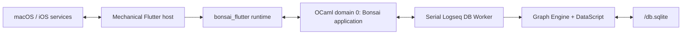

# Logseq Journal Architecture

## Status

This is the single authoritative architecture document for this repository. It
describes the implemented system and the constraints that future work must
preserve. Product requirements, visual specifications, implementation plans,
and acceptance reports do not belong here.

Last reconciled with the working tree on 2026-08-14.

The source code and dependency manifests remain authoritative when this
document and the implementation disagree. Update this document in the same
change that intentionally changes an architectural boundary.

## Architectural decision summary

1. The application is OCaml-first. OCaml owns product state, domain rules,
   routes, actions, semantics, declarative views, graph requests, and durable
   reconciliation.
2. `bonsai_flutter` is the application runtime and rendering bridge. Bonsai on
   OCaml domain 0 owns the component; Flutter renders the emitted widget
   protocol.
3. Flutter is a mechanical host. Project-local Dart may bootstrap the runtime
   and implement explicit platform adapters, but it must not duplicate product
   state, graph rules, navigation, or product widgets.
4. The application owns exactly one serial `Logseq_db_worker` service. Its
   Worker Domain exclusively owns the graph Engine, DataScript value, SQLite
   connection, ownership lock, backup state, and mutation pipeline.
5. The canonical database is an admitted local Logseq DB graph. There is no
   app-private journal database, generic-store fallback, legacy startup
   decoder, access mode, or recovery-only compatibility path.
6. All graph sessions are read-write. A native graph requires exclusive
   coordinated ownership; a verified package snapshot is writable only
   through its authenticated snapshot session.
7. Supported graph schema versions are `65.33` or newer when the reachable
   graph can be decoded losslessly. Remote, RTC-owned, ambiguous-sync, corrupt,
   or unsupported graphs fail closed.
8. All cross-boundary data is typed, immutable, bounded, and fenced by UUID,
   basis, request ID, mutation ID, cursor, or generation. Database handles,
   DataScript values, SQLite addresses, and entity integers never cross the
   Worker boundary.
9. Durable state wins over optimistic state. Mutations use stable mutation IDs
   and expected basis. A newer invalidation basis triggers a read
   reconciliation when a durable commit may have outlived its transport
   response.
10. Obsolete paths are deleted rather than retained as aliases, fallbacks,
    migrations, or compatibility wrappers.

## Technology baseline

The exact dependency sources are [`dune-project`](../../dune-project),
[`logseq_db_worker.opam`](../../logseq_db_worker.opam),
[`logseq_journal.opam`](../../logseq_journal.opam),
[`bonsai-flutter.sexp`](../../bonsai-flutter.sexp), and
[`flutter/pubspec.yaml`](../../flutter/pubspec.yaml).

| Layer | Current baseline |
|---|---|
| OCaml | `5.1.1` |
| Dune | `3.23.1` |
| Jane Street stack | Bonsai/Base/Core `v0.17` |
| `bonsai_flutter` | `0.1.0~dev`, pinned by the package manifests |
| DataScript | `datascript_ocaml` and `datascript-ocaml-native`, pinned by the package manifests |
| SQLite | `sqlite3` `5.4.0`, with system SQLite linked on Apple targets |
| Dart | `^3.12.2` |
| Flutter | `>=3.44.0` |
| macOS target | arm64, macOS 26.0 or newer |
| iOS target | arm64, iOS 15.0 or newer |

The OCaml compiler version is shared by host and iPhoneOS closures. Target
closure problems must not be bypassed by moving product or graph logic into
Dart or by modifying `bonsai_flutter` OCaml sources from this repository.

## System context



There is one application runtime and one Worker service for the selected graph.
The host resolves the target before runtime startup. The OCaml application owns
all product decisions; the Worker owns graph interpretation and persistence.

## Graph location and startup target

A native target consists of a bounded graph name and the canonical directory
derived by the platform host:

- Desktop: `graph-dir = ~/logseq/<graph-name>`.
- iOS: `graph-dir = <app-data-dir>/graphs/<graph-name>`.
- Both platforms: `database-path = <graph-dir>/db.sqlite`.

The target is never an arbitrary path entered through application UI. The
graph name is one bounded path component. The host canonicalizes the platform
base and graph directory, rejects symlink or traversal escape, and verifies
that the graph directory basename matches the graph name.

The alternative startup targets are:

- `Snapshot { token }`, containing only an authenticated catalog UUID; and
- `Import_snapshot { inbox_entry }`, containing only one confined inbox entry
  name which is consumed into a newly authenticated local snapshot.

The application-support directory contains the snapshot catalog, import inbox,
recovery artifacts, and package-owned metadata. It is not the native graph
directory.

The application startup payload is the byte-exact `LDB1` envelope nested in
the framework-owned runtime envelope. It contains bounded JSON for:

- the canonical application-support directory;
- exactly one typed target;
- compatibility profile `logseq-65.33-or-newer`;
- response budget; and
- default page size.

The `LDB1` header contains magic plus the exact payload length. The complete
payload is limited to 1 MiB. Unknown fields, invalid UTF-8, NULs, invalid UUIDs,
non-canonical paths, trailing bytes, and legacy envelope formats are rejected.
Startup decoding on domain 0 performs bounded immutable validation only; graph
resolution and all filesystem/database work run on the Worker Domain.

## Ownership model

### OCaml domain 0

[`app/application.ml`](../../app/application.ml) composes the application with
`App.create_with_worker`. Domain 0 owns:

- route, back-navigation, capture, detail editor, and timeline state;
- sparse-window state, stable slot keys, and focus restoration;
- mutation admission and optimistic presentation;
- request and calendar generations and stale-response rejection;
- mapping typed graph projections into the journal UI;
- handling `Accepted`, `Full`, `Not_ready`, and `Stopping` send results; and
- declarative widgets, actions, semantics, adaptive tokens, and localization
  requests.

Domain 0 may hold bounded immutable projections. It must not own a DataScript
database, SQLite connection, storage callback, raw graph payload, entity ID, or
graph query implementation.

### Serial Logseq DB Worker

[`logseq_db_worker/bonsai/logseq_db_worker_bonsai_service.ml`](../../logseq_db_worker/bonsai/logseq_db_worker_bonsai_service.ml)
defines the sole `Worker.Service.Serial` service. Its Worker Domain owns:

- target resolution and graph classification;
- snapshot provenance and import confinement;
- exclusive ownership and lock identity;
- the only live SQLite connection and restored DataScript value;
- schema and local/remote admission;
- typed queries and outliner mutation planning;
- first-write recovery backup and atomic persistence;
- native FTS and vector sidecar invalidation;
- graph basis, cursor authentication, and mutation idempotency; and
- orderly close or terminal failure.

The service state is either `Ready Engine.t` or a typed `Open_failed` value. An
expected open failure remains a usable transport and is rendered through the
initial `Graph_info` response. A persistence exception terminalizes the Worker
session; the application disables graph interaction until restart.

### Flutter host

[`flutter/lib/application_host_adapter.dart`](../../flutter/lib/application_host_adapter.dart)
is the application-specific host adapter. Dart is limited to:

- discovering and validating application-support/application-data/home roots;
- deriving the platform-native graph directory;
- selecting and encoding one `LDB1` target;
- supplying calendar, locale, time-zone, lifecycle, and day-format facts;
- hosting `BonsaiFlutterRoot`; and
- platform integration unavailable to portable OCaml.

Dart must not contain a journal model, reducer, repository, SQLite client,
DataScript query, graph mutation rule, product navigation stack, or local
product widget hierarchy.

## Source boundaries

| Area | Responsibility |
|---|---|
| `logseq_db_worker/lib/config.*` | Typed startup configuration and target |
| `logseq_db_worker/lib/protocol.*` | Versioned UUID/basis protocol and bounded codecs |
| `logseq_db_worker/lib/graph_locator.*` | Desktop/iOS native path derivation and validation |
| `logseq_db_worker/lib/snapshot.*` | Authenticated snapshot catalog, import, and recovery |
| `logseq_db_worker/lib/admission.*` | Schema, sync-state, value, and structural admission |
| `logseq_db_worker/lib/logseq_sqlite_*` | Exact Logseq SQLite/Transit codec and storage |
| `logseq_db_worker/lib/storage_session.*` | Staged immutable DB plus atomic persistence |
| `logseq_db_worker/lib/ownership.*`, `backup.*`, `derived_sidecars.*` | Exclusive owner, recovery backup, and projection invalidation |
| `logseq_db_worker/lib/query.*`, `read_model.*` | Bounded typed graph reads |
| `logseq_db_worker/lib/outliner/` | Structural, page, and property mutation planners |
| `logseq_db_worker/lib/engine.*` | Shared lifecycle and request dispatcher |
| `logseq_db_worker/bonsai/` | Bonsai Worker adapter only |
| `logseq_db_worker/cli/` | CLI/NDJSON adapter only; unreachable from the app closure |
| `app/journal_graph_request.*` | Journal-level graph commands |
| `app/journal_graph_runtime.*` | Request correlation, basis tracking, bounded graph flow, reconciliation |
| `app/journal_graph_transport.*` | Worker send outcomes and unaccepted-request cleanup |
| `app/journal_graph_projection.*` | Bounded graph-to-journal projection |
| `app/journal_startup.*` | Bounded `LDB1` codec only |
| `app/journal_platform.*`, `journal_calendar.*` | Calendar platform protocol and snapshots |
| `app/journal_routes.*`, `journal_timeline_state.*` | OCaml routes and bounded timeline |
| `app/journal_capture.*`, `journal_detail.*` | Editor state machines and graph commands |
| `flutter/lib/*` | Generated bootstrap and mechanical platform adapter only |

No app-private schema, repository, storage, storage-path, recovery, or second
Worker module exists under `app/`.

Repository guardrails remain architectural:

- Do not modify OCaml files under `spec/` unless an explicit request permits
  the relevant `.mli` change.
- Do not modify Dune files without explicit authorization.
- Do not modify OCaml files in the `bonsai_flutter` repository.
- If a `spec/*.mli` contract is unclear or unreasonable, stop and report the
  specific issue rather than bypassing it.

## Graph compatibility and identity

The admitted database is the exact local Logseq DB graph stored at
`<graph-dir>/db.sqlite`. The minimum schema is `65.33`; newer versions are
accepted only while all reachable values and structures remain losslessly
understood. There is no normalized intermediate store.

Public identities are UUIDs, qualified property identifiers, typed page
selectors, and authenticated cursors. Numeric DataScript entity IDs and
physical SQLite addresses are internal implementation details.

The graph is rejected before mutation when it is remote, RTC-owned,
ambiguously synchronized, structurally corrupt, contains unsupported reachable
values, has an unsupported schema, or cannot establish exclusive ownership.
Ordinary local client-operation metadata is not itself classified as remote.

The journal projection uses Logseq journal pages and block relations. Stable
UUIDs become UI keys. Task state is derived from the Logseq status property,
not Markdown TODO text. Block source, parent, page, order, timestamps, refs,
tags, properties, and graph basis are projected without exposing database
storage identities.

## Persistence and ownership

Every session is read-write and exclusive:

- Snapshot sessions acquire a package-owned authenticated owner sentinel.
- Native sessions acquire the coordinated Logseq owner generation plus the
  shared SQLite owner transaction.
- A second writer, ambiguous lock, malformed sentinel, stale identity, or
  owner replacement fails closed.
- Every backup, sidecar operation, mutation, checkpoint, and release revalidates
  the owner identity.

Before the first mutation, the Engine creates one consistent SQLite recovery
backup. Native mutations additionally mark FTS and vector projections
independently invalid before the main database write. Failure to back up or
invalidate prevents the mutation from starting.

Mutation planning produces a new immutable DataScript value and concrete
storage batch. SQLite `BEGIN`, address writes, root publication, and `COMMIT`
form one atomic persistence boundary. The in-memory canonical value advances
only after commit succeeds. Any persistence failure terminalizes the Engine;
the session is never treated as reusable after an uncertain storage outcome.

Authenticated pending-write metadata and recovery backups guarantee that a
later snapshot open chooses a complete before or after state, never a mixed
state. Snapshot imports are confined to one inbox entry and cannot authorize
an arbitrary path.

## Protocol, queries, and mutations

The versioned protocol has `Open` and `Execute` failure phases, typed errors,
request UUIDs, mutation UUIDs, expected basis, result basis, bounded changed
UUIDs, and authenticated pagination cursors.

Reads include graph info, block/page lookup, children, page tree, ancestors,
siblings, pages, tags, properties, tasks, and references. Every collection has
an explicit limit and continuation.

Mutation families include:

- save, insert, move, move-up/down, indent, direct outdent, and hard block
  delete;
- ordinary, journal, and class page create, rename, recycle, restore, and
  permanent delete; and
- property upsert/set/remove/batch operations, closed values, and class
  properties.

The Worker implements Logseq parent/page/order, refs, tags, timestamps,
transaction metadata, recycle metadata, status, default value, alias, class,
closed-value, placeholder, and orphan-cleanup rules. Unsupported automatic
effects reject before staging; they do not partially approximate Logseq.

Mutations return `Applied`, `No_change`, or `Already_applied`. A stale expected
basis returns a typed conflict unless the mutation ID proves the exact durable
effect already exists. Successful applied mutations advance basis exactly once.

## Application graph flow and durable reconciliation

Startup sends `Graph_info`. Once both graph and host calendar are ready, the
application issues a bounded initial feed request. The graph runtime correlates
protocol request IDs, remembers page ownership for later UUID mutations, and
rejects uncorrelated or stale responses.

The initial feed uses at most 31 journal days, 64 top-level blocks per day, and
a total projection budget of 128 day/block slots. Per-day page-tree limits are
allocated before requests are sent so the combined projection cannot exceed
the slot budget. Invalid budgets and Worker responses exceeding their assigned
limit are rejected.

`Journal_graph_transport` preserves immediate runtime rejections, stops at the
first unaccepted send, classifies `Full`, `Not_ready`, and `Stopping`, and
removes every unsent request from runtime correlation. The application does
not mark a request pending unless its delivery was accepted.

Applied mutations emit one bounded `Graph_invalidated` latest-wins hint. A
normal mutation response advances the runtime basis before its push is drained,
so an equal or older push is already reconciled and causes no duplicate read.
If a commit succeeds but cancellation wins transport arbitration, the push has
a newer basis. The application then reloads the most recent initial feed with a
fresh generation. Runtime basis is monotonic, duplicate in-flight invalidations
collapse, and a late lower-basis response cannot regress reconciliation state.

## Calendar and presentation boundaries

Calendar facts are supplied through the bounded `LJP1` application platform
protocol, separate from `LDB1` startup. A snapshot contains instant, numeric
local day/minute, locale, time-zone ID, UTC offset, calendar generation, and
lifecycle generation. The host validates that instant, offset, and local day
are consistent.

Graph timestamps are projected with the current host time-zone ID and UTC
offset. No implicit UTC fallback is used when the host calendar is unavailable.
Localized day headings are host-formatted presentation data; numeric
proleptic-Gregorian `YYYYMMDD` remains journal identity.

The timeline uses stable semantic keys and a bounded sparse projection:

- at most 512 retained logical slots;
- at most 40 supplied rows per renderer window;
- overscan of 4 rows;
- generation- and epoch-fenced paging and expansion; and
- at most three direct children in an inline preview.

Arbitrary-depth or unbounded content belongs in bounded detail/page queries,
not the known-extent feed.

## Security, privacy, and diagnostics

- Startup accepts one derived native target or authenticated snapshot target,
  never an arbitrary database path.
- Native graph, snapshot catalog, and import paths are canonicalized and
  checked against traversal and symlink escape.
- Snapshot manifests and pending-write markers are authenticated; copied or
  forged artifacts are rejected.
- Ordinary protocol errors contain stable codes, safe bounded messages, and
  bounded details. They exclude raw Transit, journal source, SQLite paths,
  handles, and unbounded exception text.
- Fatal persistence diagnostics terminate the Worker session rather than being
  converted into an ordinary reusable response.
- Invalid or oversized input is rejected before it can become an unbounded
  Worker, SQLite, FFI, or renderer workload.

## Verification architecture

The verification layers mirror ownership boundaries:

- core tests cover codec, official Logseq restore, admission, ownership,
  snapshots, atomicity, queries, structural/page/property planners, Engine,
  protocol, and CLI;
- pinned Logseq oracle and cross-runtime tests compare canonical graph state
  and prove that Logseq and OCaml can reopen and continue after each other's
  writes;
- Bonsai service tests cover serial execution, open failure, fatal persistence,
  response-before-push, latest-wins collapse, backpressure, cancellation, and
  dependency closure;
- application tests cover startup, graph flow, bounded projection, stable UUID
  keys, timezone projection, send outcomes, basis reconciliation, and absence
  of domain-0 persistence;
- Flutter tests cover the mechanical target/path/startup adapter and compiled
  runtime behavior; and
- source-boundary tests prevent product logic from migrating into Dart and
  reject obsolete app-private storage paths.

Standard local gates are:

```text
opam exec -- dune runtest
opam exec -- dune build -p logseq_db_worker @install
opam exec -- bonsai-flutter sync-project --check
opam exec -- bonsai-flutter sync-host --check
cd flutter
opam exec -- bonsai-flutter exec --profile=debug -- flutter analyze --no-pub
opam exec -- bonsai-flutter exec --profile=debug -- flutter test --no-pub
```

macOS arm64 and unsigned iPhoneOS arm64 packaging are unconditional release
gates. Signed physical-device persistence/relaunch evidence remains a separate
externally provisioned gate when a Team, certificate, profile, and device are
available. Simulator, Intel Mac, and universal macOS targets are outside the
current Bonsai support boundary.

## Current scope and explicit non-goals

The architecture supports local Logseq DB graph journal paging, capture,
content/task updates, detail editing, direct-child creation, subtree deletion,
page and property operations through the shared package, snapshots, native
exclusive ownership, CLI/NDJSON automation, and cross-runtime compatibility.

The following remain outside the current scope:

- remote, RTC, sync, E2EE, or concurrent Logseq graph access;
- plugins, whiteboards, or complete markup execution;
- arbitrary-depth inline outliner rendering;
- search, date selection, attachments, or graph picker product ownership;
- Android, Windows, Linux, or web delivery; and
- a Dart product application parallel to the OCaml application.

Adding one of these capabilities requires an explicit architecture update and
its own typed, bounded, tested boundary. It must replace obsolete paths instead
of adding compatibility fallbacks.

## Maintenance rule

Keep one architecture document. Future UI/UX proposals, implementation plans,
visual assets, and acceptance reports must not accumulate here. When an
architecture decision changes, edit this file and delete the superseded text
in the same change.
