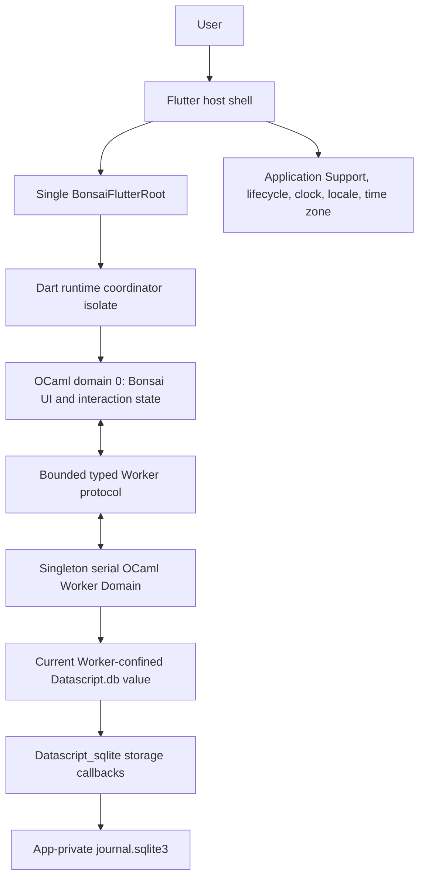
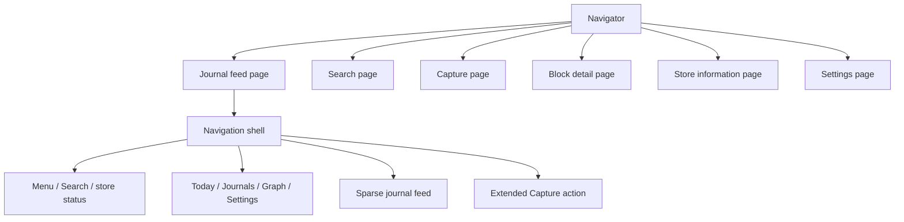

# Logseq Journal Rewrite Research and Design

## Document status

| Field | Value |
| --- | --- |
| Status | Application implementation complete; local OCaml, Flutter, managed-host, macOS app-bundle, and unsigned iPhoneOS app-bundle gates are green, with the macOS deployment target and signed-device persistence proof still external |
| Date | 2026-08-07 |
| Scope | Rewrite the current in-memory prototype as a local-first journal app |
| UI runtime | `bonsai_flutter` |
| Data runtime | `datascript_ocaml` on one OCaml Worker Domain |
| MVP persistence | App-private SQLite through `datascript-ocaml-native.sqlite` |
| DataScript source policy | Pin and consume the researched version unchanged; harden it in a separate follow-up project |
| Development target | macOS arm64 |
| Mobile target | Physical iPhoneOS arm64, iOS 15 or later |
| Supersedes | `001-journal-mobile-app-architecture.md` as the implementation baseline |
| Implementation effect | Governs the in-repository rewrite and its release gates |

The previous architecture document remains useful historical research for
native Logseq graph interoperability. It is no longer the current
implementation baseline because the repository now contains a runnable
prototype, the Worker API has evolved, the dependency commits have moved, and
the former OCaml version conflict has been removed.

The application-owned Phase 0 slice is implemented and tested: exact nested
startup bytes, canonical Application Support containment, exact pinned
dependencies, app-private schema and metadata admission, generic SQLite first
store/restore/tail behavior, one Serial Worker owner, typed fact persistence
across runtime replacement, process-lifetime path quarantine, and a bounded
volatile accepted-mutation registry. `bonsai_flutter` commit
`2838c77a9e4235e423e8a9a5340086aa1c119801` supplies the managed adapter,
application request/event bridge, retained sparse-list transition state,
typed `Viewport`/`Body` constraint boundary, and generic Dune-closure resolver.
Managed-host synchronization is clean. The
iPhoneOS resolver now builds and verifies the complete 66-package target
closure, including DataScript, SQLite, Transit/EDN, `uucp`, and `uunf`, as an
arm64 iOS 15 complete object. The unsigned iPhoneOS `Runner.app` also passes
final arm64/iOS 15 framework and app-bundle verification. Remaining Phase 0
external gates are the macOS deployment-target fix and the signed
physical-iPhone persistence proof.

The application-owned Phase 1 data slice is implemented and tested. Stable-ID
Capture validates date, UUID, UTF-8, nonempty content, and the 65,536-byte
bound before transaction construction; creates at most one page per journal
day; writes the complete block, revision, task state, order, and mutation
identity in one transaction; returns `db_after` projections; treats
same-mutation redelivery as already applied; rejects block-ID collision; and
restores the captured block through the Serial Worker after runtime
replacement. Recent days, top-level blocks, compound sibling continuations,
depth-two/eight-node previews, and bounded detail pages use derived tuple AVET
seeks. Oversized stored content becomes a bounded sentinel, locks mutations,
and never crosses into the rendered tree. Opening, empty, ready, recovery,
mutation-locked, and terminal states render through the complete application.

Phase 2 includes a pure bounded feed-state reducer, stable tagged slot
keys, a hard 31-day/512-slot terminal Search boundary, the regular 48/88/56/64
extent profile, a 24-child overlapping sparse-list window, and the complete
single-destination `Navigation_shell` contract. Near-tail visible-range events
load compound per-day continuations only after Worker admission and merge them
through request-ID, request-generation, and cursor fencing. Older-day
admission now preserves the loaded prefix, rejects stale or overlapping pages,
and terminates at the 31-day/512-slot Search boundary. One-open previews load
at most depth 2 and 8 descendants, update the `Morphing_surface` endpoint and
extent override in the same domain-0 state transition, and discard stale
responses. Block bodies open declarative `block-detail:<uuid>` pages with a
bounded immediate-child page; platform pop is accepted only for the actual
top page key and returns to the retained feed/window state. The centered shell
is capped at 720 pixels, renders only the working Today destination, reserves
bottom inset for a bottom-center Capture layer, and has tested motion,
text-scale, semantic, contrast, live-region, and 48-pixel target profiles.
Generation-fenced batches localize visible day headings through the native
calendar formatter. A confirmed Capture made away from the top retains the
current feed window behind a live saved-entry banner; Show recreates the list
at the top and merges only after the top visible range settles. Drawer settled
state is synchronized with OCaml while Flutter consumes system Back/Escape
locally before reporting Closed. Every mounted block also exposes a bounded
More action that opens its detail actions.

Phase 3 includes complete durable Capture, child creation, task transition,
and expected-revision edit vertical paths. Read-write feed states expose a
dedicated, non-platform-pop editor route; recovery-only, opening, loading,
mutation-locked, and terminal states do not expose mutation controls. The
editor uses the retained 65,536-byte Flutter guard and document/local-revision
acknowledgement protocol, disables blank Save, retains rejected or conflicting
drafts, and requires explicit Keep/Discard for dirty cancellation. Save
allocates stable IDs, observes an action-time calendar snapshot, records a
pending command only after `Worker.Accepted`, and displays `Saved` only after a
fenced durable response. Detail child creation atomically updates the parent,
task and content mutations use compare-and-set revisions, and the process
registry reconciles accepted commands after runtime replacement. Clean close
writes basis-keyed atomic snapshots and retains the newest three without
changing the pinned DataScript source.

Phase 4 includes a 250 ms debounced Unicode NFKC-casefold Search route with a
512-candidate request budget, automatic bounded continuation, 50-result and
2 MiB work caps, 512-byte snippets, and raw 512-byte/256-scalar query limits.
The remaining production gates are recorded explicitly rather than being
claimed by the current test suite.

## Executive decision

The rewrite should replace the current monolithic in-memory application with
one worker-backed vertical architecture:

1. Flutter remains a mechanical host. It resolves an Application Support
   directory, sends a versioned startup envelope, renders the OCaml-owned tree,
   and owns renderer-local resources and platform interactions.
2. OCaml/Bonsai domain 0 owns routes, interaction state, pending UI overlays,
   bounded projections, handlers, and the declarative widget tree.
3. One serial OCaml Worker Domain exclusively owns the SQLite session, the
   current persistent `Datascript.db` value, queries, transactions, restore,
   and shutdown. The value is treated as immutable by application code but
   remains Worker-confined because queries may fill internal caches and lazily
   restore storage nodes.
4. The greenfield MVP uses the installable public `Datascript_sqlite`
   sublibrary at a pinned commit and a new app-private database. The journal
   consumes that dependency unchanged: this implementation does not patch,
   vendor, or otherwise modify `datascript-ocaml`. Backend cleanup, strict
   restore, and failure-injection work proceed later as a separate dependency
   project and do not block the journal rewrite. The MVP does not open or
   overwrite an existing Logseq `db.sqlite` file.
5. The Mail example supplies interaction and ownership patterns, not Gmail
   taxonomy. The journal adopts its rounded shell, drawer, bounded virtual
   window, single inline preview, stable declarative navigation, semantics, and
   retained Flutter behavior. It rejects placeholder bottom navigation and
   mail-specific swipe actions.
6. Direct Logseq SQLite interoperability is a separate product track. If it is
   promoted into MVP scope, implementation must pause until the compatible
   adapter is made public, transactional, lifecycle-safe, and covered by
   cross-runtime fixtures.

This choice satisfies the stated requirement to use `datascript_ocaml` with
SQLite while keeping the first rewrite on an installable package boundary. It
also prevents the UI rewrite from being coupled to an immature Logseq physical
storage adapter.

## Research conclusions

### Current application baseline

The current repository is a working `bonsai_flutter` demo skeleton, not a
persistent journal implementation.

| Current area | Observed behavior | Rewrite disposition |
| --- | --- | --- |
| Domain state | Two hard-coded blocks with integer IDs, title, and a boolean completion flag | Replace with typed journal/page/block projections and stable UUIDs |
| Capture | Appends the fixed string `New journal block` to Bonsai memory | Replace with real text input and a durable Worker command |
| Toggle | Flips an in-memory boolean | Replace with a typed task-state transaction |
| Date | `Today` and `Thursday, August 6` are static labels | Replace with injected locale, time zone, and current-day calculation |
| Feed | Unbounded `ScrollView` containing a `Column` | Replace with a bounded `Sparse_extent_list` window |
| Persistence | None | Add app-private DataScript storage backed by SQLite |
| Runtime | `App.create`; no Worker | Replace with `App.create_with_worker` |
| Routing | None | Add OCaml-owned declarative list, search, capture, and detail routes |
| Flutter host | One `MaterialApp` and one `BonsaiFlutterRoot` with a raw string config | Keep the thin host, but pass a versioned startup envelope |
| Tests | Headless visible-text and click checks for the demo | Keep the testing style and replace the behavior contract |

The useful assets to retain are the generated Flutter platform shell, single
root ownership, native entrypoint registration, app name, native artifact
hook, stable `Test_id` convention, and the use of keyed Bonsai associations.
The demo model, handlers, component composition, raw startup payload, and
UI-only public component contract should be replaced.

The existing `dune runtest` baseline passed during this research. That proves
only that the current demo still runs; it does not verify Worker lifecycle,
DataScript, SQLite, restart persistence, routing, text editing, or mobile
packaging.

The reproducible build path uses the managed host authority in
`bonsai_flutter` commit `2838c77a9e4235e423e8a9a5340086aa1c119801`.
That clean commit includes the application-owned adapter and BFR1 bootstrap,
the UTF-8 text-input byte-limit contract, the application request/event bridge,
retained sparse-list transition state, typed axis-specific viewport/body slots,
and generic per-application iPhoneOS Dune-closure resolution. Normal host
synchronization preserves the selected
application adapter and passes `bonsai-flutter sync-host --check`.
`flutter/lib/main.dart` remains generated; Application Support and journal
startup bytes belong in the application-owned adapter selected by
`bonsai-flutter.sexp`.

The current `bonsai-flutter.sexp` enables SQLite. `dune-project` and
`logseq_journal.opam` declare and pin DataScript,
`persistent_sorted_set_ocaml`, Transit, EDN, SQLite, and the Unicode search
stack (`uutf`, `uunf`, and `uucp`). The exact closure is installed in the
`bonsai-flutter-v017-exact` host switch without modifying any dependency
source. The macOS application library now links the generic
`Datascript_sqlite` adapter and passes create, transact, close, reopen,
restore, empty/nonempty tail, and 32/33-datom compaction tests.

The generic iPhoneOS resolver excludes application-local Dune libraries while
retaining their external dependencies. The recorded build resolves 66 target
packages, 135 host-only packages, and 103 components, then verifies DataScript,
SQLite, Transit/EDN, `persistent_sorted_set_ocaml`, `uucp`, and `uunf` objects
as arm64 iOS 15 Mach-O before producing the application complete object. The
remaining mobile gate is installation and persistence verification on a signed
physical iPhone, not dependency declaration or cross-compilation.

The official macOS native build produces the combined arm64 complete object,
but the result still records macOS 26.0 while the application contract is
macOS 13.0. Flutter's macOS 13 native hook therefore emits a newer-object
linker warning. At `2838c77`, `artifact.ml` also hard-codes `26.0` for macOS
verification rather than using `config.macos.minimum_version`. This cannot be
fixed by declaring more application packages. `bonsai_flutter` must compile
the macOS closure under the configured deployment target and verify the staged
object against that same value.

### Corrections to the previous architecture baseline

The following claims in `001-journal-mobile-app-architecture.md` are obsolete:

- The repository is no longer empty; it contains OCaml source, Dune files,
  tests, and generated Flutter hosts.
- `datascript-ocaml-native` no longer requires OCaml 5.2.1. At the researched
  commit, both `datascript_ocaml` and `datascript-ocaml-native` declare OCaml
  5.1.1 or later, matching this application's exact 5.1.1 baseline.
- The dependency compatibility gate is now a real macOS/iPhoneOS link and
  runtime test, not a package-metadata version conflict.
- Current `bonsai_flutter` documents successful development signing,
  installation, OCaml callback execution, and an Eio Worker probe on a physical
  iPhone. iOS Simulator and Android remain outside the supported target set.
- The Worker API is now the direct-style Eio service contract with explicit
  session/request contexts and `Serial` or bounded concurrent policy.

The following principles from the previous document remain valid and are
carried into this design:

- one runtime, one Worker session, and one SQLite owner;
- immutable and bounded data crossing the Worker/UI boundary;
- stable UUID-based row and route identity;
- OCaml-owned routes and Flutter-owned transition interpolation;
- no live multi-writer access to a SQLite graph;
- durable confirmation before displaying `Saved`;
- generation and basis fencing for asynchronous results;
- bounded feed cards with full content on a detail route; and
- explicit recovery for uncertain persistence outcomes.

### `datascript_ocaml` and SQLite findings

The current `datascript-ocaml` checkout is compatible with the app's OCaml
5.1.1 package metadata. The native package exposes DataScript schema,
transaction, entity, pull, Datalog query, and index APIs. The SQLite sublibrary
is installable as `datascript-ocaml-native.sqlite` and exposes
`Datascript_sqlite.open_session`, `storage`, and `close` at the researched
commit. It has no `.mli`, so its inferred surface, including raw externals and
session representation, is not a stable application contract. Only
`journal_storage` may use the three intended lifecycle entry points.

There are two materially different SQLite implementations in the checkout:

| Capability | Generic `Datascript_sqlite` | Example `Logseq_sqlite_storage` |
| --- | --- | --- |
| Package boundary | Public sublibrary | Repository-private example library |
| Table shape | `kvs(address TEXT, payload TEXT)` | `kvs(addr INTEGER, content TEXT, addresses JSON)` |
| Session lifecycle | Explicit open and idempotent close | Helpers open and close per call; no storage session |
| Successful batch write | Explicit `BEGIN IMMEDIATE` and `COMMIT` | Concatenated upserts without an explicit batch transaction |
| Codec | Generic DataScript Transit representation | Logseq-compatible Transit representation |
| Existing Logseq file | Incompatible | Correct starting format, but not release-ready |
| Recommended use | Greenfield app-private MVP store | Future native Logseq interoperability after promotion and hardening |

The physical difference is intentional. A database created by the generic
backend must never be presented as a Logseq graph file even if both tables are
named `kvs` and both codecs use Transit.

The generic backend is the better MVP boundary, but it is still development
software. The following work remains desirable in a separate
`datascript-ocaml` hardening project:

- guarantee statement finalization and rollback for bind, step, finalize, and
  commit failures;
- verify and report close failures;
- add a bounded busy timeout and typed SQLite error phase/code;
- reject a second live session for the same path;
- add strict root, tail, and index-node corruption diagnostics;
- stop silently accepting a tail group that cannot be replayed;
- cover compaction around the 32/33-datom boundary;
- after cleanup hardening, test safe reopen and reconciliation after every
  uncertain write phase; and
- build and execute the complete DataScript plus SQLite closure on macOS and a
  signed physical iPhone.

That upstream hardening list is explicitly outside this repository's
implementation scope. `logseq_journal` pins the researched dependency, tests
its supported happy path, and compensates at the application boundary: one
Worker owns one session, no accepted write is cancelled, `db_after` is
installed only after `Datascript.transact` returns, and any storage exception
is treated as durability-unknown and terminal for the remainder of the OS
process. The app never promises same-process recovery, precise mutation
reconciliation after a process restart, or complete detection of a tail group
that the current dependency silently skips.

### Database value instead of mutable connection

The Worker should own a current persistent `Datascript.db` value, not use
`Datascript.Conn.t` as its primary state. Application code treats each value as
an immutable snapshot, but it stays on the Worker because query caches and lazy
storage-backed indexes have internal mutation and effects.

`Datascript.transact db operations` computes a transaction report, attempts to
persist it, and returns only after persistence succeeds. The Worker can assign
`report.db_after` to its state after the call returns. In contrast,
`Conn.transact` assigns `conn.db <- report.db_after` before storing the tail or
snapshot. A storage exception can therefore leave the mutable connection ahead
of the durable file.

The MVP has one serial command owner and does not need connection listeners.
Keeping the current database value directly gives the service a simpler commit
rule:

```text
validate command
  -> calculate and persist transaction
  -> success: install db_after and return its projection
  -> storage exception: retain no speculative database, quarantine session,
     enter Terminal, and require a full process restart
```

No `db`, connection, entity, storage callback, or lazy `Seq.t` crosses to
domain 0. Lazy index results are fully materialized into bounded DTOs inside
the Worker because index traversal can lazily restore SQLite nodes.

### Mail example findings

The Mail example's useful design is its ownership and interaction model:

```text
Theme
└── Center
    └── ConstrainedBox(maxWidth = 720)
        └── Navigator
            ├── List page
            │   └── NavigationShell
            │       ├── retained body
            │       │   ├── rounded search header
            │       │   ├── heading
            │       │   └── SparseExtentList
            │       │       └── keyed MorphingSurface rows
            │       ├── Drawer
            │       └── bottom-navigation child
            └── Detail page with Slide transition
```

OCaml owns route state, selection, expansion, pagination, projections, and
actions. Flutter owns the retained body, scroll controller, drawer gesture,
press feedback, haptics, extent animation, morph timeline, and interactive
back gesture. Only settled visible ranges and discrete typed actions cross the
boundary.

The rewrite should use the following mapping:

| Mail pattern | Journal behavior | Decision |
| --- | --- | --- |
| Quiet tonal canvas, rounded surfaces, maximum width 720 | Keep the visual hierarchy and single-column responsive shell | Adopt |
| Rounded static search pill | Make the center a focusable button that opens a real Search page; show menu on the left and store status on the right | Adapt |
| Inbox drawer | Today, Journals, Graph, and Settings; show only working destinations | Adapt |
| Mail/Chat/Spaces/Meet bottom navigation | No bottom bar until the app has at least two real primary destinations | Reject |
| 88-pixel message row | Journal block card with one exact default extent per environment profile: 88 regular, 96 large-text | Adapt |
| `Sparse_extent_list` | Flatten day headers, block cards, continuation rows, and loading/error rows into stable tagged slots | Adopt and adapt |
| One inline `Morphing_surface` expansion | At most one bounded descendant preview, depth at most 2 and at most 8 preview nodes | Adopt |
| Whole-row click expands, footer opens | Disclosure control expands; block body opens detail directly | Adapt |
| Mail archive/read swipe | Omit; it conflicts with text selection, outliner indentation, and future reorder | Reject |
| Stable declarative detail page | Use `block-detail:<uuid>` page keys and validate platform pop keys | Adopt |
| Mail detail actions | Back, task state, copy text, and overflow; destructive actions require confirmation or Undo | Adapt |
| Inline live-region notice | Saving, Saved, Conflict, Save failed, and editing-disabled feedback | Adopt |
| Placeholder Reply/Compose | Capture is a real durable flow; cancelling creates no empty block | Reject placeholder behavior |

`Sparse_extent_list` requires known extents and does not measure arbitrary
children. Collapsed content must therefore have bounded lines, every nondefault
slot must provide an explicit extent, and expanded height must be calculated
from a bounded preview. A complete or unbounded outliner belongs on the detail
route.

The Mail example does not implement a Floating Action Button, and the current
Material scaffold has no FAB slot. The journal should add a minimum 48-pixel
extended Capture button in a bottom-center `Stack.positioned` layer and reserve
bottom list inset for it. The current positioning API exposes physical
left/right rather than directional start/end, so bottom-center avoids silently
breaking RTL; a future bottom-end placement requires an RTL-aware primitive.
On mobile it opens an autofocus Capture page. On desktop it is also available
through a visible header action. Global shortcuts remain gated on the keyboard
API described below.

## Product scope

### MVP goals

- Restore an app-private journal database at startup and remain useful fully
  offline.
- Show today and recent journal days in reverse chronological order.
- Show ordered top-level blocks for each day with stable identity.
- Capture a plain-text block into the current local day.
- Represent task state as `Not_a_task`, `Todo`, or `Done`, and persist explicit
  task transitions.
- Open a block detail route, display a bounded subtree, and edit plain text with
  conflict detection.
- Add a plain-text child from Detail so child count, disclosure, bounded
  preview, and subtree navigation are reachable without import fixtures.
- Search page and block text with a bounded, debounced result set.
- Preserve feed offset and inline expansion across detail navigation.
- Expose opening, loading, saving, saved, conflict, mutation-locked, and
  recovery states accessibly.
- Run on macOS arm64 and package/run on a physical iPhoneOS arm64 device.

### MVP non-goals

- Directly opening, modifying, or exporting a native Logseq `db.sqlite`.
- Live co-writing a file that Logseq has open.
- Full Logseq markup execution, plugin APIs, RTC, sync, E2EE, whiteboards,
  Markdown file mirroring, or graph visualization.
- A full drag-and-drop outliner, arbitrary-depth inline feed editing, or
  unbounded tree virtualization.
- Placeholder product destinations copied from Gmail.
- Delete without a defined recovery or Undo contract.
- iOS Simulator, Android, Windows, Linux, or Flutter Web delivery.

### Primary user journeys

1. **Relaunch:** open the app, restore the SQLite-backed DataScript value, and
   display the same confirmed blocks and task states.
2. **Quick capture:** invoke Capture, enter text, submit, see `Saving`, and see
   `Saved` only after the Worker returns a durable projection. Merge the row
   immediately at the feed top or stage it behind the saved-entry banner when
   the existing viewport is away from the top.
3. **Browse:** scroll toward older days, retain the visible anchor, and load up
   to the fixed recent-feed cap without replacing newer results with stale
   responses; use Search beyond that cap.
4. **Preview and detail:** open the stable block detail route, append an
   immediate child, return to the preserved feed offset, and expand the now
   reachable bounded preview.
5. **Edit:** change plain text using Flutter-local IME echo, submit an expected
   basis/document revision, and receive confirmed, conflict, or failed state.
6. **Search:** open Search from its visible header control, enter a query, and
   open a result through the same stable detail route.

## Target architecture

### System context



### Ownership rules

| Owner | Owns | Must not own |
| --- | --- | --- |
| Flutter UI isolate | Flutter elements/render objects, focus, IME controller, scroll controller, pointer/keyboard dispatch, animations, accessibility bridge, typed platform calendar snapshots | Journal reducer, DataScript value, SQLite connection, business routes |
| Dart runtime coordinator | Native runtime lease, copied buffers, serialized native calls, frame presentation | Journal data or mutation logic |
| OCaml domain 0 | Bonsai graph, route stack, drawer/search/capture state, bounded feed projections, pending overlays, typed handlers | SQLite session, DataScript database/entity, lazy query sequence |
| Process recovery registries | Canonical-path tombstones and bounded volatile accepted-mutation commands across same-process runtime replacement | Canonical journal state or a promise of OS-restart draft recovery |
| OCaml Worker Domain | Startup validation, one SQLite session, current `Datascript.db`, schema, bounded queries, transactions, restore, reconciliation, close | Flutter values, widget construction, UI controller state |
| SQLite | Durable DataScript root, tail, index nodes, and app schema | UI preferences or transient route/edit selection |

### Logical package boundaries

The exact Dune layout belongs to the implementation plan and needs explicit
authorization under this repository's rules. The target logical boundaries
are:

| Boundary | Responsibility |
| --- | --- |
| `journal_domain` | IDs, journal day, block tree, task state, commands, validation, invariants |
| `journal_schema` | App schema version, DataScript schema, schema admission and migration policy |
| `journal_repository` | Query plans, transaction construction, DTO projection, basis checks |
| `journal_storage` | `Datascript_sqlite` session lifecycle, restore/init, quarantine, close |
| `journal_process_recovery` | Thread-safe path tombstones and volatile pending-mutation handoff across same-process runtime replacement |
| `journal_worker_protocol` | Immutable requests, responses, errors, cursors, generations, mutation IDs |
| `journal_worker` | Serial Worker service and current database state |
| `journal_ui_state` | Route, drawer, feed window, search, capture/editor state, pending overlays |
| `journal_ui` | Bonsai components and journal-specific rendering |
| `application` | Startup decoding and `App.create_with_worker` composition |
| Flutter host adapters | Application Support path, generated versioned payload, lifecycle, and typed live calendar bridge |

Dependency direction is one way: UI depends on domain DTOs and protocol;
repository depends on domain and DataScript; storage depends on the SQLite
adapter; only application composition depends on all concrete boundaries.

### Domain identity and invariants

| Type | Durable representation | Rule |
| --- | --- | --- |
| `Store_id` | UUID generated when the app-private store is created | A file path is not identity |
| `Journal_day` | Proleptic Gregorian civil date, serialized as `YYYYMMDD` integer | Identity is locale-neutral; instant-to-day conversion and display formatting go through the host calendar service |
| `Journal_page_id` | UUID | Stable page and section identity |
| `Block_id` | UUID | Primary row, route, and mutation identity |
| `Order_key` | Fractional ordering string | Compared lexicographically; generated in repository layer |
| `Basis_tx` | Current DataScript `max_tx` | Fences edits and result acceptance |
| `Mutation_id` | Random UUID allocated before dispatch and persisted on the affected block | Correlates pending UI state and proves an applied mutation during reconciliation |

Required invariants:

- there is at most one journal page per `Journal_day`;
- a block has one stable ID, content, page, parent, and order key;
- a top-level block's parent is its journal page;
- a child remains in the same journal page as its ancestors;
- parent relationships are acyclic;
- sibling order keys are unique within a parent;
- DataScript's derived parent-order tuples track their source attributes, the
  two-part tuple uniquely enforces sibling order, and the three-part tuple
  supplies a total seek order with stable block-ID tie-breaking;
- empty capture is rejected before creating any datom;
- entity integers remain Worker-local and never become UI identity;
- domain 0 allows at most one in-flight durable mutation per block and queues
  or coalesces later edits until it resolves;
- every block starts at revision 1 and increments its durable revision exactly
  once in the same transaction as a successful mutation;
- content and task edits compare-and-set the expected durable block revision;
- a block revision covers content, task state, and structural child-list
  changes; child creation compare-and-sets and increments the parent revision;
- each successful mutation stores its `Mutation_id` on every affected block in
  the same transaction, allowing same-process outcome reconciliation and
  applied-state diagnosis after restore; and
- the local day is recomputed when Capture is submitted, not only when its page
  was first opened.

### App-private DataScript schema

The MVP should use an explicit app schema rather than claim native Logseq graph
compatibility. Conceptual attributes are:

| Attribute | Semantics |
| --- | --- |
| `:journal.store/id` | Unique store identity |
| `:journal.store/schema-version` | App schema version |
| `:journal.page/id` | Unique journal page UUID |
| `:journal.page/day` | Unique indexed journal day |
| `:journal.page/title` | Locale-neutral canonical title; localized display text derives from day plus the live calendar snapshot |
| `:journal.block/id` | Unique block UUID |
| `:journal.block/page` | Indexed ref to containing journal page |
| `:journal.block/parent` | Indexed ref to page or immediate block parent |
| `:journal.block/order` | Indexed fractional order key |
| `:journal.block/parent-order` | Derived unique-value tuple `[parent, order]` enforcing sibling-order uniqueness |
| `:journal.block/parent-order-block` | Derived indexed tuple `[parent, order, block-id]` supplying a total bounded sibling seek order |
| `:journal.block/content` | Raw plain-text content |
| `:journal.block/task-state` | `not-a-task`, `todo`, or `done` |
| `:journal.block/revision` | Monotonic per-block revision, initialized to 1 |
| `:journal.block/last-mutation-id` | Last durably applied mutation UUID |

The domain model must remain storage-neutral so a future Logseq adapter can map
these concepts to `:block/*` datoms. That future mapping is not a promise of
lossless interoperability; Logseq title parsing, derived references,
properties, tags, task markers, outliner metadata, schema profiles, and
fractional order semantics need their own compatibility tests.

## Storage and Worker design

### Startup envelope

`BonsaiFlutterRoot.config` carries two nested envelopes, not the journal bytes
directly. The outer framework envelope is
`RuntimeBootstrapConfig(...).encode()`: BFR1, entrypoint `logseq_journal`,
`RuntimeLaunchPolicy.replaceExisting`, and the journal bytes as
`applicationPayload`. Only that inner byte string reaches
`App.create_with_worker`'s application decoder. The inner journal envelope is
versioned independently and contains:

- envelope version;
- canonical absolute Application Support root plus the fixed app-private
  database relative name `logseq_journal/journal.sqlite3`;
- expected application/store schema version;
- initial locale and calendar snapshot with a calendar generation;
- read-write or application-level recovery-only access mode; and
- diagnostic mode without journal content logging.

The inner payload must remain below the framework's 1 MiB application-payload
limit; it contains configuration and paths only, never journal data. A raw
journal envelope passed directly as `BonsaiFlutterRoot.config` would be parsed
as a legacy entrypoint rather than as application configuration and is
forbidden.

The host creates and canonicalizes the dedicated app directory from the
platform-provided Application Support location. The decoder validates the
envelope version, absolute root, exact relative components, and absence of
`.`/`..` or alternate separators. Before SQLite open, the native storage
wrapper canonicalizes the existing parent, proves it remains beneath the
supplied root, and rejects symlink components or a symlink database leaf. A new
leaf is created only under that already-verified parent. Passing one
unanchored absolute database path is insufficient evidence of containment.
The host chooses the sandbox root but never opens or interprets the database.

The startup snapshot is not the ongoing source of truth for `Today`. A typed
host calendar bridge must also:

- return a fresh wall-clock instant, local calendar day, locale, time-zone ID
  and offset, and runtime-monotonic `calendar_generation` on request;
- emit a settled `Calendar_changed` event after resume and after platform
  significant-time, time-zone, or locale changes;
- accept bounded `Format_journal_days { calendar_generation; days }` batches
  of at most 64 locale-neutral dates and return fully localized headings with
  the same generation;
- refresh visible journal headings when the generation changes; and
- service Capture submission with a fresh snapshot before the mutation is
  dispatched.

`Capture` carries the observed local day and calendar generation. The Worker
rejects a generation older than the newest snapshot it has accepted, and the
UI refreshes and resubmits only after the user action is still applicable.
This makes action-time day selection explicit instead of deriving it from an
immutable startup value. The host calendar adapter, payload schema, and event
codec are part of the generated-host authority chosen in Phase 0. The runtime
epoch fences a generation counter that restarts with a new process/runtime.

Domain 0 caches formatted headings by `(calendar_generation, Journal_day)` and
drops a formatting result from any older generation. The host maps each
proleptic-Gregorian date to local noon and uses the platform
locale/calendar formatter for weekday, month, order, relative labels, and
script; keys remain the original `YYYYMMDD`. OCaml does not synthesize
`Thursday, August 6` with English literals or infer formatting rules from the
locale string alone.

`recovery-only` is initially an application mutation gate, not a filesystem
read-only SQLite mode. The generic backend opens every session with
`sqlite3_open` and executes `CREATE TABLE IF NOT EXISTS` during open, including
when the application intends only to read. A true read-only mode requires a
separate native open API. Filesystem-read-only inspection is therefore outside
the current MVP; if it becomes a product requirement, it belongs to the
separate `datascript-ocaml` hardening and dependency-upgrade track rather than
blocking this journal implementation.

### Worker service state

The Worker service uses `Worker.Service.Serial` and owns:

```text
session
storage callbacks
current persistent database value, Worker-confined
store ID
schema version
current basis transaction
latest accepted calendar generation
health = Ready | Recovering | Mutation_locked | Terminal
```

Serial policy is required even if the linked SQLite library uses serialized
threading mode. SQLite's C-call safety does not serialize a multi-call
transaction, and DataScript query/transaction state is an application-level
ordering concern.

### Restore and initialize

1. Open exactly one `Datascript_sqlite` session for the app-private path.
2. Obtain the DataScript storage callbacks from that session.
3. Call `Datascript.restore storage`.
4. If a database is restored, validate store ID, schema version, required
   attributes, and scoped structural invariants.
5. If no root exists, create an empty database with the exact app schema,
   attach storage, and explicitly perform the initial full store.
6. Return a bounded initial feed projection with its basis.
7. On shutdown, stop accepting work, cancel only bounded reads, let accepted
   durable mutations resolve or become outcome-unknown, close the session, and
   record that the dependency's close call returned. The current API does not
   expose a checked native-close result, so the journal does not claim that it
   can detect a silent `sqlite3_close` failure.

Restore returning `Some db` is not sufficient proof of complete storage health
because the current dependency can skip an invalid tail group. The journal
validates the restored schema, store identity, and all bounded structural
invariants it can observe, but this version does not claim strict tail
diagnostics. Strict replay and corruption classification remain an upstream
follow-up and are not a journal implementation gate.

`App.shutdown` and `Worker_runtime.stop` do not return a storage-close result
that can veto `Replace_existing`. Therefore `journal_storage` also owns a
thread-safe, process-lifetime quarantine registry keyed by canonical database
path and located outside an individual Worker service state. A surfaced
unknown-write or lifecycle-outcome-unknown path is tombstoned before cleanup
is attempted. Every future service initialization checks the registry before
`open_session`; normal shutdown and runtime replacement never clear an
existing tombstone. At the researched backend commit only an OS process
restart clears a tombstone. A future hardened dependency may enable a
controlled recovery flow, but this journal baseline never clears a tombstone
in-process. Phase 0 must prove the registry survives the framework's default
`Replace_existing` cycle and prevents a second open until the OS process
exits. A native close failure that the dependency does not report cannot be
tombstoned and remains an accepted upstream risk in this pinned baseline.

### Query plans

- **Recent days:** reverse-seek the indexed day attribute, stop as soon as the
  sequence leaves that attribute, and apply a strict day limit.
- **Top-level blocks:** AVET-seek the derived
  `[parent, order, block-id]` tuple from the compound cursor, stop when the
  parent component changes, and materialize at most the requested limit. The
  source tuple is maintained by DataScript when parent, order, or ID changes;
  the first page uses DataScript's supported nil-component tuple lower bound.
  Do not encode the tuple as a delimiter string or fetch and sort every child
  of the page.
- **Preview:** breadth/depth-bounded child traversal, maximum depth 2 and
  maximum 8 projected nodes; each sibling step uses the same parent-order seek.
- **Detail:** bounded page with explicit parent-order continuation and a
  bounded traversal-work budget; never scan or return an unbounded subtree.
- **Search:** debounced page-title and block-content search using one pinned,
  locale-independent Unicode `NFKC_Casefold`-equivalent pipeline for both
  candidate strings and queries. The implementation uses `uutf`/`uunf`/`uucp`
  or an API-equivalent reviewed stack, never `String.lowercase_ascii`, and has
  separate per-request candidate and accumulated-result caps. The
  correctness-first implementation AVET-seeks unique page IDs and block IDs in
  stable order, examines at most the candidate budget, and returns matches plus
  a typed next-candidate cursor and `complete` flag. Domain 0 continues the same
  request generation while the result cap is not full and shows
  Searching/Partial rather than claiming a partial page is complete. A derived
  n-gram/token index remains a rebuildable measured optimization, not a source
  of truth.

Every query materializes its lazy DataScript results in the Worker before
returning immutable DTOs. In addition to item limits, a request stops after
inspecting 2 MiB of raw content and returns its deterministic continuation with
`stop_reason = Count_limit | Byte_limit | End`. Response order and limits are
deterministic; a long sequence of maximum-size blocks cannot monopolize one
serial request merely because its item count is small.

### Mutation flow

```mermaid
sequenceDiagram
    participant F as Flutter renderer
    participant U as OCaml/Bonsai domain 0
    participant W as Worker client and Serial Domain
    participant D as DataScript and SQLite

    F->>U: Typed user action
    U->>U: Validate draft and allocate mutation ID
    U->>W: Worker.send command
    W-->>U: Accepted request ID, Full, Not_ready, or Stopping
    alt Accepted
        U->>U: Install pending overlay and request-to-mutation mapping
        W->>W: Revalidate and construct complete transaction
        W->>D: Datascript.transact current_db operations
        D-->>W: Durable tx_report or exception
        W->>W: On success only, install db_after
        W-->>U: Event with request ID and confirmed projection/error
        U->>U: Reconcile and remove mapping
    else Not accepted
        U->>U: Keep draft; expose typed queue/lifecycle state
    end
    U-->>F: Declarative frame
```

`Worker.send` is nonblocking and admission is part of the application
protocol. Domain 0 first enforces the eight-global/one-per-affected-block
application limit. Only `Accepted request_id` creates an in-flight/Saving
state. Domain 0 records a bijection between that request ID and the allocated
`Mutation_id`, and accepts a response only through that mapping. `Full` leaves
the draft unsent, installs no pending row, and exposes a retryable busy state;
retry may reuse the mutation ID because no request was accepted. `Not_ready`
retains the draft under Opening, while `Stopping` retains it under the current
mutation-locked or terminal lifecycle state. Bounded reads are coalesced and
retried with a new request generation rather than displayed as mutations.

On `Accepted`, domain 0 also copies the bounded mutation command into a
thread-safe, process-lifetime volatile pending registry outside the Bonsai
model and Worker session. It contains the mutation/request IDs, stable entity
IDs, expected revisions, command kind, and bounded draft content. It is cleared
only after a typed known outcome. A replacement runtime in the same OS process
must inspect and reconcile this registry before accepting new writes; this
prevents the framework's `Replace_existing` policy from silently discarding
accepted mutation context.

Domain code never calls `Worker.cancel` for an accepted durable mutation; only
bounded reads are actively cancelled. For a mutation, only
`Response (Completed typed_response)` can be classified precisely: confirmed
returns `Saved`, while expected validation/conflict/known-not-applied outcomes
are encoded inside that typed response and retain an editable draft as needed.
Outer `Failed`, `Cancelled`, `Shutdown`, or `Terminal`, and a typed persistence
outcome-unknown response, are all conservative `Outcome_unknown`: the command
may already be durable even when cancellation was requested before synchronous
SQLite returned. Domain 0 moves the registry entry out of `Saving`, preserves
its mutation ID and draft, and issues `Reconcile` if a healthy service remains;
otherwise the next same-process runtime reconciles it. It never directly
retries or allocates a replacement mutation while the outcome is unknown.

Create allocates `Block_id` before dispatch, stores revision 1 and the command's
`Mutation_id`, and can therefore be reconciled by stable identity. An update
atomically compare-and-sets `:journal.block/revision` from the expected value
to its successor while changing content/task state and writing
`:journal.block/last-mutation-id`. A response is derived from `db_after`, not
from an optimistic copy of the command.

`Create_child` allocates its child ID before dispatch. Under the serial Worker,
the repository inherits the parent's journal page, computes the
end-of-sibling order key, creates the child at revision 1, and in the same
transaction compare-and-sets/increments the expected parent revision and
records the mutation ID on both. Child existence by stable ID therefore
reconciles the entire atomic structural change. MVP does not yet indent, move,
or reorder existing blocks.

Before constructing a transaction, a mutation handler checks stable identity
and `last-mutation-id`. The same mutation ID returns the already-confirmed
projection without writing another transaction; a reused block ID with a
different create mutation is an identity collision; and an update with a
different mutation ID must still pass the revision compare-and-set. This makes
transport redelivery idempotent without turning an unknown SQLite outcome into
a blind same-session retry.

Normal business operations must not use `skip-store?`, `transact_async`, or
connection listeners. In the current library `transact_async` is synchronous,
and listeners add an exception boundary after persistence.

### Uncertain write recovery

Any SQLite/storage exception means durability is unknown. With the currently
researched generic backend, the service must:

1. stop accepting further mutations;
2. preserve the last UI-confirmed state only as a projection, not as canonical
   database state;
3. tombstone the canonical path in the process-lifetime quarantine registry,
   quarantine the current session, and enter `Terminal`;
4. require a full process restart before opening the path again; and
5. on the next startup, restore and validate only the canonical database; do
   not claim mutation-specific reconciliation or draft recovery.

The current native error path can leave a statement or `BEGIN IMMEDIATE`
unfinished, ignore a failed `sqlite3_close`, remove the handle from its cache,
and orphan the connection and lock. Consequently, same-process close/reopen is
not a safe recovery promise at this commit.

The volatile pending registry does not survive an OS process restart. Because
the mutation ID is written in the same uncertain transaction as the business
change, its absence cannot reveal an attempted-but-not-applied command whose
only copy was in memory. A crash-durable draft/intent journal would be a
separate product and privacy design. The MVP therefore accepts a conservative
process-restart-only recovery boundary: it reports only that the previous
write outcome is unknown, never claims that the draft was recovered, and on
the next launch presents only state restored from the canonical database.
This limitation does not block Phase 3.

Blind retry in the same session is always forbidden. Same-process reopen is
also forbidden in this journal baseline. A later `datascript-ocaml` release may
support a stronger recovery contract, but adopting it requires a separate
dependency update and does not change the current implementation plan.

### Worker protocol

Conceptual requests:

- `Observe_calendar { calendar_generation; local_day }`
- `Load_feed { before_day; day_limit; initial_blocks_per_day; slot_limit;
  request_generation }`
- `Load_day_blocks { day; after_order; after_block_id; limit;
  request_generation }`
- `Load_preview { block_id; max_depth; max_nodes; request_generation }`
- `Load_detail { block_id; cursor; limit; request_generation }`
- `Search { query; candidate_cursor; candidate_limit; result_limit;
  request_generation }`
- `Capture { mutation_id; calendar_generation; local_day; block_id; content;
  task_state }`
- `Create_child { mutation_id; parent_block_id; expected_parent_revision;
  block_id; content; task_state }`
- `Update_content { mutation_id; block_id; expected_revision; content }`
- `Set_task_state { mutation_id; block_id; expected_revision; task_state }`
- `Reconcile { mutation_id; block_id }`

`Load_feed` returns bounded day summaries and only the first bounded block page
for each day. Every truncated day carries a compound continuation
`{ day; after_order; after_block_id }`; `Load_day_blocks` advances that cursor
with the `(Order_key, Block_id)` pair as a deterministic tie-break. It returns
a replacement continuation or an explicit end marker. Thus one day containing
millions of blocks can neither make a response unbounded nor become
unreachable after the first page. The overall slot budget is enforced after
including required day and continuation slots. Domain 0 never accumulates more
than the total feed-state budget below; once reached, it replaces continuation
with a boundary row directing older lookup to Search rather than requesting or
evicting more slots.

A Search response reports bounded matches,
`next_candidate_cursor = Page_after page_id | Block_after block_id`, and
`complete`. Page and block ID AVET order makes the cursor stable without
exposing a DataScript entity integer. If the accumulated result cap is reached,
the UI reports truncation explicitly; otherwise it continues bounded candidate
pages through the whole store. Cancellation or a new query generation stops
continuation immediately, so full-store correctness never becomes one
uninterruptible Worker request.

Domain 0 forwards every settled host calendar event through
`Observe_calendar`. Capture's fresh calendar read is observed on the same
serial service before its mutation command. The Worker keeps only the greatest
accepted generation and rejects a Capture with an older one. This ordering
closes the race between a visible `Today` refresh and a stale mutation command;
it does not turn the Worker into a source of wall-clock or time-zone data.

Every response carries store ID, basis transaction, request generation, and a
bounded payload. Calendar-dependent mutation responses also carry the accepted
calendar generation. The framework's runtime epoch and Worker generation
already fence events across runtime replacement. Domain 0 rejects a response
if any framework identity, store ID, request generation, calendar generation,
or basis rule is stale.

### Bounded data budgets

Item counts alone are not a bound. MVP uses hard protocol limits enforced in
three places: Flutter text input before a full controller value is enqueued,
domain 0 for immediate business feedback, and the Worker before any query,
normalization, or transaction:

| Value | Hard MVP maximum |
| --- | --- |
| Capture, child, or edited block content | Valid UTF-8, 65,536 bytes |
| Raw Search query | Valid UTF-8, 512 bytes and 256 Unicode scalar values |
| Normalized/folded Search query | 2,048 UTF-8 bytes |
| Feed/search content snippet | 512 UTF-8 bytes, cut only at a valid scalar boundary |
| Formatted journal heading | 256 UTF-8 bytes |
| Feed days / logical slots in one response | 31 / 128 |
| Total feed state in domain 0 | 31 days / 512 logical slots |
| Accepted durable mutations | 8 globally / 1 touching any given block |
| One day/detail sibling page | 64 projected blocks |
| Preview | Depth 2 / 8 nodes |
| Search candidate visits / accumulated results | 512 per request / 50 |
| Raw source content inspected by one Worker query | 2 MiB |
| Any Worker response application-size budget | 256 KiB |

Worker requests/responses are typed OCaml values placed directly in the domain
mailbox; the framework does not encode them or provide a byte-size limit.
`journal_worker_protocol` therefore defines a deterministic
`estimated_payload_bytes` function: UTF-8 byte lengths plus documented fixed
charges for each record, variant, ID, and collection element. Item caps bound
runtime object overhead, and the Worker checks the 256 KiB application budget
before publishing a response. This is an application invariant, not a claim
about a framework wire codec. Startup and Flutter event/frame strings still
remain below their real framework transport ceilings. Unicode normalization
expansion is checked before matching. A command that exceeds a limit returns
typed validation and creates no datom.

The pinned text-field API exposes a retained Flutter-side
`max_utf8_bytes`/input-formatter contract. Content and Search fields must use
it so an over-limit insertion or paste is rejected before EventBatch encoding,
the last valid controller/selection/composing state is preserved, and one
bounded limit-reached action provides accessible feedback. It never truncates
in the middle of UTF-8, a scalar, or an active IME composition. This local
guard is required because a value above the framework's 1 MiB string ceiling
can fail encoding before either OCaml validator runs.

The host calendar adapter likewise enforces its 64-day batch and 256-byte
per-heading limits before emitting an event; domain 0 rechecks them before
caching labels.

If an older, corrupt, or future-imported store contains oversized content, a
projection returns an `Oversized_content { block_id; measured_bytes }` sentinel
and a bounded diagnostic/recovery action, never the raw value or a silently
truncated editable document. Feed snippets may be explicitly ellipsized, but
Detail must not allow editing an incomplete value. Search checks raw byte size
before normalization and reports that an oversized candidate was skipped; a
first oversized value moves the store to `Mutation_locked`, and a repair/export
path is required before it can again accept writes or claim complete Search.

Typed error categories are:

- startup/configuration;
- unsupported schema;
- invariant violation;
- query/validation;
- payload limit or oversized stored content;
- stale calendar generation;
- conflict;
- SQLite busy/locked;
- persistence outcome unknown;
- corrupt root/tail/index;
- framework lifecycle outcome unknown; and
- terminal Worker failure.

Errors shown to users contain safe summaries and recovery actions. Diagnostics
may include store ID, request ID, basis, error category, and timing, but never
block content or search text.

## Bonsai UI and UX design

### Information architecture



There is one primary destination in MVP, so the shell receives an empty bottom
navigation child. Placeholder destinations are not rendered. If the framework
later makes the bottom child optional, the app can remove the empty adapter
without changing product state.

The current `Navigation_shell` contract is explicit: use one stable shell key,
`bodies = [ feed_body ]`, `selected_index = 0`, `drawer_enabled = true`, and
`bottom_navigation = Ui.Widget.empty ()`. Supply the drawer and always handle
the settled `on_drawer_state_changed` event. The API requires at least one
body and requires both drawer and bottom-navigation children even when the
product has no bottom destination.

### Feed slots and keys

The loaded feed is flattened into logical slots:

| Slot | Stable key | Extent policy |
| --- | --- | --- |
| Day header | tagged `Journal_day` | 48 logical pixels |
| Top-level block | tagged `Block_id` | default 88 regular or 96 large-text; bounded expansion override only while expanded |
| Day continuation | tagged day plus compound cursor | 56 logical pixels |
| Global loading/error | tagged request generation | 64 logical pixels |

Tags are part of identity, so a day key cannot collide with a block ID. List
indexes and DataScript entity IDs are never keys.

The environment chooses exactly one list profile before frame construction.
The regular profile has `default_item_extent = 88`; the large-text profile has
`default_item_extent = 96` and is selected whenever text scale or bold-text
layout cannot preserve all required controls in the regular profile. All
nondefault overrides are sorted, unique, and specified by index across the
complete logical list, including day, continuation, status, and expanded slots
outside the currently mounted OCaml child window. A collapsed block row uses
the profile's default extent and has no per-row override.

The UI keeps a small overlapping OCaml child window around the settled visible
range. Defaults should start from the Mail example's 24-row window and overscan
4, then be measured with real journal content. Near the loaded tail, the UI
coalesces an older-days request and advances its request generation only while
the domain-0 state remains below 31 days and 512 logical slots. At the cap, a
fixed boundary row points to Search; MVP neither appends more nor evicts the
newer prefix. Thus child DTOs, logical slot keys, and the complete extent
override vector remain bounded, not merely the mounted Flutter window. Flutter
retains the exact scroll controller while the mounted child window moves. The
native list's `total_count` is this bounded loaded-slot count, never an estimate
of every block in SQLite.

Current `Sparse_extent_list` anchor correction covers extent changes at stable
indexes, not structural insertions, deletions, or reorders before the viewport.
Older-day pages append after the current reverse-chronological feed and do not
shift its prefix. When Capture completes while the user is away from the top,
the UI stages the new slot and shows a live `New entry saved — Show` banner;
Show first scrolls to the top and merges only after that position settles; a
normal return to the top also merges. At the top it may merge immediately; if
the 512-slot cap is full, the same frame trims only the oldest suffix beyond
the viewport. Claiming keyed anchor preservation for arbitrary structural
prefix changes requires a separate native-list extension.

### Block card interaction

- A leading disclosure control expands or collapses the bounded preview.
- A task checkbox appears only for `Todo` or `Done`; non-task blocks retain a
  bullet/disclosure affordance.
- The main content area opens detail directly.
- The content preview is at most two lines with ellipsis.
- Trailing metadata may show child count, pending/save state, and an always
  reachable overflow action.
- Only one block is expanded at a time.
- Expansion is one atomic Bonsai-frame update: the expanded block ID, compact
  and expanded `Morphing_surface` endpoint trees, and that index's calculated
  extent override change together. Configure `Sparse_extent_list.Transition`
  for the same duration and curve. Never render an expanded endpoint at the
  default extent or retain an expansion override after the compact endpoint is
  active.
- An expanded preview shows at most depth 2 and 8 nodes, followed by `N more`
  and an Open action when truncated.
- Preview nodes use `Block_id` identity; their positional path is display data,
  not identity.
- Full editing and arbitrary depth are never mounted in a feed card.

Default swipe is omitted. Any future swipe action must be nondestructive,
rebound rather than dismiss, and have an equivalent visible and accessible
control.

### Detail and child creation

Detail is the reachable bounded outliner surface, not only a read-only card.
It exposes a visible Add child action for the current block. The action opens a
multiline child editor with the same Cancel/Save, draft retention, Worker
admission, durable confirmation, and outcome-unknown rules as Capture, but it
inherits the parent's page instead of consulting `Today`. MVP appends one
immediate child; it does not indent, move, or reorder existing blocks. After a
confirmed child create, returning to the feed updates child count and makes the
one-block disclosure/Morph preview reachable through normal product use.

### Routes and back behavior

Routes are an OCaml algebraic value. Each page uses a stable key such as:

- `journal-feed`
- `journal-search:<session-id>`
- `journal-capture:<session-id>`
- `block-detail:<block-id>`
- `journal-graph`
- `journal-settings`

Every page supplies both a stable widget `Ui.Key` and the corresponding stable
`Navigation.Page_key`; they solve different identity problems. The feed root
uses `can_pop = false`. Flutter performs the Slide animation and interactive
edge gesture. A committed pop emits the actual `Navigation.Page_key`; OCaml
changes its route stack only if that key is the current expected top page.
Returning from detail does not clear the feed window or the valid expanded
preview.

The current navigation callback is post-removal, so it cannot flush, veto, or
recover a dirty editor before a page disappears. A dirty or saving editor page
therefore uses `can_pop = false` and visible Back/Cancel/Save/Done actions.
Back or Done first resolves the draft or durable save and only then removes the
route declaratively. An alternative future design may keep the draft outside
the route and allow post-pop recovery, but MVP must not treat the pop callback
as a pre-pop guard.

### Capture and editing

Capture is a dedicated autofocus route on mobile, not an inert button or
placeholder notice. It always exposes visible Cancel and Save actions. Save is
disabled for whitespace-only input and while a save is in flight; Cancel during
a dirty draft requires an explicit discard decision and cannot interrupt a
save whose durability is unknown. A known-not-applied validation or business
failure keeps the full local draft with Retry and Discard actions. A
persistence-outcome-unknown failure keeps the draft but offers restart and
reconciliation guidance, not same-session Retry. The editor is multiline, so
Enter inserts a newline; MVP never hides submission behind Enter.

Save requests a fresh typed host calendar snapshot, validates its generation,
uses its action-time local day, allocates stable IDs, installs a pending
overlay, and sends one command. A stale calendar result refreshes the visible
day and requires a still-applicable submit path; it must not silently store
against the startup snapshot.

Text editing follows `bonsai_flutter`'s two-authority protocol:

- Flutter owns immediate controller echo, selection, composing range, and
  local revision;
- Flutter enforces the field's UTF-8 byte ceiling before EventBatch enqueue and
  reports a bounded, nonfatal limit action;
- OCaml owns the canonical document revision and business validation;
- wire text is UTF-8 while selection/composition offsets are UTF-16 units;
- stale corrections cannot overwrite newer local input; and
- a successful SQLite confirmation advances the canonical document/basis and
  is the only transition to `Saved`.

Editor state distinguishes `Editing`, `Saving`, `Saved`, `Conflict`,
`Save_failed`, `Outcome_unknown`, and `Mutation_locked`. Dirty and saving states
disable platform pop as described above. Explicit Done performs an immediate
durable save before route removal. App lifecycle transitions request a
best-effort flush when safe, but the app neither depends on that callback for
draft safety nor claims iOS background time.

### Search

The header's search region is a real focusable action, not decorative text.
It opens a dedicated route with a text field, debounced Worker requests,
request-generation fencing, a bounded result list, and explicit empty/error
states. Search results use `Block_id` and open the same detail page as feed
cards. A future verified `Cmd/Ctrl+K` action must invoke this same route rather
than create a second search flow.

### Keyboard, pointer, and accessibility

- Tab and Shift+Tab reach menu, Search, disclosure, the block primary action,
  overflow, task control, and Capture within the currently mounted sparse-list
  window. Approaching a window edge must scroll/mount the next focus target or
  stop at a deliberate boundary; unmounted rows are not claimed to be globally
  traversable.
- Enter or Space activates the focused control. Each action must use a Flutter
  control that actually owns focus and activation, plus appropriate semantics.
  `Semantics ~focusable:true` alone does not create a `FocusNode` and is not an
  implementation of keyboard access.
- The Flutter shell handles Drawer Back/Escape locally first. Only after
  `on_drawer_state_changed` confirms closed may OCaml interpret Escape as
  collapse-preview or explicit route-back. This order requires macOS and iOS
  integration tests because focus may remain inside the Drawer subtree.
- `Cmd/Ctrl+K` and `Cmd/Ctrl+N` are deferred until the framework provides a
  per-event handled result or a native menu/shortcut adapter. The current
  `keyboard_listener` has one fixed `Handled`/`Ignored` policy for every key;
  a root listener would either consume unrelated typing or fail to suppress a
  platform action. Visible Search and Capture controls are the MVP paths.
- Hover may reveal emphasis but never the only path to an action.
- Search, Capture, disclosure, task, overflow, and other pointer targets are at
  least 48 by 48 logical pixels and have a visible keyboard-focus indicator.
- Each day header is a localized heading while its key remains locale-neutral.
- Each block exposes its content summary, task state, pending state, child
  count, and explicit actions through semantics. Disclosure exposes an
  Expanded/Collapsed value or hint.
- Loading and save/error messages use live-region semantics.
- Reduced motion applies final geometry directly. During a morph, the inactive
  endpoint must be absent from semantics and hit testing.
- Text scale and bold text select a known extent profile; high contrast and
  invert colors select tested semantic color tokens. Content that no longer
  fits routes to detail rather than clipping required actions.

The Mail example's whole-row press host is not keyboard-focusable by itself.
Journal primary actions therefore use actual Material buttons or an explicit
Flutter Focus/Action host plus semantics; pointer tap alone is not sufficient.

### Visual language

The journal may start with the Mail example's neutral roles:

| Role | Initial value |
| --- | --- |
| Canvas | `#F1F6FB` |
| Surface | `#FDFDFF` |
| Search surface | `#FFFFFF` |
| Primary | `#435F8A` |
| Primary container | `#DCE7F8` |
| Text primary | `#1C2026` |
| Text secondary | `#5B636E` |

Mail's unread, star, and archive colors do not carry over by name. The journal
defines semantic tokens for today/selection, pending, saved, conflict, warning,
and error. Material Icons may be reused, but mail icons and the `BM` avatar are
not journal assets.

The MVP remains a centered single column up to 720 pixels. The Mail example
does not implement desktop breakpoints, navigation rail, split view, or
master/detail, so those are deferred rather than assumed.

## UI state model

Domain 0 keeps only interaction state and bounded projections:

```text
App_state
├── store_state: Booting | Loading | Ready | Recovering | Mutation_locked | Terminal
├── route_stack
├── drawer_open
├── calendar snapshot and generation
├── feed
│   ├── bounded slots/window
│   ├── older-day and per-day block cursors
│   ├── request generation
│   ├── basis transaction
│   └── expanded block ID
├── search
│   ├── session, query, generation
│   └── bounded results
├── capture/editor
│   ├── text-input revisions
│   └── save state
├── pending_mutations keyed by Mutation_id
└── accepted_request_to_mutation keyed by Worker request ID
```

Do not copy the Mail example's monolithic record containing all application
data. Feature state should be separate, and all durable projections come from
the Worker.

## Migration from the current prototype

### Phase 0: authority and dependency gate

Before implementation starts:

- explicitly authorize the concrete Dune files, dependency manifests,
  `bonsai-flutter.sexp`, generated-host/tooling files, and `spec/*.mli`
  contracts that the implementation will create or modify;
- decide that app-private generic SQLite is the MVP product mode;
- pin `bonsai_flutter` commit
  `2838c77a9e4235e423e8a9a5340086aa1c119801` as the clean managed-host,
  typed viewport/body, UTF-8-limit, generic target-closure, and signed-device
  SQLite authority;
- pin exact clean commits for `datascript-ocaml`,
  `persistent-sorted-set-ocaml`, Transit, and the Unicode UTF/normalization/
  property stack (`uutf`, `uunf`, and `uucp`, or a reviewed equivalent);
- consume the pinned `datascript-ocaml` commit unchanged; do not patch its
  SQLite stubs, storage implementation, tests, Dune files, or package metadata
  from the journal implementation;
- enable `(features sqlite)` in `bonsai-flutter.sexp`, declare the complete
  DataScript/SQLite/Unicode transitive closure in this application, use the
  framework's generic per-application resolver, and record the resulting
  iPhoneOS target closure; the verified closure contains 66 target packages,
  135 host-only packages, and 103 components;
- implement the versioned startup envelope and Application Support path
  resolver in the application-owned adapter;
- extend the host authority with an application request/event extension point
  that is available when `BonsaiFlutterRoot` is constructed, then implement
  lifecycle events and the live typed calendar bridge through that extension;
  prove that a build sync preserves rather than overwrites the adapter;
- verify the exact BFR1 outer bytes, `logseq_journal` entrypoint,
  `replaceExisting` policy, inner journal codec, and 1 MiB rejection on both
  Dart and OCaml sides;
- use and verify the framework Flutter text-input UTF-8 byte-limit contract so
  oversized paste/composition cannot fail EventBatch before OCaml validation;
- prove canonical parent containment and reject traversal, symlink-component,
  and symlink-leaf database paths;
- build a minimal combined `App.create_with_worker` plus
  `Datascript_sqlite` complete object on OCaml 5.1.1;
- add the process-lifetime canonical-path quarantine registry and prove that a
  surfaced storage exception or lifecycle-outcome-unknown state cannot reopen
  through `Replace_existing` during the same OS process;
- add the process-lifetime volatile pending-mutation registry and prove that an
  accepted command survives same-process runtime replacement for reconciliation;
- prove create, transact, close, reopen, and restore on macOS;
- prove the same vertical slice on a signed physical iPhone; and
- define the app schema and Worker protocol in reviewed `.mli` contracts.

Exit criterion: the combined runtime persists one typed fact across a full
runtime shutdown/restart on both supported targets. A surfaced storage
exception tombstones the canonical path, enters `Terminal`, prevents
same-process reopen through `Replace_existing`, and requires an OS process
restart; strict tail diagnostics, injected storage-failure cleanup, and
controlled same-process recovery are explicitly deferred to the independent
`datascript-ocaml` hardening track and are not writable Phase 3 gates.
The generated host survives its normal sync command, live calendar events
cross the real host boundary, and the recorded iPhoneOS closure contains every
DataScript/SQLite/Unicode dependency. Startup uses the nested framework/application
envelopes, and path containment plus quarantine survive runtime replacement.

### Phase 1: repository and mutation-locked feed

- Add domain IDs, schema, repository, storage lifecycle, Worker protocol, and
  service boundaries.
- Implement every `Worker.send` admission branch and request-ID/mutation-ID
  lifecycle before exposing an in-flight UI state.
- Integrate the Phase 0 versioned Application Support envelope and live
  calendar bridge.
- Restore or initialize the app-private store.
- Implement bounded recent-day, top-level block, preview, and detail queries.
- Replace `App.create` with `App.create_with_worker`.
- Render opening, empty, ready, application-level mutation-locked, corrupt, and
  terminal states. Do not label a writable SQLite session as filesystem
  read-only.

Exit criterion: deterministic fixtures render through the full Worker-backed
feed and survive relaunch without mutation features.

### Phase 2: Mail-derived shell and navigation

- Add the rounded header, real drawer, centered 720-pixel shell, and empty
  bottom-navigation adapter using the complete `Navigation_shell` contract.
- Add the flattened sparse feed window, stable slot keys, older-day cursor, and
  compound per-day block continuation, with the 31-day/512-slot terminal cap.
- Add the one-open bounded preview, atomic morph/extent transition, and
  declarative detail route with both widget and page keys.
- Add keyboard navigation, semantics, reduced motion, and text-scale profiles.

Exit criterion: scrolling, mounted-window advance, expansion, route push/pop,
and returning to the same controller offset pass headless and Flutter
integration tests. Structural insertion while away from the top uses the
staged-entry banner unless a keyed-anchor framework extension is implemented
and tested. Repeated older-page requests never grow domain-0 slots, DTOs, or
extent overrides beyond their hard cap.

### Phase 3: durable capture, task state, and editing

- Add the extended Capture action and dedicated editor route.
- Add stable-ID capture, pending overlays, durable confirmation, and
  reconciliation.
- Validate action-time calendar generation and day for Capture.
- Add the visible Detail Add child/editor flow with atomic parent revision and
  child creation; append only, with no move/reorder.
- Add typed task-state transitions.
- Add expected-revision editing with the text-input revision protocol.
- Add conflict, uncertain-write, recovery, and mutation-locked flows.

Exit criterion: capture/edit/task changes survive restart, failed writes never
display `Saved`, healthy same-process runtime replacement reconciles accepted
commands by stable identity, and any storage-exception tombstone requires a
full process restart that reports only canonical restore health rather than
inventing a lost mutation result.

### Phase 4: bounded search and production hardening

- Add real Search route and bounded results.
- Measure query, projection, frame size, mounted row count, startup, shutdown,
  and physical-device lifecycle.
- Add backups, schema upgrade fixtures, long-running soak tests, and
  content-free operational diagnostics.

Exit criterion: all journal-owned release gates and supported-device tests
pass with no content in diagnostics. Deferred `datascript-ocaml` hardening is
tracked independently and does not change this exit criterion.

### Optional Phase 5: native Logseq interoperability

This phase starts only after a separate product decision. It requires:

- promoting `Logseq_sqlite_storage` to a public package with `.mli` and explicit
  session lifetime;
- atomic batch writes and robust rollback/close behavior;
- exact supported Logseq schema profiles;
- import/export through checkpointed or SQLite backup snapshots;
- no co-write with a live Logseq process;
- derived refs/properties/tags/task/outliner transaction parity; and
- cross-runtime fixtures proving Logseq -> OCaml -> Logseq behavior.

The generic app-private database is not renamed or copied into this role.
Interop is a domain translation and storage compatibility feature, not a file
extension change.

## Verification strategy

### Pure domain tests

- journal-day conversion across local midnight and time-zone changes;
- calendar-generation rejection and refresh after resume/significant-time
  events;
- proleptic-Gregorian journal identity independent of localized heading text;
- stable ID parsing and equality;
- page/block/parent/order invariants;
- fractional order insertion;
- task-state transitions;
- empty-content rejection;
- route reducer and platform-pop validation;
- pending mutation reconciliation; and
- stale generation/basis rejection.

### DataScript repository tests

- schema construction and validation;
- one page per day;
- recent-day reverse scan stays within the day attribute and limit;
- derived tuple maintenance, duplicate sibling-order rejection, and tuple
  ordering for prefix-like fractional keys such as `a` and `a0`;
- top-level block projection and ordering with an asserted datom-visit/work
  budget rather than response size alone;
- child append, parent revision conflict, derived tuple update, idempotent
  redelivery, same-process reconciliation, and confirmed state after relaunch;
- a single huge day paginates with `(Order_key, Block_id)` continuation and
  never exceeds either response or visited-candidate budget;
- bounded preview/detail continuation;
- search result limits, deterministic ordering, per-request candidate budget,
  match discovery just beyond the first candidate page, explicit completion or
  truncation, and stale-generation cancellation;
- identical locale-independent Unicode normalization/case-fold behavior for
  composed/decomposed accents, CJK, `ß`, Turkish `İ`, and emoji;
- content/query byte, scalar, normalized-expansion, snippet, and deterministic
  response-size-estimator limits at below/equal/above boundaries with
  multibyte UTF-8;
- query raw-content work-byte continuation independently of item count;
- oversized stored-content sentinel and mutation-locked repair behavior;
- compare-and-set conflict;
- duplicate mutation redelivery and create-ID collision;
- transaction projection from `db_after`; and
- no entity ID or lazy sequence in DTOs.

### SQLite storage tests

- first create/store/close/reopen/restore;
- empty and nonempty tail;
- 32/33-datom compaction boundary;
- surfaced root and missing/corrupt-node errors supported by the pinned
  dependency, without claiming strict invalid-tail detection;
- canonical-root containment plus traversal/symlink rejection;
- process-lifetime path tombstone across service and runtime replacement;
- process-restart canonical restore at the researched commit with no false
  mutation-specific or draft-recovery claim;
- normal shutdown and runtime replacement without an injected backend failure;
- a surfaced storage exception enters `Terminal` and prevents same-process
  reopen, without injecting failures into or modifying `datascript-ocaml`; and
- macOS and physical-iPhone system SQLite behavior.

Tests for bind/step/finalize/commit failure injection, checked rollback/close,
busy handling, second-session rejection inside the adapter, strict tail replay,
and safe same-process reopen belong to the separate `datascript-ocaml`
hardening project. This journal suite must not claim those properties from the
pinned dependency.

### Bonsai and Flutter tests

- startup, empty, ready, loading-more, recovery, mutation-locked, and terminal
  trees;
- stable keyed rows and duplicate-key diagnostics;
- bounded mounted window and retained scroll offset;
- repeated older paging stops at 31 days/512 slots with bounded DTO and extent
  override counts, a stable offset, and a Search boundary row;
- regular/large-text day, block, continuation, and status extent profiles,
  including nondefault slots outside the mounted window;
- one-open preview, interrupted expansion, atomic endpoint/extent changes, and
  inactive-endpoint semantics/hit-test exclusion;
- capture insertion at the top and staged-entry behavior away from the top;
- Capture, task state, edit, conflict, and save-status flows;
- visible Detail Add child, child-editor failure retention, confirmed child
  count, and reachable feed disclosure/preview;
- `Worker.send` Accepted/Full/Not_ready/Stopping admission; typed Completed
  outcomes; conservative Failed/Cancelled/Shutdown/Terminal handling; volatile
  registry survival across replacement; and no orphaned `Saving` state;
- eight-global/one-per-block mutation backpressure and bounded pending-registry
  memory;
- cancel-before-handler and cancel-during-synchronous-SQLite fixtures proving
  that an accepted mutation is never classified known-not-applied from its
  outer outcome alone;
- declarative push/pop, dirty-page pop prevention, and distinct widget/page-key
  validation;
- search debounce and stale response rejection;
- Chinese, Japanese, Korean, emoji, combining marks, selection, and composing;
- local content/Search byte-limit rejection for paste and active IME,
  including an attempted value above the 1 MiB transport ceiling with nonfatal
  recovery and no oversized EventBatch;
- mounted-window focus order, visible action activation, pointer sizes,
  semantics, focus indicators, text/bold scale, high contrast, invert colors,
  and reduced motion;
- Drawer-local Back/Escape ordering;
- host calendar reads and lifecycle/significant-time/time-zone refresh without
  claiming background execution;
- bounded journal-day formatting, stale-generation rejection, and locale/
  calendar fixtures for English, CJK, and RTL headings;
- BFR1 outer plus journal inner startup codec parity, exact entrypoint/policy,
  malformed input, and 1 MiB boundary behavior;
- generated-host sync preservation and recorded macOS/iPhoneOS dependency
  closure; and
- complete native app startup/shutdown rather than only a directly mounted
  internal component.

### Completion criteria for the rewrite

The implementation is not complete until evidence proves all of the following:

- no current application data remains hard-coded in the UI component;
- one Worker exclusively owns DataScript and SQLite;
- all confirmed durable commands survive normal close/reopen, while any
  surfaced storage exception enters `Terminal` and requires an OS process
  restart;
- every response is bounded and fenced;
- only an accepted Worker request can create in-flight mutation UI, and every
  accepted request is resolved or cleared by a typed event;
- row and route identity use stable UUIDs;
- Capture uses the action-time local day;
- `Saved` follows durable confirmation only;
- the feed mounts a bounded sparse window, retains controller state, and does
  not claim unsupported keyed anchoring for structural prefix changes;
- loaded feed DTOs, logical slots, and extent overrides remain under the
  31-day/512-slot cap after arbitrarily many older-page triggers;
- Search, Capture, and Detail are real routes, not placeholders;
- a visible Detail action can durably create a child and make feed disclosure/
  preview behavior reachable without test-only seed data;
- bottom navigation and destructive swipe are absent from MVP;
- supported keyboard and accessibility behaviors are tested;
- `dune runtest`, Flutter tests, macOS integration, and signed physical-iPhone
  persistence tests pass; and
- application logs contain no journal content or query text.

## Risks and mitigations

| Risk | Impact | Mitigation |
| --- | --- | --- |
| Generic SQLite backend has incomplete failure cleanup | Same-process retry or reopen can encounter an orphaned connection/lock | Consume the dependency unchanged; on any surfaced storage exception, tombstone the path, enter `Terminal`, and require a full process restart; harden upstream separately |
| Worker shutdown cannot veto runtime replacement, and the pinned dependency does not report native close failure | A silent failed close may be followed by a new open in the same process | Test the normal close/reopen path, check a process-global tombstone after every surfaced storage/lifecycle failure, never clear that tombstone in-process, and defer checked-close guarantees to the upstream hardening track |
| Startup receives an unanchored absolute path | OCaml cannot prove Application Support containment | Pass canonical support root plus fixed relative name; verify parent and reject symlinks natively |
| Tail replay silently skips invalid groups | Restore can look successful while omitting facts | Record this pinned-dependency limitation, validate all observable journal invariants, maintain backups, and fix strict replay only in the separate upstream hardening track |
| `Conn.transact` advances memory before store | Memory can get ahead of disk | Worker owns one persistent database value; install `db_after` only after `Datascript.transact` returns |
| Floating transitive pins | Builds are not reproducible | Pin exact commits and record them in the implementation baseline |
| Uncommitted host generator rewrites `main.dart` | Typed startup/calendar adapters disappear during build sync | Resolve one clean host authority in Phase 0 and test sync preservation |
| The declared application closure omits a DataScript dependency | macOS succeeds while device packaging fails | Enable SQLite, declare and record the full closure through the generic resolver, and prove a signed device slice |
| The iPhoneOS resolver treats application-local Dune libraries as host opam libraries | Target resolution stops at `Dune library app does not resolve in the pinned host switch` | Fix `bonsai_flutter` to exclude workspace-local libraries from external closure roots while preserving their external library dependencies; do not restructure this application as a workaround |
| Host-switch native objects inherit the current macOS SDK deployment minimum | The staged complete object advertises macOS 26.0 and produces linker warnings in a macOS 13.0 application | Build the host closure with the configured deployment target and make complete-object verification reject a mismatched `LC_BUILD_VERSION` minimum |
| Generic database mistaken for Logseq format | Data loss or incompatible file | App-private path/name, explicit metadata, no direct import/export claim |
| A reviewed `.mli` contract is unclear or unreasonable | Implementation can encode the wrong boundary | Stop at that contract, report the exact issue and proposed change, and wait for review |
| Known-extent list clips arbitrary content | Broken feed layout | Bounded lines, explicit extent profiles, limited preview, detail route |
| Whole-row pointer host lacks keyboard activation | Desktop/accessibility action is unreachable | Explicit focusable actions and keyboard tests |
| Sparse list cannot key-anchor prefix insertion | Capture shifts a reader's viewport | Stage the new entry behind a banner away from the top, or first add a tested keyed-anchor primitive |
| Mounted rows are bounded but logical feed state grows forever | Domain-0 DTOs and extent overrides exhaust memory | Stop at 31 days/512 slots, keep the newer prefix, and direct older lookup to Search |
| Pop callback occurs after page removal | Dirty editor can lose an unflushed draft | Set `can_pop = false` while unsafe and use explicit save/discard route actions |
| `Worker.send` is not admitted | Draft remains permanently `Saving` without any future response | Enter in-flight only after `Accepted`; model Full/Not_ready/Stopping and retain the draft |
| Accepted mutation returns outer Failed/Cancelled/Shutdown/Terminal | SQLite may be durable although no typed projection arrived | Never cancel writes; classify outer outcomes unknown, retain volatile intent, and reconcile before retry |
| Parent lookup sorts every sibling | A huge day monopolizes the serial Worker despite a small response | Derived tuple AVET seek, continuation, and visited-work budget |
| Search becomes one unbounded scan or silently partial | Slow Worker queue or missing results | Continue bounded stable-ID candidate pages with explicit complete/truncated state; add a derived index only if measured |
| Search falls back to ASCII lowercase | Non-ASCII queries miss or mismatch content | Pin one Unicode NFKC/case-fold stack in Phase 0, include it in iPhoneOS closure, and share fixtures across targets |
| A bounded item count carries an unbounded string | Worker, normalization, SQLite, or FFI work can still explode | Enforce UTF-8/scalar/snippet/estimated-response budgets in Flutter and both OCaml domains; mutation-lock oversized stored values |
| Text input exceeds transport before OCaml sees it | EventBatch encoding fails and the root enters an error state | Use the retained Flutter byte-limit/input-formatter contract and test oversized paste plus IME recovery |
| Local midnight changes while Capture is open | Block saved into yesterday | Read a fresh typed calendar snapshot at submit and validate its generation |
| OCaml formats headings from a locale string alone | Dates use English assumptions or the wrong calendar | Use bounded generation-fenced host formatting; keep `YYYYMMDD` identity proleptic Gregorian |
| Application mutation lock is mistaken for SQLite read-only | A recovery inspection may still open or create storage | Name it mutation-locked; add a real native read-only open API before claiming filesystem-safe recovery |
| Physical iPhone closure differs from macOS | Package links but does not run on device | Signed vertical-slice gate before feature work |
| Monolithic Mail state is copied into production | UI owns too much data and becomes hard to test | Separate feature state; Worker-backed projections only |

## Open product decisions

The design supplies defaults so implementation can proceed, but these choices
should be confirmed before their affected phase:

1. **Native Logseq interoperability:** default is out of MVP. If required in
   MVP, replace the storage track before implementation rather than hiding it
   behind the generic file.
2. **Multiple stores/graphs:** default is one app-private store. Graph manager
   initially shows store identity, health, and backup information rather than
   switching among live stores.
3. **Task syntax:** default is a typed task state separate from content. Native
   `TODO`/`DONE` text round-tripping belongs to Logseq interoperability.
4. **Delete:** default is deferred until Undo/recycle semantics are designed.
5. **Desktop layout:** default remains the Mail-style centered single column;
   split view requires a separate UX design.

## Implementation authorization

The repository currently has no `spec/` directory, but it does have restrictive
development instructions:

- do not modify OCaml files under `spec/` unless explicitly asked to modify the
  relevant `.mli` files;
- do not modify Dune files unless explicitly asked; and
- stop if a future `.mli` contract is unclear or unreasonable.

The follow-up implementation request explicitly authorizes all files in this
repository, including Dune files, dependency metadata,
`bonsai-flutter.sexp`, generated-host/tooling files, and `spec/*.mli` files.
That authorization is now satisfied. If any proposed `.mli` definition is
unclear or unreasonable, implementation still stops immediately and reports
the exact issue, proposed change, and rationale.

This implementation does not require or authorize changes in the
`datascript-ocaml` repository. It pins and consumes the researched dependency
unchanged. SQLite cleanup, strict restore, typed native errors, and failure-
injection work require a separate task, repository scope, review, and future
dependency update.

## Research baseline

Research used local source state on 2026-08-06:

- `logseq_journal`
  - current prototype: [`app/application.ml`](../../app/application.ml)
  - current host: [`flutter/lib/main.dart`](../../flutter/lib/main.dart)
  - current host-tool dependency: [`dune-project`](../../dune-project)
  - current native feature set: [`bonsai-flutter.sexp`](../../bonsai-flutter.sexp)
  - current test: [`test/app_test.ml`](../../test/app_test.ml)
  - previous architecture: [`001-journal-mobile-app-architecture.md`](001-journal-mobile-app-architecture.md)
- [`RCmerci/bonsai_flutter` at `7ddb3a5a89d44c2e38bed66dfee1271febb60663`](https://github.com/RCmerci/bonsai_flutter/tree/7ddb3a5a89d44c2e38bed66dfee1271febb60663)
  - implementation authority subsequently advanced to
    [`2838c77a9e4235e423e8a9a5340086aa1c119801`](https://github.com/RCmerci/bonsai_flutter/tree/2838c77a9e4235e423e8a9a5340086aa1c119801),
    which contains the clean managed-adapter generator and BFR1 bootstrap,
    UTF-8 text-input byte limits, the application bridge, retained sparse-list
    transition state, typed axis-specific viewport/body slots, and generic
    per-application iPhoneOS Dune-closure resolution;
  - the Mail source and README were unchanged from
    [`1fb0950ac40e06683ff28b19d0f410174d816d36`](https://github.com/RCmerci/bonsai_flutter/tree/1fb0950ac40e06683ff28b19d0f410174d816d36)
  - [Mail application](https://github.com/RCmerci/bonsai_flutter/blob/1fb0950ac40e06683ff28b19d0f410174d816d36/examples/mail/ocaml/mail.ml)
  - [Mail UX contract](https://github.com/RCmerci/bonsai_flutter/blob/1fb0950ac40e06683ff28b19d0f410174d816d36/examples/mail/README.md)
  - [Application and Worker API](https://github.com/RCmerci/bonsai_flutter/blob/7ddb3a5a89d44c2e38bed66dfee1271febb60663/ocaml/runtime/app.mli)
  - [Worker contract](https://github.com/RCmerci/bonsai_flutter/blob/7ddb3a5a89d44c2e38bed66dfee1271febb60663/ocaml/runtime/worker.mli)
  - [SQLite Worker example](https://github.com/RCmerci/bonsai_flutter/tree/7ddb3a5a89d44c2e38bed66dfee1271febb60663/examples/sqlite_worker)
  - [Virtual lists](https://github.com/RCmerci/bonsai_flutter/blob/7ddb3a5a89d44c2e38bed66dfee1271febb60663/docs/virtual-lists.md)
  - [Navigation](https://github.com/RCmerci/bonsai_flutter/blob/7ddb3a5a89d44c2e38bed66dfee1271febb60663/docs/navigation.md)
  - [Text input](https://github.com/RCmerci/bonsai_flutter/blob/7ddb3a5a89d44c2e38bed66dfee1271febb60663/docs/text-input.md)
- [`logseq/datascript-ocaml` at `b1029d6a7210baae15aa2189293bd126b746bad4`](https://github.com/logseq/datascript-ocaml/tree/b1029d6a7210baae15aa2189293bd126b746bad4)
  - [public DataScript API](https://github.com/logseq/datascript-ocaml/blob/b1029d6a7210baae15aa2189293bd126b746bad4/impl/datascript.mli)
  - [connection persistence ordering](https://github.com/logseq/datascript-ocaml/blob/b1029d6a7210baae15aa2189293bd126b746bad4/impl/conn.ml)
  - [storage model and tail replay](https://github.com/logseq/datascript-ocaml/blob/b1029d6a7210baae15aa2189293bd126b746bad4/impl/storage.ml)
  - [generic SQLite backend](https://github.com/logseq/datascript-ocaml/tree/b1029d6a7210baae15aa2189293bd126b746bad4/sqlite)
  - [Logseq-compatible example adapter](https://github.com/logseq/datascript-ocaml/blob/b1029d6a7210baae15aa2189293bd126b746bad4/examples/logseq_sqlite_storage.ml)
- [`logseq/logseq` at `4975d5c21398d6173a2ef4444cb0f7c44817000e`](https://github.com/logseq/logseq/tree/4975d5c21398d6173a2ef4444cb0f7c44817000e)
  - [Logseq graph schema](https://github.com/logseq/logseq/blob/4975d5c21398d6173a2ef4444cb0f7c44817000e/deps/db/src/logseq/db/frontend/schema.cljs)
  - [Logseq SQLite table](https://github.com/logseq/logseq/blob/4975d5c21398d6173a2ef4444cb0f7c44817000e/deps/db/src/logseq/db/common/sqlite.cljs)
  - [WAL checkpoint and backup lifecycle](https://github.com/logseq/logseq/blob/4975d5c21398d6173a2ef4444cb0f7c44817000e/src/main/frontend/worker/db_core.cljs)

The `bonsai_flutter` checkout was dirty during the original research. Its Mail
source and README matched the recorded commit, so the Mail conclusions above
remain attributable to that source. Managed-host generation, UTF-8 byte
limits, the application bridge, retained sparse-list state, and generic
per-application iPhoneOS closure resolution were subsequently committed and
extended with typed axis-specific viewport/body slots at
`2838c77a9e4235e423e8a9a5340086aa1c119801`; that commit is now the
implementation pin. The application declares and has built its concrete
DataScript/SQLite/Unicode target closure. The remaining framework defect is
the macOS deployment-target mismatch described above.
The `datascript-ocaml` files used by this research matched their recorded HEAD.
The journal implementation deliberately consumes that recorded source
unchanged; the hardening findings above are retained as input to a separate
future dependency project, not as work items or gates for this repository.
The `logseq` checkout also contained local changes, but none touched the three
schema/SQLite lifecycle files cited above; those files matched the recorded
Logseq commit. Implementation must start from explicit clean, pinned dependency
and tooling inputs rather than a floating or dirty local branch.
