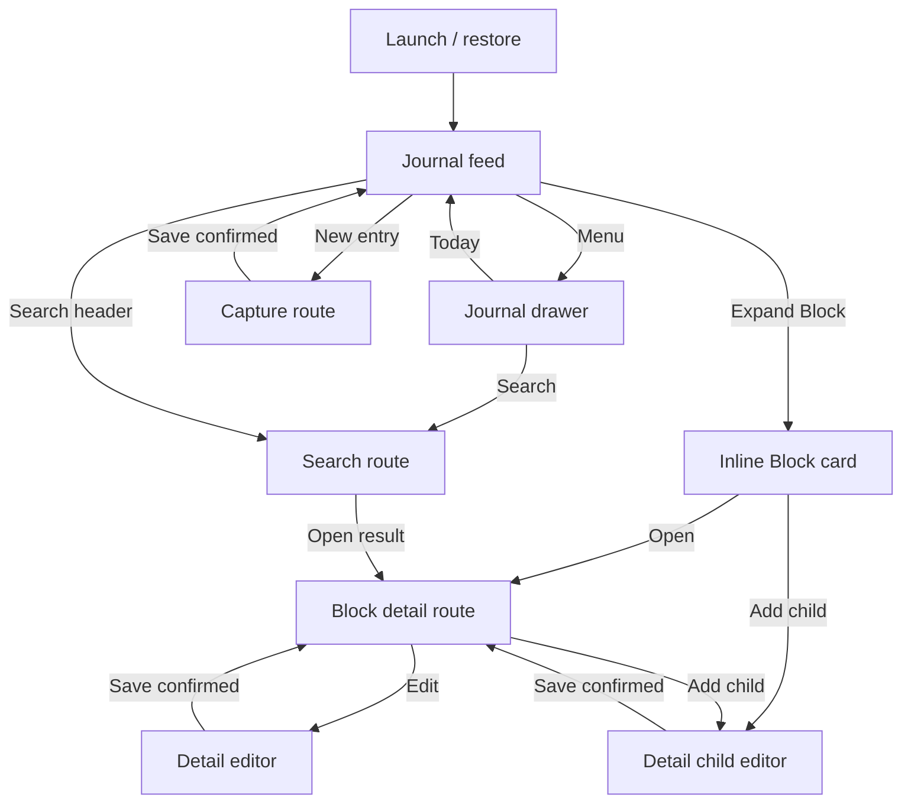

# Journal UI/UX Redesign

## Document status

| Field | Value |
| --- | --- |
| Status | Research and product design; implementation intentionally deferred |
| Date | 2026-08-07 |
| Scope | Refactor the current journal UI/UX using the `bonsai_flutter` Mail example as the primary visual and interaction reference |
| Current repository baseline | Working tree at `36d4747350f4b963824a1e0fd3bab025829e9161` |
| Reference repository baseline | `bonsai_flutter` at `2838c77a9e4235e423e8a9a5340086aa1c119801` |
| Primary implementation surface | `app/application.ml` |
| Relationship to prior design | Narrows the UI/UX direction established by `002-journal-rewrite.md`; it does not change the persistence or Worker architecture |
| Implementation effect | None. This document does not authorize source, specification, Dune, or Flutter host changes |

## Executive decision

Refactor the journal into an original, quiet, mail-inspired reading and capture
experience. Reuse the Mail example's tonal shell, rounded surfaces, dense scan
path, functional drawer, single-open inline card, sparse-extent transition,
compact detail toolbar, and restrained motion. Translate those patterns into
journal concepts rather than copying mail taxonomy or Gmail branding.

The redesign keeps the current product behavior and ownership boundaries:

- the chronological journal feed remains the home surface;
- Capture, Search, block detail, task updates, editing, child creation,
  recovery, and durable confirmation remain available;
- OCaml/Bonsai continues to own state, routes, handlers, and the declarative
  widget tree;
- Flutter remains a mechanical host and owns only renderer-local behavior;
- `Sparse_extent_list`, `Morphing_surface`, `Navigation_shell`, and the current
  bounded Worker projections remain the core infrastructure; and
- there is no one-item bottom navigation bar, placeholder destination, or
  mail-specific archive, delete, star, and swipe behavior.

The most important interaction change is to replace the current band of
textual Block actions with one predictable row anatomy. A compact Block row
has one primary expansion target and one optional task checkbox. Expansion
transforms that row into an inline outliner card with explicit `Add child` and
`Open` actions. This follows the Mail example's row-to-card model while
preserving journal semantics.

## Goals

- Make recent journal content the strongest visual element and keep chrome
  quiet.
- Make the root screen recognizably related to the Mail example without
  copying its product language or branding.
- Give every screen a clear primary action, hierarchy, and scan path.
- Reduce duplicate and competing controls in compact rows.
- Preserve stable list identity, bounded rendering, scroll position, route
  state, durable confirmation, and accessibility behavior.
- Make Capture feel immediate and central without covering feed content.
- Make Search, empty, loading, recovery, conflict, and failure states feel
  designed rather than appended.
- Support compact iPhone layouts first and retain the current centered desktop
  presentation.
- Define enough visual and behavioral detail for a later TDD implementation
  without changing code in this phase.

## Non-goals

- Changing DataScript, SQLite, Worker, recovery, or application-host
  architecture.
- Implementing direct Logseq graph interoperability.
- Reproducing Gmail branding, colors, icons, content, categories, or account
  UI.
- Adding mail concepts such as archive, trash, unread, star, reply, or swipe
  actions.
- Adding nonfunctional bottom destinations or settings placeholders.
- Implementing rich Markdown rendering, block drag-and-drop, indentation,
  reordering, backlinks, graph navigation, or a complete Logseq outliner.
- Introducing arbitrary self-measuring rows into the virtual feed.
- Changing files under `spec/` or any Dune file as part of the future visual
  refactor unless separately and explicitly requested.
- Preserving obsolete UI paths alongside the redesign. The later
  implementation should replace the old presentation rather than add a
  compatibility layer.

## Research method and sources

This design is based on source and test inspection of the current working tree
and the pinned local `bonsai_flutter` checkout. No external product screenshots
or web sources are required to make the repository-local decision.

| Source | What it established |
| --- | --- |
| `app/application.ml` | Current lifecycle, routes, feed composition, Block controls, editors, theme, semantics, and native-widget use |
| `test/feed_app_test.ml` | Existing behavioral contract for persistence, bounded feed rendering, routes, drawer state, capture, search, semantics, motion, and target sizes |
| `docs/agent-guide/002-journal-rewrite.md` | Current application architecture and already-approved Mail ownership patterns |
| `../bonsai_flutter/examples/mail/ocaml/mail.ml` | Implemented tonal palette, search header, dense rows, drawer, detail hierarchy, bounded list, inline card, and theme composition |
| `../bonsai_flutter/docs/agent-guide/002-mail-client-example_report.md` | Mail visual hierarchy, screen metrics, responsive rules, and accessibility principles |
| `../bonsai_flutter/docs/agent-guide/009-mail-inbox-expansion_report.md` | Functional drawer, bounded endless list, press feedback, gesture ownership, and rejection of one-destination bottom navigation |
| `../bonsai_flutter/docs/agent-guide/010-mail-outliner-card_report.md` | Single-open card behavior, explicit action isolation, deterministic extents, and outliner composition |
| `../bonsai_flutter/docs/agent-guide/011-mail-outliner-transition.md` | Shared sparse-list and surface transition behavior, scroll anchoring, interruption, and reduced motion |

## Current UX audit

### What is already strong

The current application is not a demo skeleton. It already has a substantial
behavioral foundation that should survive the visual refactor:

- a bounded, stable-key feed with day headings and compound continuations;
- one-open, depth-two/eight-node previews;
- stable detail routes and validated platform Back behavior;
- durable Capture, task updates, parent edits, and child creation;
- explicit saving, rejection, conflict, mutation-lock, recovery, and terminal
  states;
- debounced, bounded Unicode Search;
- safe-area-aware Capture placement and a centered `720`-pixel maximum width;
- environment-driven large-text and reduced-motion profiles;
- semantic headings, live regions, minimum targets, and deterministic test IDs;
  and
- the correct OCaml/Flutter ownership split.

These are product assets. The redesign should change their presentation and,
where specified, their interaction entry points, not weaken their guarantees.

### Current problems

| Area | Current observation | UX consequence | Redesign response |
| --- | --- | --- | --- |
| Root hierarchy | A default AppBar titled `Today` sits above a separate `Search` text button | The first screen has duplicated, weak chrome and does not resemble the Mail composition | Replace the root AppBar with one rounded journal header that contains Menu, Search, and quick Capture |
| Drawer | The shell enables a drawer whose content is only `Today`; there is no visible Menu action in the app composition | Edge-only discovery is poor and the drawer does not justify itself | Add a visible Menu target and a small set of functional journal actions; hide future items until they work |
| Block row | Expand, Open, More, checkbox, and a second textual task action share one horizontal band | The row is crowded, difficult to scan, and contains duplicate actions | Use a stable leading/main/trailing anatomy, one task control, one primary row action, and contextual card actions |
| Block summary | Content and task metadata are nested inside a text button | Journal text reads like a control label instead of primary content | Render content as styled text inside a semantic pressable region |
| Preview | Preview descendants are plain lines with no depth, connector, or grouping treatment | Hierarchy is difficult to understand | Render a bounded, read-only outliner with indentation, bullets, and quiet connectors |
| Feed grouping | Day headings, continuations, boundaries, and cards are isolated default widgets | Dates do not create a coherent reading surface | Put feed content on a rounded near-white sheet and establish day-section rhythm |
| Capture | An elevated text button floats at bottom center | It is prominent but visually generic and can feel detached from the mail-inspired shell | Use an extended lower-trailing `New entry` action with protected safe-area and list inset |
| Search route | AppBar title, body title, field, `Close`, status, and results are stacked without grouping | The route repeats labels and has no result hierarchy | Use a single search toolbar, a dedicated result surface, and designed prompt/loading/empty states |
| Capture route | AppBar `Capture` and body `Capture journal entry` repeat the same hierarchy | The editor feels like a form demo | Use a compose-style full-screen editor with Cancel, date context, and Save in one toolbar |
| Detail route | Root content, Edit, Add child, and children form a plain column | Content, metadata, actions, and hierarchy compete | Use a compact toolbar, a primary Block surface, a child-outline section, and contextual editors |
| Feedback | Notices and recovery text are inserted as plain rows | Important state is easy to miss and changes layout abruptly | Use consistent tonal banners with icon, title, supporting text, and live-region semantics |
| Empty/loading/error | Mostly plain text in a fixed body slot | System state feels unfinished | Use centered state compositions that preserve the shell and expose one relevant next action |
| Theme | The theme changes only seed/brightness; the application defines no coherent surface or type system | Default component styling dominates and Mail's quiet tonal hierarchy is absent | Add environment-selected semantic application tokens for surface, text, outline, status, shape, and type |

## Reference pattern decisions

### Adopt directly

- A very light tonal application background with a near-white primary content
  surface.
- A `56`-pixel rounded header/search surface.
- A predictable row scan path with generous targets inside a dense layout.
- A visible Menu control and settled drawer state synchronized with OCaml.
- One expanded inline card at a time.
- The same logical list index and stable key before, during, and after
  expansion.
- `Sparse_extent_list` for bounded rendering and deterministic extent
  overrides.
- `Morphing_surface` for compact-to-expanded visual continuity.
- A compact custom detail toolbar separated from content actions.
- Slide navigation into full-screen routes.
- Original muted-blue theming, quiet dividers, and low elevation.
- Motion that explains state and geometry rather than decorating them.

### Translate into journal concepts

| Mail reference | Journal translation |
| --- | --- |
| Search in mail | Search journal |
| Sender avatar | Task checkbox or neutral Block bullet |
| Sender/subject/preview | Block content plus task/child metadata |
| Timestamp | Journal day context or child count; do not invent block timestamps |
| Trailing star control | Disclosure chevron; task state remains an independent leading control |
| Expanded mail outline | Bounded descendant preview |
| Reply | Add child |
| Open | Open Block detail |
| Inbox label | Today / localized day heading |
| Compose | New entry |
| Mailbox drawer | Today, Search, and truthful graph/access status |

### Reject

- Bottom navigation with a single Journal destination.
- Placeholder Chat, Spaces, Meet, Settings, Favorites, or Tasks destinations.
- Mail-specific swipe actions. A future journal swipe design needs a separate
  product decision because destructive gestures have no current journal
  command equivalent.
- Marking anything read when expanded.
- Account avatars or an account switcher.
- Copying Gmail red or other Google brand assets.
- Arbitrary-height feed content that invalidates sparse-list geometry.
- Separate compact and expanded list children with different identity.

## Design principles

1. **Journal content is primary.** Chrome, borders, icons, and status surfaces
   should support reading rather than compete with it.
2. **One region, one primary action.** Compact rows must not expose several
   equivalent ways to open or mutate the same Block.
3. **Preview before context switch.** A row activation expands a bounded inline
   preview; full reading and editing remain on Detail.
4. **Every visible control works.** Future destinations stay hidden until their
   behavior exists.
5. **Durability remains visible.** `Saving` and `Saved` continue to reflect the
   Worker contract, not optimistic UI alone.
6. **Identity never follows position.** Block IDs, day IDs, route keys, and list
   keys remain stable through paging, expansion, filtering, and navigation.
7. **Density does not reduce accessibility.** Visual compactness is achieved
   through hierarchy and spacing, not targets smaller than `48` pixels.
8. **Bounded content stays bounded.** Feed previews truncate predictably; full
   content belongs on Detail or in an editor.

## Target information architecture



The drawer is a shell interaction, not a pushed page. Inline preview is feed
state, not route state. Capture, Search, and Detail are declarative pages.
Detail Edit and Add Child are route-local modes that prevent platform pop
until dirty state is resolved.

## Global shell

### Compact layout

Reference viewport: `390 x 844` logical pixels.

```text
┌──────────────────────────────────────┐
│  (menu)  Search journal       (+)    │  56dp pill
│                                      │
│  Today                               │  page context
│  ╭────────────────────────────────╮  │
│  │ Friday, August 7              │  │
│  │ ○ Block content…          (›)  │  │
│  │   2 children · To do           │  │
│  ├────────────────────────────────┤  │
│  │ ● Completed Block…        (›)  │  │
│  ╰────────────────────────────────╯  │
│                                      │
│                         [ New entry ]│
└──────────────────────────────────────┘
```

- The root Scaffold does not add a second standard AppBar.
- Safe-area top inset precedes the pill header.
- Horizontal page inset starts at `12` pixels on compact devices and grows to
  `24` pixels on larger windows.
- The header, section label, and rounded feed surface remain fixed in visual
  hierarchy; the feed itself owns vertical scrolling.
- The feed reserves bottom inset for the extended Capture action plus the
  platform safe area.
- The existing maximum content width remains `720` pixels and is centered on
  wider windows.

### Header

The header is one rounded surface with three zones:

1. A `48 x 48` Menu icon target that opens the drawer.
2. A flexible Search target with search icon, `Search journal` label, and
   button semantics. It opens the existing Search route; it is not a fake text
   field.
3. A `48 x 48` quick Capture target using a plus or edit glyph. It opens the
   same Capture route as the extended action.

The two Capture entry points are intentionally different in scale but not in
behavior. If product review prefers one entry point, retain the extended
action and remove the header plus; do not give the trailing circle a decorative
or inert account-avatar role.

### Drawer

The initial drawer contains only truthful, functional content:

- product header: `Logseq Journal`;
- `Today`: selected on the feed; selecting it closes the drawer and returns the
  retained feed to the top;
- `Search`: closes the drawer and opens Search;
- a non-interactive status section showing `Local data` and either
  `Read-write` or `Recovery only`; and
- the current recovery warning when applicable.

The drawer uses the Mail example's rounded selected item, quiet iconography,
scrim, edge gesture, and settled-state synchronization. The Menu control is
the discoverable entry point. Back, Escape, scrim tap, and the leading-edge
gesture close it before any route changes.

Do not render Settings, Tasks, Favorites, calendar scopes, graph switching, or
storage management until each has a real state transition and screen.

## Feed design

### Feed composition

The feed is a rounded surface containing stable day headers and Block rows.
The virtual-list contract remains unchanged:

- bounded overlapping mounted window;
- stable tagged slot keys;
- deterministic default and override extents;
- current near-tail continuation behavior;
- current 31-day/512-slot Search boundary; and
- one expanded Block preview at a time.

Day headers use a stronger title and quiet supporting context. The current
localized host heading remains authoritative when generation fencing accepts
it. The canonical page title is only a fallback.

Suggested day-header content:

- `Today`, `Yesterday`, or the localized full date as the heading;
- no repeated `Today` if the outer page context already shows it; in that case
  the first header uses the full localized date; and
- an optional Block count only when it is already present in the projection.
  The UI must not infer or display a partial count as a total.

### Compact Block row

Regular target extent: `88` pixels. Large-text target extent: `104` pixels,
subject to device verification.

```text
┌──────────────────────────────────────┐
│  ○   Plan the release notes…     ›   │
│      To do · 3 children              │
└──────────────────────────────────────┘
```

Anatomy:

- **Leading, 48 pixels:**
  - task Block: one checkbox, with selected state and a label that includes the
    Block content;
  - non-task Block: a non-interactive bullet or quiet circular marker, excluded
    from button semantics.
- **Main, flexible:**
  - Block content, maximum two lines with ellipsis;
  - one metadata line containing only true values such as `To do`, `Done`, and
    `3 children`.
- **Trailing, 48 pixels:**
  - disclosure chevron with expanded/collapsed semantics;
  - the main text region and chevron perform the same expand/collapse action.

Remove the current textual `Expand`, nested content button, `More`, duplicated
task checkbox/text button pair, and row-level action sentence. Their behavior
is replaced by the clearer anatomy above.

Task changes remain independent of expansion. Tapping the checkbox must not
expand, collapse, or navigate. The entire remaining row target expands or
collapses and provides immediate press feedback before the OCaml action is
committed.

### Expanded Block card

The compact row transforms at the same logical list index into an inset card.
At most one card is expanded.

```text
╭──────────────────────────────────────╮
│  ○  Plan the release notes…      ⌃   │
│     To do · 3 children               │
├──────────────────────────────────────┤
│  • Confirm release scope             │
│    └─ Verify signed iPhone build      │
│  • Publish the change summary        │
│  More descendants…                   │
├──────────────────────────────────────┤
│          Add child   │      Open      │
╰──────────────────────────────────────╯
```

Composition:

1. Header with the same leading marker, content hierarchy, metadata, and
   collapse chevron as the compact row.
2. Divider.
3. Read-only descendant preview with a maximum depth of two and maximum eight
   nodes, preserving the current data bound.
4. A quiet `More descendants…` label only when `has_more` is true.
5. Divider.
6. Equal `Add child` and `Open` footer actions, each at least `48` pixels high.

Preview nodes are single-line, ellipsized, and indented by depth. Decorative
bullets and connector lines are excluded from semantics. The accessibility
tree announces node content in source order and announces that the preview is
bounded when more descendants exist.

`Add child` opens Detail with the child editor active so all mutation work
remains on the dedicated route. `Open` opens normal Detail. Expansion alone
does not change task state, load full descendants, or start editing.

If the application is `Recovery only`, the card still expands and opens
Detail, while `Add child` and task mutation controls are absent rather than
disabled without explanation.

### Continuations and Search boundary

- `More blocks…` becomes a low-emphasis loading/status row with a progress
  indicator while a request is pending.
- It must not look tappable unless a manual retry handler exists.
- The terminal feed boundary becomes a rounded tonal card reading
  `Looking for something older?` with one functional `Search journal` action.
- Older-day admission and list fencing remain unchanged.

### Capture action and saved-entry notice

The primary action is an extended `New entry` button aligned to the lower
trailing edge of the centered content area. On compact devices it sits `12`
pixels above the safe area and `12` to `16` pixels from the content edge. It
uses medium elevation and a pill shape.

The existing away-from-top capture behavior remains. A confirmed capture
appears as a compact tonal banner above the feed surface:

- title: `Entry saved`;
- optional supporting line: `Added to today`;
- action: `Show`;
- live-region announcement only once; and
- no optimistic `Saved` before the durable Worker response.

## Capture route

Capture becomes a compose-style page rather than a stacked form.

```text
┌──────────────────────────────────────┐
│  Cancel        New entry        Save │
├──────────────────────────────────────┤
│  Today · Friday, August 7             │
│  ╭────────────────────────────────╮  │
│  │ Write a journal entry…         │  │
│  │                                │  │
│  │                                │  │
│  ╰────────────────────────────────╯  │
│  Saving… / validation / conflict      │
└──────────────────────────────────────┘
```

- A custom compact toolbar contains Cancel, `New entry`, and Save.
- Save is disabled for blank trimmed content and during an accepted pending
  save.
- The localized observed day is shown above the editor so the user knows which
  page receives the entry.
- The multiline editor fills the useful remaining height and remains capped at
  `65,536` UTF-8 bytes.
- If the current text-input primitive cannot display a styled hint, render a
  visible label above the field rather than adding a fake overlay that can
  diverge from input state.
- Saving, validation, queue-busy, Worker-not-ready, and content-limit feedback
  use one consistent inline status region below the editor.
- Dirty Cancel reveals an inline confirmation surface with `Keep editing` and
  destructive `Discard`. It does not push another page or use a dead modal.
- The page remains non-poppable while a dirty draft, discard decision, or save
  is unresolved.

## Search route

Search uses one top search surface rather than an AppBar title plus repeated
body title.

```text
┌──────────────────────────────────────┐
│  ‹  Search journal…              ×   │
├──────────────────────────────────────┤
│  Friday, August 7                     │
│  Release notes and signed build…  ›   │
├──────────────────────────────────────┤
│  Thursday, August 6                   │
│  Earlier matching Block…          ›   │
└──────────────────────────────────────┘
```

- Back closes Search and restores the feed.
- The existing revisioned field, `250 ms` debounce, Unicode normalization,
  query limits, candidate continuation, result cap, and stale-request fencing
  remain unchanged.
- A clear action empties the query and returns to the prompt state.
- Results use stable keys and a dense two- or three-line row: localized day,
  title/snippet, and detail chevron.
- Tapping a Block result opens Detail. A page-only result is presented as
  non-interactive until a day-navigation behavior exists; it must not resemble
  an enabled button.
- Search state has designed variants:
  - prompt: search icon plus `Search journal entries`;
  - searching: compact progress and live-region label;
  - empty: `No entries found` plus query-preserving guidance;
  - partial: results remain visible with one `Continue search` action;
  - failed: error banner with Retry only when a real retry handler exists.
- Results must scroll independently and stay usable at the maximum `50`
  results. They must not be appended to an unbounded static Column.

## Block Detail route

Detail uses the same tonal background as the feed with a compact custom
toolbar:

- Back;
- title `Block` or a localized journal-day context;
- Edit when read-write and no editor is active; and
- no duplicated `More` action.

The content is organized into three regions:

1. **Primary Block surface**
   - full root content with comfortable line height;
   - task state and child-count metadata;
   - one task checkbox when applicable and writable;
   - no feed truncation.
2. **Children section**
   - heading `Children` with count only if it is a known total;
   - bounded immediate children rendered as an outliner or separated rows;
   - a functional `Load more` action when continuation is supported;
   - otherwise omit the current inert-looking `More children…` affordance.
3. **Primary actions**
   - `Add child` as the main contextual action;
   - Edit stays in the toolbar to avoid a row of competing text buttons.

Loading Detail preserves the same page shell and uses a skeleton-like tonal
Block surface or a centered compact progress state. It should not flash back
to an unrelated plain page.

### Detail Edit and Add Child

Edit replaces the primary Block surface with the revisioned multiline editor.
Add Child inserts a visually nested editor beneath the root Block. Both share
the Capture route's Save, Cancel, validation, saving, conflict, and discard
components.

Conflict presentation includes:

- title `This Block changed`;
- the latest saved content in a read-only tonal surface;
- the user's draft retained in the editor;
- explicit next actions defined by the existing conflict policy; and
- live-region announcement without reading the full content twice.

Back remains disabled while an editor is active. Cancel resolves clean versus
dirty state exactly as it does today.

## System states

All lifecycle states render inside the same root shell so the app does not
visually jump between unrelated compositions.

| State | Presentation | Primary action |
| --- | --- | --- |
| Opening | Header shell plus centered compact progress and `Opening journal` | None |
| Loading | Feed surface skeleton/status and `Loading journal` | None |
| Empty, read-write | Friendly empty surface explaining that today has no entries | `New entry` |
| Empty, recovery-only | Read-only empty surface with recovery explanation | None |
| Recovery only | Persistent warning banner; read actions remain available | None unless a real recovery workflow is later added |
| Mutation locked | High-emphasis warning card explaining that stored content exceeds the supported limit | `Open Block` only if safe and implemented |
| Terminal, restart not required | Error surface with concise reason | Retry only when implemented |
| Terminal, restart required | Error surface with `Restart required` and no false recovery action | None |
| Queue busy / Worker unavailable | Route-local status that retains the draft | Retry Save through the existing Save action when admission becomes possible |

Warnings use icon, title, text, and semantics. Color is supporting information,
not the only signal.

## Visual system

The palette is original but deliberately close in mood to the Mail example.
Values are initial implementation tokens and must pass automated contrast and
device review before being treated as final.

### Color tokens

| Role | Light | Dark | Use |
| --- | --- | --- | --- |
| App background | `#F1F6FB` | `#111418` | Root tonal canvas |
| Primary surface | `#FDFDFF` | `#181C21` | Feed sheet and page content |
| Raised surface | `#FFFFFF` | `#20252B` | Header, expanded card, editor |
| Primary | `#435F8A` | `#ABC7F5` | Selected actions and focus |
| Primary container | `#DCE7F8` | `#2B466D` | Selected drawer row and quiet banners |
| Text primary | `#1C2026` | `#E2E6EC` | Main content |
| Text secondary | `#5B636E` | `#BCC4CF` | Metadata and helper copy |
| Outline/divider | `#D9E1EA` | `#404852` | Section boundaries and outliner connectors |
| Success | `#4F7D58` | `#A3D3A8` | Durable success support color |
| Error | `#BA1A1A` | `#FFB4AB` | Validation, terminal, and destructive confirmation |

Environment brightness selects the application token set. High contrast and
invert colors must continue to select dedicated accessible tokens rather than
reusing the normal light palette.

### Typography

| Role | Starting style |
| --- | --- |
| Page context | `20sp`, semibold, `1.2` line height |
| Day heading | `16sp`, semibold, `1.25` line height |
| Block content | `15sp`, regular or medium for a pending task, `1.3` line height |
| Block metadata | `12sp`, regular, secondary color |
| Detail Block | `20sp`, medium, `1.4` line height |
| Editor text | `17sp`, regular, `1.45` line height |
| Button label | `14sp`, medium |
| Status/supporting text | `13sp`, regular, `1.35` line height |

Bold-text accessibility should increase weight without causing every Block to
look selected. Text scale may increase row and header extents through the
existing environment profile; feed content remains capped and ellipsized,
while Detail and editors expand vertically.

### Spacing, shape, and elevation

- Base spacing unit: `4` pixels.
- Compact page inset: `12`; regular page inset: `24`.
- Header height: `56`; header radius: `28`.
- Feed surface radius: `24` to `28`.
- Expanded card radius: `20`.
- Banner and editor radius: `16` to `20`.
- Compact row horizontal padding: `12` to `16`.
- Minimum action target: `48 x 48`.
- Feed surface elevation: `0` or `1`.
- Expanded card elevation: `2` to `3`.
- Capture action elevation: `3` to `6`, tuned against the card.

Use elevation sparingly. Shape and tonal difference should do most grouping.

## Motion and gesture behavior

### Inline expansion

- Expansion target duration: `220 ms`, `easeOutCubic`.
- Collapse target duration: `190` to `220 ms`, `easeInOutCubic` or the current
  accepted collapse curve after device review.
- The activated header remains the preferred scroll anchor.
- Compact content fades out early; descendant preview and footer enter after
  the surface has begun expanding.
- Accordion switches animate old collapse and new expansion concurrently.
- A new target starts from the current interpolated state rather than snapping.
- Direct scrolling takes priority over animation anchoring.

These values refine, but do not replace, the current environment-aware
`Sparse_extent_list.Transition` contract.

### Navigation

- Capture, Search, and Detail use the existing Slide transition.
- Platform Back pops only the actual top page key.
- Drawer Back/Escape is consumed locally before route Back.
- The root feed never animates as a replacement page after returning from
  Detail; retained list and expansion state become visible again.

### Reduced motion

When reduced motion, disabled animations, or accessible navigation is active:

- list and surface geometry resolve directly to the committed endpoint;
- press feedback remains visible;
- routes may use the framework's reduced transition behavior;
- no functionality, focus order, or semantics change; and
- outgoing visual trees do not remain in hit testing or accessibility.

## Responsive behavior

| Width | Behavior |
| --- | --- |
| `< 600` | Compact single-column pages, `12`-pixel outer inset, full-width route content |
| `600-839` | Centered single column, `20-24`-pixel outer inset, content capped at `720` |
| `>= 840` | Centered `720`-pixel reading column; drawer and routes remain single-column in the first refactor |

A permanent split Feed/Detail view is deferred. Adding it would change route,
selection, focus, and restoration behavior and deserves a separate design.

Landscape compact-height layouts keep the header compact and let the feed or
editor own the available vertical space. The Capture action must never cover
the last reachable row because bottom content inset is derived from its actual
footprint plus safe area.

## Accessibility specification

- Preserve all existing deterministic test IDs or intentionally rename them in
  one coordinated test-first change; do not keep duplicate old UI solely for
  test compatibility.
- Header Menu, Search, quick Capture, extended Capture, checkbox, disclosure,
  Add Child, Open, Back, Edit, Save, Cancel, Keep Editing, and Discard all expose
  explicit button roles and labels.
- A compact Block exposes content as its label and task state, child count,
  durability state, and expansion state as values or concise hints.
- Expanded and collapsed state is explicit and not inferred only from chevron
  direction.
- Day headings use header semantics with level two. Route titles use level one
  where the API supports it.
- Decorative bullets, connector lines, dividers, and progress backgrounds are
  excluded from semantics.
- Every interactive target is at least `48 x 48` even where the visible icon is
  smaller.
- Focus order follows visual reading order. Nested checkbox and disclosure
  actions do not cause the whole Block to announce twice.
- Live regions are limited to state changes: opening/loading, searching,
  durable save confirmation, save failure, conflict, and terminal errors.
- Success, task, selected, warning, and error states never depend on color
  alone.
- High contrast, invert colors, bold text, text scale, safe area, accessible
  navigation, and reduced motion remain covered by headless and renderer tests.

## Architecture and ownership

The visual refactor does not move state across runtime boundaries.

| Owner | UI/UX responsibilities after redesign |
| --- | --- |
| OCaml/Bonsai | Routes, drawer target state, selected/expanded Block, feed window, visual tokens selected from environment, semantic labels, editor state, request state, and target widget tree |
| Flutter renderer | Retained scroll/text/focus controllers, drawer gesture progress, press feedback, transition interpolation, hit testing, safe-area realization, and accessibility mapping |
| Worker Domain | Durable journal data, bounded projections, mutations, queries, and confirmations; no visual state |
| Host adapter | Calendar formatting, application path, lifecycle, and platform events; no journal reducer or UI composition |

No app-specific monolithic Dart widget should be introduced. The target design
is expressible from the reusable primitives already demonstrated by Mail:

- styled text and decoration;
- `Navigation_shell`;
- `Sparse_extent_list`;
- `Morphing_surface`;
- Material cards, dividers, buttons, checkbox, and text field;
- page/navigator;
- semantics; and
- environment-driven theme selection.

Before implementation, verify whether the pinned text-field and AppBar APIs
now expose the needed label, decoration, action, and layout capabilities. If a
gap remains, prefer composing a custom toolbar/header from existing typed
widgets. Add a renderer primitive only when it is generic, typed, and useful
beyond this application.

## State and interaction invariants

- At most one feed Block is expanded.
- Expansion and Detail route selection are independent; Back from Detail
  restores the same card and feed offset.
- Checkbox activation changes only task state.
- Main compact-row activation changes only expansion state and preview loading.
- `Add child` and `Open` are separate card-footer actions.
- Changing route never creates a second feed model or loses the retained feed
  window.
- A Block that leaves the active feed projection cannot remain expanded.
- A pending mutation disables only conflicting mutation targets, not unrelated
  read or navigation actions.
- Saving is announced only after the durable response.
- Drafts survive rejection and conflict.
- A dirty editor cannot be dismissed by platform pop without explicit
  resolution.
- Drawer open/closed state reflects settled Flutter state; per-frame gesture
  progress does not cross FFI.
- Page-only Search results are not styled as interactive until navigation to a
  day exists.
- Recovery mode removes or explains mutation actions while preserving reading,
  Search, preview, and Detail.

## Future implementation slices

This is not an implementation plan, but the design has natural verification
boundaries for a later test-driven change:

1. Application tokens and the root tonal shell.
2. Functional header and drawer.
3. Compact Block anatomy with removal of duplicate actions.
4. Expanded outliner card and transition tuning.
5. Capture route composition and shared editor status components.
6. Search result composition and scrolling.
7. Detail, Edit, and Add Child composition.
8. Complete lifecycle, accessibility, responsive, and device visual QA.

The later plan should write failing behavior or structural tests before each
slice and should update obsolete expectations instead of preserving the old
widget tree.

## Visual QA matrix

The later implementation is not complete until the following states have been
captured and reviewed at minimum:

| Viewport/environment | Required captures |
| --- | --- |
| `390 x 844`, light | Feed, expanded card, drawer, Capture, Search results, Detail |
| `390 x 844`, dark | Feed, expanded card, editor, warning/error |
| Compact, text scale `1.3+` | Feed rows, expanded card, Capture, Detail |
| Compact, reduced motion | Expansion endpoints and route behavior |
| Compact, high contrast | Feed, controls, banners, editor focus |
| `720+`-pixel content window | Centered Feed, drawer, Search, Detail |
| Recovery only | Feed, expanded card, Detail, absence of mutation actions |
| Failure/conflict | Save rejected, edit conflict, mutation locked, restart required |

Review criteria include hierarchy, clipping, ellipsis, touch reachability,
safe-area clearance, scroll restoration, connector alignment, focus order,
contrast, and whether the result feels like the same product across all routes.

## Acceptance criteria

The eventual UI implementation satisfies this design when:

- the root screen uses the rounded tonal journal shell and no duplicated
  standard AppBar/Search hierarchy;
- the visual relationship to the Mail example is clear while all language,
  data, color, and actions remain journal-specific and original;
- every compact Block has the defined leading/main/trailing scan path;
- duplicate Expand/Open/More/task controls from the current row are removed;
- one Block expands inline at a stable list index into a bounded outliner card;
- expansion, Detail navigation, task mutation, Add Child, and Open remain
  isolated actions;
- Capture, Search, Detail, Edit, and Add Child use a consistent route and editor
  language;
- the drawer has a visible Menu entry point and only functional content;
- no one-destination bottom bar or placeholder destination is present;
- all lifecycle, durability, conflict, recovery, and terminal states have
  designed presentations without false actions;
- the existing Worker, persistence, routing, bounded-list, and stale-response
  guarantees still pass;
- compact, wide, dark, large-text, high-contrast, invert-color, safe-area, and
  reduced-motion behavior passes automated and manual review; and
- no compatibility layer retains the obsolete widget hierarchy.

## Resolved product choices

- **Primary root pattern:** rounded Mail-style header plus rounded feed surface.
- **Primary row action:** expand/collapse inline preview.
- **Detail entry:** explicit `Open` from the expanded card.
- **Task action:** one leading checkbox, never a duplicate text action.
- **Capture placement:** extended lower-trailing action plus an optional header
  shortcut with identical behavior.
- **Bottom navigation:** omitted because there is only one app-level
  destination.
- **Drawer:** retained, made discoverable, and limited to functional actions.
- **Dark mode:** included through explicit environment-selected tokens rather
  than deferred.
- **Destructive swipe:** omitted pending a separate journal-specific decision.
- **Arbitrary row height:** rejected; bounded deterministic extents remain.

## Remaining validation questions

These do not block the design document, but they must be answered through a
prototype and device review before final tuning:

- Whether the header quick Capture action is useful alongside the extended
  action or should be removed.
- Whether `88` and `104` pixels are sufficient for two-line Block content at
  the supported text scales.
- Whether the expanded card footer is reachable enough without automatic
  scrolling on the smallest physical iPhone target.
- Whether the dark palette and status tokens meet the project's required
  contrast ratios in the actual Flutter renderer.
- Whether current press feedback is perceptible before the expansion frame on
  a physical device.
- Whether the existing Detail projection can truthfully expose a total child
  count and functional continuation, or whether count/continuation UI must be
  omitted in the first visual slice.
