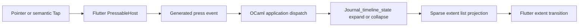

# Journal Row Disclosure and Capture Interaction

Status: Selected direction; implementation pending

Date: 2026-08-10

Selected Capture concept: **A — Center Orb**

Concept image:
[option-a-center-orb.png](assets/008-capture-ui-options/option-a-center-orb.png)

## Objective

Revise the Journal timeline interaction shown in the supplied `390 x 844`
reference image so that:

1. a task-status control remains an independent action that toggles task state;
2. the remainder of a parent row becomes one action that expands or collapses
   its direct children;
3. every enabled activation control provides visible press feedback;
4. the Capture `+` action becomes a refined bottom-center orb; and
5. trailing timestamps become visually quieter without losing readable or
   truthful semantics.

The supplied image has SHA-256
`95aa0807dac22b2a2917ee22137118033947921715d3a446e56d020948149f6a`.
The annotated point at approximately `(47.1%, 16.1%)` falls inside the first
parent row and illustrates the desired whole-row disclosure target.

## Executive decision

Adopt two mutually exclusive activation regions for a parent task row:

| Region | Activation | Visual feedback | Semantics |
| --- | --- | --- | --- |
| Task-status target | Toggle `Todo` and `Done` | Local pressed overlay | Checkbox with checked state |
| Remaining row body | Toggle direct children | Row-surface pressed overlay, followed by the existing extent transition | Button with `Collapsed` or `Expanded` textual value |

The remaining row body includes source text, disclosure glyph, child-count
badge, timestamp, and whitespace. The disclosure glyph and count remain visible
state indicators, but stop being a separate target. The source text and
timestamp also stop opening Detail.

For a row whose durable `child_count` is zero, the body is static rather than a
no-op button. It exposes no Tap action and shows no press feedback. This is the
only truthful interpretation of “expand children”: querying or animating a row
known to have no children would present a false affordance. If the product
requires every leaf row to remain actionable, it must define a separate leaf
outcome before implementation.

This decision intentionally replaces the Timeline row-to-Detail entry point.
No hidden tap zone, fallback to Detail, double-tap behavior, or long-press
compatibility path should remain. A new visible Detail affordance, if still
required, needs a separate product decision because the requested row anatomy
permits only task toggle and children toggle.

## Capture UX decision

Option A, **Center Orb**, is the selected Capture direction. It supersedes the
labeled Capture pill, fixed bottom shelf, and Expandable Quick Composer
concepts. The control remains one focused shortcut into the existing durable
full-screen Capture flow.

### Interaction contract

1. The visual is a 48-point dark Capture orb inside a 56-point target,
   horizontally centered 16 points above the bottom SafeArea.
2. The fill remains the current dark navy, with a crisp centered plus and a
   restrained two-layer shadow. There is no persistent outer halo.
3. Pointer down shows the existing pressed overlay immediately. Activation is
   emitted once after the normal 80 ms release feedback and opens the existing
   full-screen Capture route.
4. A drag cancels pressed feedback and activation. Rapid repeated Tap while
   activation is pending opens only one Capture route.
5. Semantic Tap uses the same feedback and single-activation path, with label
   `Capture` and hint `Create a new journal entry`.
6. Reduced motion removes the release delay while retaining feedback for the
   duration of a held pointer.
7. RTL does not mirror the control because the horizontal center is
   direction-neutral.

### Route consequence

The existing full-screen `Capture` route, `Journal_capture` reducer, IME state,
task-state selector, dirty-draft confirmation, Worker admission, retry,
recovery, restoration, and durable commit flow remain authoritative. Only the
Timeline entry control's geometry and styling change.

## Scope

### In scope

- Timeline parent-row hit regions, semantics, handlers, and disclosure state.
- Visible press feedback for every enabled action in the application.
- Bottom-center Center Orb geometry, press feedback, SafeArea ownership, route
  admission, and final-row clearance.
- Timestamp typography and palette hierarchy.
- Compact, adaptive, RTL, reduced-motion, dark, and high-contrast behavior.
- OCaml view tests, state tests, compiled-runtime integration tests, Flutter
  interaction tests, and the real-runtime golden.

### Out of scope

- A replacement Detail or Edit affordance.
- Changes to Detail, storage, schema, or task-state durability.
- New formal expanded semantics; the pinned public API still exposes textual
  state rather than a typed expanded trait.
- Menu and More activation. They remain nonactionable visual shells.
- Alternative Capture concepts B, C, and D.
- Any Dune or `spec/` file change.

## Current implementation findings

### Ownership and event flow

The row-disclosure event flow remains entirely inside the existing OCaml-owned
product tree and public generated-host primitives:



- `app/journal_row.ml` currently creates three distinct row actions: task,
  disclosure, and source/open.
- `app/journal_timeline.ml` maps those actions to block IDs.
- `app/application.ml` maps `timeline-disclosure:<id>` to inline child state and
  `timeline-open:<id>` to Detail navigation.
- `app/journal_timeline_state.ml` already owns bounded child expansion,
  collapse, pagination, stable slots, and animated extent geometry.
- `PressableHost` in the pinned `bonsai_flutter` dependency paints a pressed
  overlay on pointer down, cancels it on a drag, keeps it through an 80 ms
  release delay, suppresses duplicate activation, and lets a nested action win.
- Application page actions use Flutter `TextButton`, which supplies Material
  pressed/hover/focus reactions. Disabled actions have no callback or Tap
  semantics.

The row interaction and Center Orb need no Dart Journal widget, protocol
extension, native widget, or framework change. The existing public Pressable,
Stack overlay, alignment, SafeArea, shadow composition, and route primitives
cover the selected design.

### Current defects relative to the request

| Area | Current behavior | Required behavior |
| --- | --- | --- |
| Source region | Opens Detail | Toggles direct children as part of the row body |
| Disclosure/count | Separate 44-point action | Passive indicator inside the row-body action |
| Timestamp | Static metadata outside the source action | Metadata inside the row-body action |
| Task status | Independent action overlaid on the row | Remains independent and must not trigger row disclosure |
| Capture UX | Bottom logical-end 44-point orb | Refined bottom-center 48-point orb opening the existing Capture route |
| Timestamp hierarchy | Uses the shared 14-point supporting token and `text_secondary` | Uses a quieter timestamp-specific token |

### Interaction research

The chosen design follows the capabilities and constraints of the existing
renderer:

- Flutter documents `InkWell` as a rectangular Material region that visibly
  reacts to touch. The local `PressableHost` provides the equivalent bounded
  overlay response without requiring a new Material subtree.
- Flutter recommends at least `48 x 48` dp on Android and `44 x 44` points on
  iOS for tap targets. The project already uses a 44-point minimum and a
  56-point Capture target.
- Flutter accessibility guidance recommends testing target size, labels, and
  contrast. The design therefore keeps the 44-point task target, labels the one
  row-body action, and keeps the full source and time in semantics even while
  reducing the timestamp's visual emphasis.
- The local Pressable implementation honors `MediaQuery.disableAnimations` by
  removing the release delay while retaining immediate down-state feedback.
  The sparse-list transition already becomes duration zero under reduced
  motion.

Primary references:

- [Flutter InkWell API](https://api.flutter.dev/flutter/material/InkWell-class.html)
- [Flutter UI accessibility design guidance](https://docs.flutter.dev/ui/accessibility/ui-design-and-styling)
- [Flutter accessibility testing guidance](https://docs.flutter.dev/ui/accessibility/accessibility-testing)
- `/Users/rcmerci/gh-repos/bonsai_flutter/flutter/packages/bonsai_flutter/lib/src/renderer/pressable_host.dart`
- `/Users/rcmerci/gh-repos/bonsai_flutter/flutter/packages/bonsai_flutter/test/pressable_test.dart`

## Detailed interaction design

### Parent rows

A parent row has one row-body Pressable and, when it is a task, one task
Pressable layered above it. Their effective hit regions must not overlap.

The row-body target spans the row's content area and includes the trailing time
slot. For a task row, reserve the task target at logical start and begin the
row-body hit region after that target. Adjust the source inset as needed so the
44-point task target does not overlap the first source characters. The 14-point
task glyph remains visually compact inside its larger target.

Activation behavior is a toggle:

- collapsed parent: set the parent expanded and request the first bounded child
  page through the existing state machine;
- expanded parent: collapse immediately and ignore any later response for the
  no-longer-expanded projection;
- pending expansion: preserve existing request fencing and suppress repeated
  activation while the Pressable release is pending.

The existing right/down disclosure glyph in LTR and mirrored right/down glyph
in RTL remains. It changes synchronously with `expanded`; inserted or removed
child extents continue to animate for 180 ms using the existing transition.

### Leaf rows

A `child_count = 0` row renders source and timestamp as static content. A task
leaf still has the independent checkbox target. The remaining body has no
button role, no Tap action, no focus stop, no pressed overlay, and no disclosure
glyph.

The application dispatch must also guard against a stale or forged toggle for a
leaf. It should look up the current block and ignore the action unless
`Journal_model.child_count block > 0`. This prevents the existing `expand`
function from inserting an unnecessary children continuation for a known leaf.

### Semantics and focus order

For a collapsed parent body:

- label: `<full source>, created at <HH:MM>`;
- role: Button;
- hint: `Show direct child blocks`;
- value: `Collapsed`;
- action: Tap.

For an expanded parent, change the hint to `Hide direct child blocks` and the
value to `Expanded`. Do not expose a second actionable disclosure node.

The task target keeps its Checkbox role, checked state, task-specific label,
and Tap action. Logical focus order is task first and row body second. A leaf
body remains readable as static semantics after the optional task target.

The public semantics API does not provide a typed expanded/collapsed property,
so no fake formal trait or action is introduced.

### Press-feedback contract

“Clickable” means an enabled activation control with a pointer or semantic Tap
action. Scroll surfaces, selectable/editable text, and disabled buttons are not
activation controls for this requirement.

Every enabled activation control must use one of these existing feedback paths:

| Control family | Primitive | Required feedback |
| --- | --- | --- |
| Parent row body | `Ui.Widget.pressable` | Full target overlay on down and through release delay |
| Task status | `Ui.Widget.pressable` | Local target overlay |
| Center Orb | `Ui.Widget.pressable` | Overlay clipped to the 56-point target before route admission |
| Detail/dialog actions | `Ui.Material.text_button` via `action_target` | Flutter Material pressed, hover, and focus reaction |

Use `Journal_visual_tokens.interaction.pressed` for all custom Pressables and
`Journal_visual_tokens.motion.press_release_ms` for their release timing. Normal
motion remains 80 ms. Reduced motion uses zero release delay and zero extent
transition duration, but immediate pointer-down feedback remains visible while
the pointer is held.

Do not nest two handlers over the same geometry, add a transparent Gesture
target, or dispatch before the visible down state is rendered.

## Visual design

### Center Orb

Replace the logical-leading/logical-trailing positioning branch with one
direction-neutral overlay:

1. give the overlay the available content width with logical `left = 0` and
   `right = 0`;
2. align the 56-point Capture target with
   `Ui.Layout.Alignment.Bottom_center`;
3. keep `fab_bottom_inset = 16` and the existing bottom-only SafeArea;
4. increase the visual circle from 44 to 48 points while retaining the
   independent 56-point target;
5. center a thin 20-point plus glyph in the visual circle;
6. use two restrained shadow layers without a permanent halo;
7. preserve explicit sparse-list bottom clearance; and
8. remove `fab_horizontal_inset` from the public token record and all tests.

The target must share the content viewport center in LTR and RTL. On the
reference `390`-point viewport without wide-content padding, the expected x
coordinate is `195` logical pixels.

Pressed feedback is the existing bounded overlay rather than a scale or morph
effect. This keeps pointer, semantic Tap, cancellation, rapid activation, and
reduced-motion behavior inside the pinned public Pressable contract. The route
transition continues to own the visual change after activation.

### Timestamp de-emphasis

Introduce timestamp-specific tokens instead of applying opacity to the entire
slot:

| Token | Light | Dark | Light high contrast | Dark high contrast |
| --- | --- | --- | --- | --- |
| `text_timestamp` | `#6E7388` | `#979CB1` | Same as `text_secondary` (`#313131`) | Same as `text_secondary` (`#E1E1E1`) |
| `typography.timestamp` | 13/18, Normal | 13/18, Normal | 13/18, Normal | 13/18, Normal |

`#6E7388` against the current `#FDFDFD` light background is approximately
`4.62:1`, preserving the 4.5:1 small-text target while being quieter than the
current 14-point `#656B8F` supporting style. Dark normal mode remains above the
same target. High-contrast palettes deliberately do not weaken the existing
secondary color.

Keep `time_slot_width` unchanged so every row retains one stable trailing
column. Keep the timestamp in the parent row's accessible label and in leaf
static semantics. Do not weaken the day-heading or disclosure/count styles as
part of this change.

## Implementation design

### `app/journal_visual_tokens.mli` and `.ml`

- Add `text_timestamp` to `palette`.
- Add `timestamp` to `typography` with the values above.
- Remove `fab_horizontal_inset` from `hit_regions`.
- Change `fab_visual` from 44 to 48 while preserving the independent 56-point
  `fab_target`.
- Preserve `fab_bottom_inset`, press and route motion durations, row extents,
  and time-slot width.

### `app/journal_row.mli` and `.ml`

- Replace `on_disclosure` and `on_open` with one `on_toggle_children` handler.
- Refactor `disclosure_control` into a passive disclosure indicator with no
  Pressable, semantics action, or independent target ID.
- Replace the source-only open Pressable with a parent-only row-body Pressable
  containing source, passive disclosure/count, timestamp, and whitespace.
- Keep task status as the only overlaid independent target and give task and row
  bodies nonoverlapping hit geometry.
- Replace `journal-row-open:*` and `journal-row-disclosure:*` action IDs with one
  `journal-row-toggle-children:*` ID.
- Preserve stable outer row keys, fixed extents, divider placement, source
  ellipsis, full-source semantics, adaptive stacked layout, and RTL layout.
- Apply `typography.timestamp` and `palette.text_timestamp` only in `time_slot`.

### `app/journal_timeline.mli` and `.ml`

- Replace `on_disclosure` and `on_open` inputs with
  `on_toggle_children`.
- Bind the one handler to the block ID for parent rows.
- Preserve focus restoration with a dedicated non-navigating focus-change
  handler; remove the misleading reuse of `on_open`.
- Do not alter sparse-list keys, extents, overscan, or child projections.

### `app/application.ml`

- Rename the action namespace to `timeline-toggle-children:<block-id>`.
- Guard the action with a current block lookup and `child_count > 0`.
- Reuse the existing expand/collapse/request-fencing branch.
- Remove the `timeline-open:<block-id>` Timeline dispatch branch. Do not route a
  row-body Tap to Detail as a fallback.
- Preserve `open-capture` and the existing Capture route, reducer, editor,
  task-state, submission, retry, dirty-cancel, and commit behavior.
- Position the one Center Orb target in a bottom-center overlay independent of
  RTL and retain final-row bottom clearance.
- Update the circle, plus, and shadow geometry without changing route
  admission or Capture state ownership.
- Audit every `action_target` call and preserve Material feedback for enabled
  buttons. Disabled controls must remain nonactionable.

No `Journal_routes`, `Journal_capture`, `Journal_model`, repository, storage,
Worker, schema, generated Flutter host, Dune, `spec/`, or `bonsai_flutter`
dependency change is required.

## Test-first implementation sequence

### 1. Row anatomy and semantics

Update `test/journal_semantics_test.ml` first and observe failures for the old
three-action anatomy. Then require:

- one task action plus one row-body action for a parent task row;
- one row-body action for a non-task parent row;
- one task action and static body for a task leaf;
- no Tap action for a plain leaf;
- no disclosure target semantics or test ID;
- parent labels, hints, textual state, focus order, pressed token, compact,
  adaptive, LTR, and RTL anatomy; and
- task activation increments only the task counter while row activation
  increments only the toggle counter.

### 2. Application dispatch and state safety

Update `test/application_view_test.ml` and
`test/journal_timeline_state_test.ml` to require:

- collapsed parent row Tap requests and shows children;
- second parent row Tap collapses them;
- task Tap never expands or collapses;
- a leaf toggle event cannot create a `Children_continuation` or Worker request;
- a response arriving after collapse does not reopen the parent; and
- the old disclosure/open action IDs and Timeline-to-Detail assertions are
  removed rather than kept as compatibility tests.

Detail reducer tests that construct Detail directly may remain, but no test may
claim that a Timeline row still opens Detail.

### 3. Press feedback

Retain the dependency's Pressable host suite and add app-level Flutter evidence
for representative controls:

- hold a parent row and observe the row overlay before any toggle event;
- hold the task target and observe only local feedback and one task event;
- hold Center Orb and observe feedback before route admission;
- verify the target opens one Capture route even under rapid repeated Tap;
- press one enabled `action_target` and observe a Material pressed state; and
- verify reduced motion removes release/extent delays without removing the
  held down state.

The test must also cover drag cancellation and rapid duplicate activation for
the parent row, either directly or by relying on the pinned dependency test plus
one compiled-runtime assertion.

### 4. Center Orb behavior and geometry

Update `test/application_view_test.ml`,
`flutter/integration_test/journal_runtime_flow_test.dart`, and
`flutter/test/journal_runtime_golden_test.dart` to require:

- Center Orb center equals the content center in LTR and RTL;
- no logical-start/logical-end placement expectation remains;
- geometry is 48 visual/56 target with a centered 20-point plus;
- the target clears the bottom SafeArea;
- initially visible timestamps are not obscured; and
- the final row can scroll above the centered overlay.

Preserve the existing end-to-end route tests for autofocus, literal text and
composing-range retention, task-state cycling, blank Save, durable Save, Saving,
Retry, dirty-cancel confirmation, Back, background/foreground, runtime
replacement, and restoration. Only the Timeline entry geometry and its route
admission assertions change.

### 5. Timestamp hierarchy

Update `test/journal_adaptive_test.ml` and row/golden tests to require:

- exact normal and high-contrast timestamp palette values;
- 13/18 Normal timestamp typography;
- at least 4.5:1 normal-mode contrast;
- unchanged stable time-slot width and alignment; and
- the full timestamp remains present in semantics.

### 6. Visual evidence

Regenerate `flutter/test/goldens/journal-reference-alignment.png` only after the
geometry and token tests pass. Review a `390 x 844` screenshot for:

- the selected Option A bottom-center Center Orb;
- 48-point visual, 56-point target, plus centering, and restrained shadow;
- parent-wide pressed surface;
- task/row target separation;
- passive disclosure/count placement;
- quieter but readable timestamps; and
- unchanged row rhythm, divider, safe-area, and final-row clearance.

## Acceptance criteria

1. Tapping task status changes only task state.
2. Tapping source, passive disclosure/count, timestamp, or whitespace in a
   parent row invokes exactly one shared children toggle.
3. A leaf body is not advertised or rendered as an action.
4. No `journal-row-open:*`, actionable `journal-row-disclosure:*`,
   `timeline-open:*`, or `fab_horizontal_inset` implementation path remains.
5. Every enabled activation control shows pressed feedback before activation;
   disabled controls do not claim Tap semantics.
6. Normal motion uses 80 ms press release and 180 ms child extent transition;
   reduced motion uses zero-duration release/extent transitions while retaining
   pointer-down feedback.
7. Center Orb is horizontally centered in LTR and RTL, remains 48 points
   visually inside a 56-point target, clears the safe bottom, and does not
   prevent the final row from scrolling clear.
8. Timestamps use timestamp-specific 13/18 typography and palette values,
   maintain normal small-text contrast, preserve high-contrast readability,
   and remain in semantics.
9. Compact/adaptive, Dynamic Type through 3.2, LTR/RTL, light/dark,
   high-contrast, empty/loading, and bounded child paging behavior remain
   mechanically valid.
10. The existing full-screen Capture route preserves literal IME state,
    optional task state, action-time calendar capture, dirty-draft
    confirmation, retry, recovery, restoration, and durable commit behavior.
11. No project-local Dart product widget, private registry patch, framework
    change, Dune change, `spec/` change, fallback behavior, or compatibility
    action namespace is added.

## Verification commands

Run the focused OCaml tests first, then the full project gates used by the
existing acceptance documents:

```sh
opam exec -- dune runtest
cd flutter && flutter analyze --no-pub
cd flutter && flutter test test/application_host_adapter_test.dart test/widget_test.dart
bonsai-flutter sync-project --check
bonsai-flutter sync-host --check
git diff --check
```

Run the existing wrapped compiled-runtime integration suite and the opt-in real
OCaml golden using the repository's current documented commands/environment.
Complete physical iPhone and release macOS checks for pointer/keyboard feedback,
VoiceOver labels and state, safe areas, and reduced motion before release.

## Risks and mitigations

| Risk | Impact | Mitigation |
| --- | --- | --- |
| Removal of row-to-Detail entry | Existing edit/add-child flow loses its Timeline entry | Treat as an explicit product consequence; do not hide a fallback in the row |
| Task and row hit regions overlap | One Tap can trigger the wrong action | Reserve nonoverlapping geometry and test coordinates plus event counters |
| Leaf rows look clickable | No visible result and false semantics | Do not wrap leaf bodies in Pressable; guard dispatch by `child_count` |
| Centered Capture obscures content | Middle timestamps or last row become unreachable | Preserve explicit bottom clearance and add initial/final-row geometry assertions |
| Timestamp becomes too faint | Readability regression | Use direct palette tokens with measured contrast; retain stronger high-contrast values |
| Press response is mistaken for delayed input | Perceived latency | Cap release feedback at the existing 80 ms and dispatch exactly once after it |
| Golden-only validation misses semantics | Visual pass with inaccessible behavior | Pair golden review with OCaml semantic tree and Flutter semantics tests |

## Implementation readiness

Option A is the selected product direction and is fully specified at the
interaction, geometry, semantics, route-admission, and test levels. The row
disclosure, Center Orb, and timestamp work all use pinned public APIs and need
no framework change. Implementation can proceed test-first while preserving
the existing full-screen Capture route and its durable editor lifecycle.
