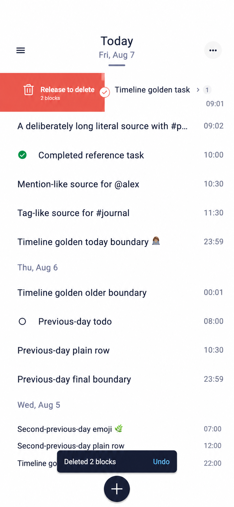

# Journal Swipe-to-Delete Subtree Implementation Plan

Goal: Add an end-to-start full-swipe action that visually removes one Block row, offers Undo, and durably deletes that Block and its complete descendant subtree only after the Undo window expires.

Architecture: Reuse the pinned `Ui.Native_widget.Swipe_action` with one square `Dismiss` end action and no start action.
OCaml owns the pending-delete state, optimistic timeline projection, Undo timer, Worker request, snackbar, and recovery behavior, while the repository builds one validated DataScript transaction that retracts the selected subtree.

Tech Stack: OCaml, Bonsai, Bonsai Flutter, DataScript, SQLite persistence, Flutter integration tests, and deterministic Bonsai time sources.

Related: Builds on `docs/agent-guide/006-journal-reference-alignment.md`, `docs/agent-guide/008-journal-row-disclosure-interaction.md`, and `docs/agent-guide/009-contextual-capture-bottom-sheet.md`.

## Problem statement

The Journal timeline currently supports task-state toggling and direct-child disclosure, but it has no delete command and no swipe action around Block rows.

The selected product direction is Option B from the swipe-action exploration.

In left-to-right layouts, dragging a Block row to the left exposes destructive feedback, crossing the commit threshold produces haptic feedback, releasing dismisses the row, and a bottom snackbar offers Undo.

The opposite direction has no action, no feedback surface, and no commit event.

The delete target is the selected Block and every recursive descendant, not only the direct children currently loaded into the timeline.

The implementation must protect durable journal data, preserve bounded timeline virtualization, avoid a new Flutter product tree, and remain usable through accessibility services that cannot perform a swipe gesture.

The current feed projection exposes only direct `child_count`.

It does not expose the total recursive descendant count, so the product must not display an exact subtree count before the Worker validates and traverses the subtree.

The selected copy therefore says `Release to delete` and `Includes descendants` during the gesture, and `Block and descendants removed` in the Undo snackbar.

The concept image remains an interaction reference only. Its illustrated direction is superseded by the end-to-start contract, and its `2 blocks` count is not production copy.



## Testing Plan

I will add repository behavior tests that delete a leaf, delete a depth-three subtree, preserve unrelated siblings and journal pages, update an immediate Block parent, reject a stale root revision, reject corrupt cyclic or cross-page structure, and treat an already-absent target as an idempotently achieved delete state.

I will add timeline-state behavior tests that stage and undo deletion for collapsed and expanded roots, remove only the projected rows owned by the selected root, repair child counts and day headings, preserve sparse-list index and extent invariants, and ignore stale paging responses fenced by the staged delete.

I will add application behavior tests that prove a swipe commit removes the row before any Worker delete request is sent, Undo restores the exact pre-swipe projection, the deadline sends one request, duplicate swipe and Undo events are suppressed, success finalizes removal, and rejection restores the row with an announced failure.

I will add semantic tests that prove `Delete block and all descendants` is available as a custom accessibility action, the opposite action is absent, the snackbar is a live region, and Undo is an enabled button with a minimum 48-point target.

I will extend the compiled-runtime Flutter flow to prove a horizontal gesture cancels the nested row and task taps, a vertical drag scrolls instead of deleting, an opposite-direction swipe stays closed, RTL mirrors the logical end action, reduced motion removes settling delays, and the snackbar remains clear of the centered Capture orb and SafeArea.

I will update the real-runtime golden only after all state, repository, Worker, semantic, and gesture tests pass.

NOTE: I will write *all* tests before I add any implementation behavior.

## Selected product behavior

### Gesture contract

| State | Behavior |
| --- | --- |
| Pointer down | The row remains visually unchanged until horizontal drag wins the gesture arena. |
| Sub-threshold end-to-start drag | The content follows the finger and exposes the destructive action surface. |
| Commit threshold | The existing native host emits one light haptic when displacement first crosses `28%` of row width, clamped to `72–112` logical pixels. |
| Release below threshold | The row returns to its origin over the existing 200 ms cancel animation and emits no action. |
| Release beyond threshold | The row completes the existing 220 ms dismiss animation and then emits one `End_to_start` commit. |
| Fast intentional fling | An end-to-start fling at or above the existing `800 px/s` threshold commits even when distance is shorter than the normal threshold. |
| Opposite direction | No action is configured, so the row remains at zero offset, exposes no feedback, and emits no event. |
| Vertical drag | The list scroll wins and the row does not move horizontally or activate nested targets. |
| Reduced motion | Tracking remains direct, while cancel or dismiss settlement and sparse extent collapse become immediate. |

The gesture is logical `End_to_start` rather than permanently physical-left.

It is a leftward swipe in LTR and mirrors to a rightward swipe in RTL.

This preserves the directionality behavior already implemented and tested by the pinned native widget.

### Action feedback

The action uses the public action-radius API with `border_radius = 0`, a destructive coral background, and a white trash icon.

The action child may include the compact `Release to delete` and `Includes descendants` copy only if it remains readable inside the existing 144-point maximum feedback width at supported text scales.

If that copy cannot fit at a given profile or text scale, the visual falls back to the trash icon while the complete label remains available through semantics.

No change to `bonsai_flutter` is permitted for this feature.

The implementation must consume the current public `Swipe_action` API rather than patching its Dart host, OCaml protocol, registry, or tests.

### Undo and durable commit

The row disappears immediately after the native dismiss animation, but the database transaction is deliberately delayed until the Undo window expires.

The normal Undo window is five seconds.

The window is ten seconds when `accessible_navigation` is enabled.

Undo before the deadline restores the immutable pre-delete timeline snapshot and cancels the pending command without touching storage.

If the application process exits before the deadline, no delete request was accepted and the Block remains durable.

When the deadline expires, the snackbar disappears, the pending delete becomes `Committing`, and the application sends exactly one Worker request.

Once committing begins, Undo is no longer available.

A successful Worker response keeps the staged projection and updates any visible immediate Block parent returned by the Worker.

A known rejection restores the pre-delete projection and announces `Delete failed. Block restored.`.

An unknown storage outcome enters the existing recovery-only path and does not claim either success or restoration until canonical storage is loaded after restart.

### Snackbar contract

| Property | Decision |
| --- | --- |
| Message | `Block and descendants removed` |
| Action | `Undo` |
| Normal duration | 5 seconds |
| Accessible-navigation duration | 10 seconds |
| Position | Bottom center, above the Capture target, SafeArea, and existing bottom inset. |
| Width | Content width minus compact horizontal margins, capped by the timeline maximum width. |
| Surface | Dark navy with high-contrast light text and a blue Undo action. |
| Semantics | One polite live-region announcement plus a separately focusable Undo button. |
| Replacement policy | A second delete is rejected while one Undoable or Committing delete exists. |

Only one delete may be pending at a time.

This matches the application's existing one-at-a-time timeline mutation admission and avoids ambiguous stacked Undo actions.

Task toggles, disclosure toggles, Capture admission, and another swipe delete are disabled while a delete is Undoable or Committing.

Every other row is rendered without a swipe wrapper during that period so no ignored commit can leave a native host permanently dismissed offscreen.

Vertical scrolling and reading remain available during the Undo window.

### Accessibility contract

Apple documents swipe as a standard gesture for revealing actions and dismissing content, but also recommends providing more than one way to perform an action and giving immediate feedback that predicts the result.

Android similarly says not to rely on gestures for complete user flows and recommends at least 48 dp touch targets.

The existing native widget already exposes its action label as a custom semantics action and routes semantic activation through the same commit state machine.

The end action label is exactly `Delete block and all descendants`.

No start action is present in the semantics tree.

The trash icon is excluded from semantics to prevent a duplicate label.

The Undo button uses a 48-point minimum target and label `Undo block deletion`.

The snackbar message is a live region but is not itself focusable.

The delete custom action remains available on leaf rows whose static row body has no Tap action.

### Primary research references

| Source | Relevant guidance | Design consequence |
| --- | --- | --- |
| [Apple Human Interface Guidelines: Gestures](https://developer.apple.com/design/human-interface-guidelines/gestures/) | Swipe commonly reveals actions or dismisses content, gesture feedback should predict the result, and gesture-only flows need alternatives. | Use direct row tracking, threshold feedback, and a custom accessibility action. |
| [Android Accessibility](https://developer.android.com/design/ui/mobile/guides/foundations/accessibility) | Do not rely on gestures for all actions and keep touch targets at least 48 dp. | Expose semantic Delete and keep Undo at least 48 points. |
| [Android Snackbar](https://developer.android.com/develop/ui/compose/components/snackbar) | A snackbar can confirm deletion without interrupting the current task and offer Undo. | Use a transient bottom snackbar instead of a confirmation sheet. |
| [Flutter Dismissible](https://api.flutter.dev/flutter/widgets/Dismissible-class.html) | Stable keys, directional thresholds, confirmation, and removal from list state are core dismissal concerns. | Keep stable Block IDs and remove the timeline slot only after the native host emits its commit. |

## Current implementation findings

### Supported without framework changes

`Ui.Native_widget.Swipe_action` already supports one optional action per logical direction, `Dismiss` and `Rebound` dispositions, stable keys, custom semantics actions, reduced motion, RTL, threshold haptics, fling commits, drag reversal, and gesture-arena arbitration with vertical scrolling and nested taps.

The Flutter host emits the commit only after the local dismiss animation finishes.

The existing package tests already prove sub-threshold cancellation, one haptic per gesture, vertical-scroll precedence, nested-tap cancellation, disabled-direction behavior, semantic activation, rebuild stability, disposal safety, RTL mirroring, and reduced motion.

The Journal app can therefore wrap each rendered Block row with the existing primitive and configure only `start_action`.

### Missing application behavior

| Area | Current state | Required addition |
| --- | --- | --- |
| Repository | Capture, child creation, source update, task update, and bounded reads only. | Validated recursive subtree enumeration and atomic `RetractEntity` transaction. |
| Worker | No delete request or response. | `Delete_subtree` request, conflict/result payloads, persistence, and response-budget accounting. |
| Timeline state | Can prepend, replace, expand, and collapse rows. | Stage removal, exact snapshot restore, parent-count adjustment, orphan-heading cleanup, and request fencing. |
| Application state | Tracks one pending task mutation string. | Typed Undoable/Committing delete state, deadline, snackbar, and failure notice. |
| Row rendering | Renders the row directly. | Stable swipe wrapper around the complete row including its independent task target. |
| Snackbar | No dedicated primitive or product state. | OCaml-owned bottom overlay built from current layout, Material button, semantics, and token primitives. |
| Tests | No deletion behavior. | Repository, Worker, state, semantics, compiled-runtime gesture, timer, and golden coverage. |

### Constraints

No OCaml file under `spec/` may change.

No Dune file may change.

No OCaml or Dart file in the `bonsai_flutter` repository may change for this feature.

No application-owned Dart product widget may be added.

No compatibility action namespace, legacy direction fallback, migration, soft-delete schema, or alternate delete path may be added.

The work must fit inside existing application modules so that the Dune graph remains unchanged.

## Architecture

```text
Pointer / accessibility action
             |
             v
Pinned Swipe_action native host
  - logical End_to_start only
  - square action feedback
  - threshold, haptic, dismiss
             |
             v
OCaml native-event dispatch
             |
             v
Stage delete in Journal_timeline_state
  - save immutable pre-delete snapshot
  - remove root plus projected children
  - fence pending timeline request
             |
             +----------------------+
             |                      |
             v                      v
       Undo before deadline     Deadline expires
             |                      |
             v                      v
      Restore snapshot         Worker.Delete_subtree
                                    |
                                    v
                         Repository preflight DFS
                         - validate root revision
                         - validate page and acyclic tree
                         - collect all descendants
                                    |
                                    v
                         One durable DataScript transaction
                         - update immediate Block parent
                         - RetractEntity deepest-first
                                    |
                         +----------+-----------+
                         |                      |
                         v                      v
                      Success               Rejection
                         |                      |
                         v                      v
                 Finalize removal       Restore snapshot and
                                        announce failure
```

The Undo window is an application-level admission delay, not a durable inverse mutation.

This avoids retaining arbitrarily large subtree content across the Worker boundary and avoids adding a restore protocol or schema-level trash state.

## Domain and repository contract

Add a validated replacement helper to `app/journal_model.mli` and `app/journal_model.ml`.

```ocaml
val with_child_count : t -> child_count:int -> (t, string) result
```

The helper preserves every other Block field and rejects a negative count through the same invariant used by `create`.

It exists only to make a visible immediate parent's optimistic count truthful while its child delete is Undoable.

Add the following public command and plan shapes to `app/journal_repository.mli` and matching definitions to `app/journal_repository.ml`.

```ocaml
type delete_subtree =
  { mutation_id : string
  ; block_id : string
  ; expected_revision : int
  }

type delete_subtree_plan =
  | Delete_already_applied
  | Delete_conflict of block
  | Delete_subtree of
      { transaction : Datascript.tx_op list
      ; deleted_count : int
      ; parent_block_id : string option
      }

val prepare_delete_subtree
  :  Datascript.db
  -> delete_subtree
  -> (delete_subtree_plan, Error.t) result
```

`prepare_delete_subtree` validates the mutation ID, Block ID, and positive expected revision before reading structure.

An absent root returns `Delete_already_applied` because the requested target state is already true.

A present root with a different revision returns `Delete_conflict root` and produces no transaction.

The repository resolves the root entity by `journal.block/id`, then performs an iterative depth-first traversal through the indexed `journal.block/parent` attribute.

The traversal records visited entity IDs, rejects a repeated entity as a cycle, verifies every descendant has the same `journal.block/page` as the root, and rejects any entity that cannot be projected as a valid Block.

The transaction retracts descendants deepest-first and retracts the selected root last.

If the root's immediate parent is another Block, the same transaction compares and increments that parent's current revision and writes the delete mutation ID as its last mutation ID.

If the root is top-level and its immediate parent is a journal page, no page mutation is added.

The transaction never deletes the journal page, even when the selected root is the day's last Block.

The returned `deleted_count` is diagnostic truth produced by the complete traversal, but it is not required for the pre-delete UI copy.

## Worker contract

Add the following request and payload cases to `app/journal_worker.mli` and `app/journal_worker.ml`.

```ocaml
type request =
  (* existing cases *)
  | Delete_subtree of Journal_repository.delete_subtree

type payload =
  (* existing cases *)
  | Subtree_deleted of
      { block_id : string
      ; deleted_count : int
      ; parent : Journal_repository.block option
      }
  | Delete_conflict of Journal_repository.block
```

The Worker rejects delete in `Recovery_only`, when mutation locking is active, or when storage is unavailable.

`Delete_already_applied` returns `Subtree_deleted` with `deleted_count = 0` and no parent.

`Delete_conflict` returns the latest root without writing.

For `Delete_subtree`, the Worker calls `Journal_storage.transact` exactly once.

After success, the Worker confirms that the selected root is absent and reloads the immediate Block parent when `parent_block_id` is present.

An unexpected surviving root or an unreadable updated parent is treated as storage unavailable because the committed projection cannot be proven.

The response-size estimator counts only fixed metadata and the optional parent Block, so subtree size cannot exceed the 256 KiB Worker response budget.

## Timeline state contract

Add staging behavior to `app/journal_timeline_state.mli` and `app/journal_timeline_state.ml` without creating a new module.

```ocaml
type staged_delete =
  { block : Journal_model.t
  ; before : t
  }

val stage_delete : t -> block_id:string -> (t * staged_delete) option
val undo_delete : staged_delete -> t
```

`stage_delete` operates only on a retained `Block` slot and returns `None` for a missing or forged ID.

For a depth-zero root, it removes the root, every immediately following loaded depth-one Block, and that root's `Children_continuation`.

For a depth-one root, it removes only that projected row because deeper descendants are not projected by the current timeline architecture.

For a depth-one root, it also decrements the retained immediate parent's `child_count` by one through `Journal_model.with_child_count`.

The immutable `before` snapshot is retained only while the delete is Undoable or Committing.

Staging clears the current pending timeline query and advances application request generation so any response admitted before the swipe is ignored.

The operation updates `total_count`, `special_extents`, `expanded_ids`, visible bounds, focus restoration, and anchor policy in the same pure transition.

If removal leaves a non-today day heading with no depth-zero Block and no day continuation before the next day boundary, the heading is removed too.

`Bottom_clearance`, feed continuation, unrelated day continuation, sibling rows, and unrelated expanded parents remain intact.

Undo returns the exact `before` projection with its pending request cleared, then lets normal visible-range observation request any data still needed.

## Application state and timing contract

Extend the private state in `app/application.ml` with typed delete and notice state.

No public change to `app/application.mli` is required.

```ocaml
type delete_phase =
  | Undoable
  | Committing

type pending_delete =
  { mutation_id : string
  ; block_id : string
  ; expected_revision : int
  ; staged : Journal_timeline_state.staged_delete
  ; deadline : Core.Time_ns.t
  ; phase : delete_phase
  }

type timeline_notice =
  | Delete_undo
  | Delete_failed
```

Add a private `write_enabled` field derived from Worker readiness and `response.access_mode` so recovery-only timelines expose no destructive wrapper or semantic action.

The component reads deterministic Bonsai logical time and derives a deadline transition with `Bonsai.Clock.at`.

`Journal_timeline` decodes the native payload inside the row-specific wrapper, accepts only `End_to_start`, captures the stable Block ID, and invokes the application handler with `timeline-delete:<block-id>`.

The global application native-event branch remains dedicated to sparse-list visible-range events and never attempts to infer a Block ID from an unscoped native payload.

Only a `timeline-delete:<block-id>` action for a retained Block, a writable Worker, and an empty pending mutation slot may stage deletion.

The staged mutation gets a fresh mutation ID, the selected root revision, the immutable timeline backup, and a deadline derived from the current logical time.

The deadline edge sends one `Journal_worker.Delete_subtree` request and changes the phase to `Committing` in the same effect batch.

Undo is accepted only in `Undoable` and clears both pending delete and snackbar state.

Worker success clears pending delete, preserves the staged timeline, replaces an optional retained immediate parent, and resumes visible-range paging.

Worker conflict restores the staged snapshot, replaces the root with the latest Block when possible, and announces failure.

Known rejection restores the snapshot and announces failure.

Recovery-only or storage-unavailable behavior follows the existing terminal mutation path and removes the Undo affordance.

## Rendering contract

### Row wrapper

Update `app/journal_timeline.mli` and `app/journal_timeline.ml` to accept `delete_enabled` and an `on_delete` handler, and wrap every enabled `Timeline.Block` row after its depth padding and before its fixed extent/focus scope.

The wrapper key is the stable Block ID.

```ocaml
let delete_action ~tokens block =
  Ui.Native_widget.Swipe_action.action
    ~label:"Delete block and all descendants"
    ~background:(Journal_visual_tokens.palette tokens).destructive
    ~border_radius:0.
    ~disposition:Ui.Native_widget.Swipe_action.Dismiss
    ~icon:(delete_feedback ~tokens block)
    ()

Ui.Native_widget.Swipe_action.create_with_handler
  ~key:(Ui.Key.string ("journal-row-swipe:" ^ id))
  ~end_action:(delete_action ~tokens block)
  ~content:row
  ~on_commit:(for_swipe on_delete id)
  ()
```

`for_swipe` decodes the native payload with `Ui.Native_widget.Swipe_action.direction_of_payload` and invokes `on_delete` with `Text id` only for `End_to_start`.

Do not pass `start_action`.

When `delete_enabled` is false, render the unwrapped row rather than constructing a `Swipe_action` with no actions.

The complete row, including the independent task target and row-body disclosure target, remains inside the swipe content so a horizontal win cancels both nested taps.

### Snackbar overlay

Update `app/application.ml` and `app/journal_visual_tokens.ml` with a compact snackbar assembled from existing OCaml widgets.

The snackbar is another `Ui.Widget.Body.overlay` child in the existing timeline body, not a route, dialog, or Flutter-owned widget.

Its bottom position is the safe bottom inset plus the Capture target height, Capture bottom inset, and one spacing token.

It must not consume the timeline's full-screen hit test area outside its own bounds.

The Undo button uses the existing `action_target` feedback path and is disabled after the deadline.

Add palette tokens for destructive feedback, snackbar surface, snackbar primary text, and snackbar action text.

Add geometry tokens for snackbar margin, maximum width, minimum height, corner radius, and vertical gap above Capture.

Normal, dark, high-contrast, and disabled states must use explicit tokens rather than local color literals.

## Scope

### In scope

- Full end-to-start swipe on every retained Block row.
- Recursive deletion of the selected Block and all descendants.
- Optimistic row removal with a delayed durable commit.
- One Undoable delete at a time.
- Snackbar layout, timing, semantics, SafeArea, and failure feedback.
- Stable timeline projection updates for collapsed roots, expanded roots, and visible children.
- Repository, Worker, application, semantic, integration, and golden tests.
- LTR, RTL, reduced motion, accessible navigation, high contrast, text scaling, and vertical-scroll arbitration.

### Out of scope

- Soft delete, trash, recycle bin, restore after the Undo deadline, or deletion history.
- Multiple stacked Undo snackbars or a delete queue.
- Selection mode, bulk delete, keyboard shortcuts, context menus, or More-menu delete.
- Exact descendant counts before Worker traversal.
- Swipe actions in Detail, Capture, headers, continuation rows, or the Center Orb.
- A new DataScript schema attribute, schema version, migration, or compatibility path.
- Any Dune, `spec/`, application-owned Dart, or `bonsai_flutter` change.

## TDD implementation tasks

All implementation must follow `@test-driven-development` with the complete RED suite written and observed before any production edit.

### Task 1: Specify repository subtree deletion behavior

Files:

- Modify `test/journal_repository_test.ml`.
- Later modify `app/journal_repository.mli` and `app/journal_repository.ml` during GREEN.

Steps:

1. Add a test that constructs a top-level root, two direct children, one grandchild, and unrelated siblings across two days.
2. Add a test that applies the prepared transaction and proves only the selected four-Block subtree disappears.
3. Add a test that deletes a direct child and proves the immediate parent revision, mutation ID, and derived child count update atomically.
4. Add stale-revision, missing-root, cross-page descendant, repeated-entity, invalid-identity, and oversized-source-neighbor cases.
5. Run `opam exec -- dune exec test/journal_repository_test.exe` and verify the new tests fail because `prepare_delete_subtree` does not exist.
6. Add the minimal repository types, traversal, validation, and transaction builder.
7. Run the focused executable again and verify every repository behavior passes.
8. Refactor traversal helpers only after GREEN, then rerun the focused executable.

### Task 2: Specify Worker durability and payload behavior

Files:

- Modify `test/journal_worker_test.ml`.
- Later modify `app/journal_worker.mli` and `app/journal_worker.ml` during GREEN.

Steps:

1. Add a serial Worker test that deletes a subtree, reloads the feed and Detail projections, and proves the subtree is durably absent.
2. Add tests for read-only rejection, stale revision conflict, already-absent idempotence, updated immediate parent, storage failure, and response-size budgeting.
3. Assert that a failed repository preflight performs no storage transaction.
4. Run `opam exec -- dune exec test/journal_worker_test.exe` and verify failures are caused by the missing Worker cases.
5. Add the minimal request, payload, byte estimate, handler, persistence, and post-transaction proof.
6. Run the focused Worker test and verify all new behavior passes.
7. Run `opam exec -- dune exec test/journal_storage_test.exe` to prove storage quarantine behavior remains unchanged.
8. Refactor shared mutation admission only if duplication is introduced, then rerun both focused executables.

### Task 3: Specify optimistic timeline removal and exact Undo

Files:

- Modify `test/journal_model_test.ml`.
- Modify `test/journal_timeline_state_test.ml`.
- Later modify `app/journal_model.mli` and `app/journal_model.ml` during GREEN.
- Later modify `app/journal_timeline_state.mli` and `app/journal_timeline_state.ml` during GREEN.

Steps:

1. Add model tests that decrement a positive `child_count` and reject a negative replacement.
2. Add tests for staging a collapsed top-level root and an expanded root with loaded children and continuation.
3. Add a test for staging a visible depth-one child and decrementing its retained parent count.
4. Add tests for missing IDs, last row of today, last row under a dated heading, retained feed continuation, sparse extents, visible bounds, and stale response fencing.
5. Add an exact round-trip property that `undo_delete staged` returns the same retained slot keys, count, extents, expansion state, and anchor as the normalized pre-delete state.
6. Run `opam exec -- dune exec test/journal_model_test.exe` and `opam exec -- dune exec test/journal_timeline_state_test.exe`, then verify failures are caused by missing replacement and staging behavior.
7. Add the minimal validated model replacement plus pure stage and undo transitions.
8. Run both focused tests and verify all cases pass.
9. Refactor index and special-extent helpers only after GREEN, then rerun both focused tests.

### Task 4: Specify row wiring and semantics

Files:

- Modify `test/journal_semantics_test.ml`.
- Modify `test/application_view_test.ml`.
- Later modify `app/journal_timeline.mli`, `app/journal_timeline.ml`, `app/journal_visual_tokens.mli`, and `app/journal_visual_tokens.ml` during GREEN.

Steps:

1. Assert every delete-enabled Block row has one stable swipe native widget around the complete row.
2. Assert only the end action is enabled, its border radius is zero, and its label is `Delete block and all descendants`.
3. Assert the start action child is empty and there is no start semantics action.
4. Assert task and disclosure controls remain nested, independently labeled, and unchanged when tapped without a drag.
5. Assert no swipe wrapper or delete semantics exists while writes are unavailable or another delete is pending.
6. Assert destructive and snackbar tokens resolve in normal, dark, and high-contrast environments.
7. Run the focused semantic and view tests and verify they fail because no swipe wrapper exists.
8. Add the minimal row-scoped payload decoder, handler surface, action feedback widget, conditional wrapper, and tokens.
9. Rerun both focused tests and verify they pass before refactoring.

### Task 5: Specify application timing, Undo, and failure recovery

Files:

- Modify `test/application_view_test.ml`.
- Later modify `app/application.ml` during GREEN.

Steps:

1. Extend the deterministic test handle to advance its existing `Bonsai.Time_source` without wall-clock sleeps.
2. Add a test that invokes the valid swipe native event, observes immediate row removal and snackbar presentation, and proves zero delete Worker requests before five seconds.
3. Add a test that presses Undo at 4.9 seconds, restores the exact projection, clears the snackbar, and never sends delete.
4. Add a test that advances through the deadline and observes exactly one `Delete_subtree` request and no remaining Undo action.
5. Add tests for accessible-navigation duration, duplicate swipe, duplicate timeout edge, stale native payload, conditional wrapper removal, task/disclosure suppression, success, conflict, known pre-transaction rejection, and recovery-only outcome after a storage error.
6. Run `opam exec -- dune exec test/application_view_test.exe` and verify the failures are behavioral rather than fixture errors.
7. Add the minimal typed pending-delete state, `Bonsai.Clock.at` edge, dispatch branches, snackbar overlay, and Worker response handling.
8. Rerun the focused application test and verify all behavior passes.
9. Refactor repeated mutation gating only after GREEN and rerun the test.

### Task 6: Specify compiled-runtime gestures and visual geometry

Files:

- Modify `flutter/integration_test/journal_runtime_flow_test.dart`.
- Modify `flutter/test/journal_runtime_golden_test.dart`.
- Add `flutter/test/goldens/journal-swipe-delete-threshold.png` only after behavior is GREEN.

Steps:

1. Add a real-runtime test that drags a representative row end-to-start beyond threshold and observes one delete event after native settlement.
2. Add tests that an opposite-direction drag stays closed, a vertical drag scrolls, and a horizontal drag beginning on the task target does not toggle the task.
3. Add RTL and reduced-motion cases using the existing environment bridge.
4. Add snackbar geometry assertions for SafeArea, Capture-orb clearance, 48-point Undo target, and maximum content width.
5. Run the existing compiled-runtime integration command and verify the new assertions fail because application wiring is absent.
6. Complete any minimal OCaml integration fixes required by the failing behavior.
7. Rerun the integration flow and verify it passes.
8. Capture the threshold and snackbar golden only after all non-golden tests are GREEN.
9. Review the golden at `390 x 844`, high text scale, RTL, dark, and high-contrast profiles.

### Task 7: Remove obsolete assumptions and run full gates

Files:

- Modify existing tests only where they assert rows have no swipe action.
- Do not modify any Dune or `spec/` file.

Steps:

1. Search for obsolete negative swipe expectations with `rg -n 'swipe|delete|Dismiss|Rebound' app test flutter docs/agent-guide`.
2. Remove only expectations superseded by this selected design.
3. Run all verification commands in the documented order.
4. Run `git diff --check` and inspect the exact changed-file list.
5. Confirm no compatibility path, unused action namespace, local Dart product widget, Dune edit, `spec/` edit, or `bonsai_flutter` edit exists.

## Edge cases and required outcomes

| Edge case | Required outcome |
| --- | --- |
| Leaf Block | The row dismisses, Undo restores it, and durable commit retracts one entity. |
| Parent with unloaded descendants | The UI uses nonnumeric descendant copy, and the Worker traverses and deletes the complete subtree. |
| Expanded parent | The root, loaded direct children, and child continuation disappear from the projection as one staged action. |
| Visible child row | The child subtree is deleted and the retained immediate parent count decrements by one. |
| Last Block under a dated heading | The orphan heading is removed locally, but the durable journal page remains. |
| Last visible Block overall | Empty-state and bottom-clearance behavior remain truthful after durable success. |
| Opposite-direction swipe | The row does not move, show feedback, or expose an accessibility action for that direction. |
| Vertical scroll started on a row | The list scrolls and neither delete nor nested Tap fires. |
| Horizontal swipe started on task target | Delete wins and task state does not change. |
| Release below threshold | The row rebounds and no pending delete is created. |
| Fast short fling | The existing native velocity threshold commits once. |
| Undo at deadline boundary | OCaml serialization chooses one event; either Undo wins before `Committing` or the deadline wins and disables Undo, never both. |
| Second swipe during Undo window | It is ignored and does not replace the first snackbar or snapshot. |
| Pending paging response arrives | Request generation fencing ignores it until normal paging resumes. |
| Root revision changed before commit | Worker returns conflict, the row is restored, and the failure is announced. |
| Descendant created before Worker handles delete | Serial Worker ordering includes it in the traversed subtree. |
| Child creation after delete commit | The missing parent causes the existing create-child rejection. |
| Repository finds a cycle | The delete is rejected before storage and no entity is retracted. |
| Repository finds a cross-page descendant | The delete is rejected before storage and no entity is retracted. |
| Worker rejects before storage transaction | The snapshot is restored and the failure is announced. |
| Storage outcome is unknown | Recovery-only state is entered without claiming restoration or success. |
| Process exits during Undo window | No Worker request was sent, so durable data remains. |
| Process exits after durable success | Canonical storage reloads without the subtree. |
| Reduced motion | Tracking is direct and settlement, extent collapse, and snackbar transitions have zero duration. |
| Accessible navigation | Undo remains available for ten seconds and all actions are reachable without swiping. |
| High text scale | Feedback may reduce to icon-only, while semantics retain the complete destructive label. |
| RTL | Logical end-to-start mirrors physically, and the logical start direction remains disabled. |

## Acceptance criteria

1. An end-to-start swipe beyond the native threshold visually dismisses exactly one selected Block row and its currently projected child rows.
2. The opposite logical direction has no visual movement, action surface, semantic action, or event.
3. Vertical scrolling and nested task or disclosure taps remain mutually exclusive with horizontal delete.
4. The UI offers Undo for five seconds normally and ten seconds under accessible navigation.
5. Undo before the deadline restores the exact normalized pre-delete projection and sends no Worker mutation.
6. Deadline expiry sends exactly one delete mutation and disables Undo before the Worker request is admitted.
7. The durable transaction deletes the selected Block and every recursive descendant while preserving unrelated Blocks and journal pages.
8. Deleting a child updates its immediate Block parent's revision, mutation ID, and derived child count in the same transaction.
9. Stale root revision, cycle, cross-page structure, invalid identity, and storage failure never produce a partial subtree delete.
10. The custom accessibility action is `Delete block and all descendants`, and the snackbar exposes one live announcement plus a 48-point Undo button.
11. The snackbar clears the centered Capture orb, device SafeArea, compact margins, and timeline maximum width in all supported profiles.
12. Normal, dark, high-contrast, reduced-motion, text-scale, LTR, and RTL environments remain valid.
13. No Dune, `spec/`, application-owned Dart, compatibility, schema migration, or `bonsai_flutter` change exists.

## Verification commands

Run focused RED and GREEN executables during each task, then run the complete gates.

```sh
opam exec -- dune runtest
cd flutter && flutter analyze --no-pub
cd flutter && flutter test test/application_host_adapter_test.dart test/widget_test.dart test/journal_runtime_golden_test.dart
bonsai-flutter sync-project --check
bonsai-flutter sync-host --check
git diff --check
```

Run the repository's documented compiled-runtime integration suite for `flutter/integration_test/journal_runtime_flow_test.dart` after the unit and view suites pass.

Complete physical iPhone and release macOS checks for touch, trackpad, VoiceOver, keyboard focus on Undo, background and foreground transitions, SafeArea geometry, and reduced motion before release.

## Risks and mitigations

| Risk | Impact | Mitigation |
| --- | --- | --- |
| Exact descendant count is unknown during swipe | Misleading destructive scope copy. | Use `Includes descendants` and return the actual count only as Worker diagnostics. |
| Native dismiss completes before OCaml state removal | A blank row extent remains briefly. | Remove the timeline slot immediately when the post-settle commit event arrives and use the existing sparse extent collapse. |
| Undo restores stale paging state | Duplicate or lost retained slots. | Fence the pending request at staging, pause new timeline mutation admission, and restore a normalized immutable snapshot. |
| Durable Undo would require a large inverse payload | Worker budget or memory failure for large subtrees. | Delay the original transaction instead of implementing an inverse mutation. |
| Process exit before deadline loses delete intent | The row returns after restart. | Treat this as the intentional data-safe outcome and document that Undoable deletes are not durable. |
| Deletion races with child creation | A descendant could escape deletion. | Traverse and transact inside the serial Worker handler so operations have one total order. |
| Parent badge becomes stale after child deletion | Timeline hierarchy is misleading. | Update the immediate Block parent atomically and return its latest projection. |
| Second delete replaces the first Undo | User cannot predict which Block Undo restores. | Permit one pending delete and remove all other swipe wrappers until resolution. |
| Snackbar obscures Capture or content | Undo or Capture becomes unreachable. | Position it above the existing Capture target and test compact SafeArea geometry. |
| Gesture-only deletion is inaccessible | VoiceOver, Voice Access, or Switch Access cannot delete. | Use the native custom semantics action and the same commit state machine. |

## Testing Details

Repository tests apply real DataScript transactions and query the resulting database rather than asserting transaction-list shape.

Worker tests use the real serial service and canonical temporary SQLite store rather than mocking persistence.

Timeline tests compare observable slot keys, counts, extents, focus state, and request behavior rather than private record fields.

Application tests drive native events, deterministic logical time, semantic actions, and real Worker responses rather than calling private timer helpers directly.

Flutter tests exercise actual pointer competition, transforms, semantics, environment changes, SafeArea geometry, and compiled OCaml frames.

## Implementation Details

- Use the existing `Swipe_action` `Dismiss` end action, set `border_radius` to zero, and omit the start action.
- Interpret the selected gesture as logical end-to-start, which is leftward in LTR and mirrored in RTL.
- Delay durable deletion until the Undo deadline instead of implementing a restore transaction.
- Delete the complete recursive subtree with one validated DataScript transaction.
- Keep the Worker response bounded to deleted metadata and an optional immediate parent Block.
- Permit only one pending delete, remove other swipe wrappers, and block other mutations until it resolves.
- Store an immutable normalized timeline snapshot for exact Undo and known-failure restoration.
- Use nonnumeric pre-delete copy because recursive descendant count is unavailable in the feed.
- Build the snackbar entirely from existing OCaml widget and overlay primitives.
- Make no Dune, `spec/`, schema, compatibility, application-owned Dart, or `bonsai_flutter` changes.

## Question

There is no blocking implementation question.

This plan assumes that `children` means the complete recursive descendant subtree and that `left swipe` follows logical end-to-start directionality, which mirrors in RTL.

---
