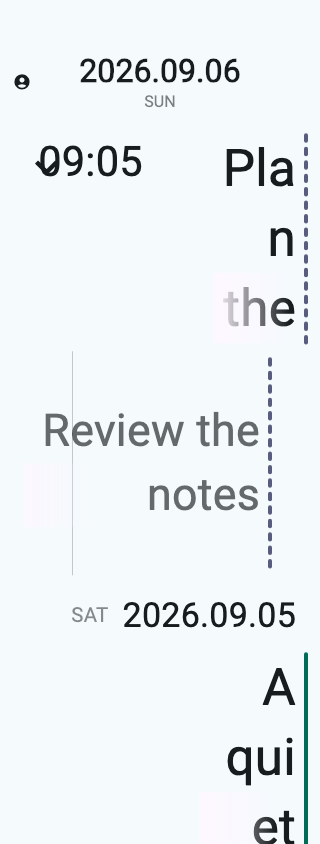

# Todo Complete Dash Segments

## Problem

The previous TODO status rail repeated a 6-logical-pixel dash and a 4-logical-pixel gap, shortening the final dash when the remaining height was insufficient.
This can produce an incomplete final segment.
The user requires at least two complete, equal-length dashes per rail, a maximum dash length of 10 logical pixels, fixed 4-logical-pixel gaps, and alignment with both ends of the content height.

This decision revises the geometry recorded in [Todo Dashed Status Rail](../../implemented/feature/2026-09-06-todo-dashed-status-rail.md).

## Proposal

Replace the remaining-height recursion in `app/journal_row.ml` with an evenly sized dash layout in the existing public `Journal_row.rail_body` function.
Top-level entries and expanded direct children already share this function, so both receive the same geometry.

For the computed rail height `H`, use:

```text
gap = 4
maximum_dash_length = 10
dash_count = max(2, ceil((H + gap) / (maximum_dash_length + gap)))
dash_length = (H - gap * (dash_count - 1)) / dash_count
```

Render exactly `dash_count` equal-length dashes, inserting a gap only between adjacent dashes.
Use the existing built-in layout and decorated-box primitives, retaining fractional logical-pixel dimensions rather than rounding individual segments.
Keep the existing rail width, corner radius, status colors, and outer height.
The first dash starts at the top and the last dash ends at the bottom.

The existing public interface remains sufficient.
Remove the obsolete shortened-tail algorithm without compatibility paths, fallbacks, or migrations.
Follow `docs/ux-guidelines.md`; do not modify dune files, OCaml files under `spec/`, or OCaml files in the bonsai_flutter repository.
On 2026-09-06, the user requested implementation of this decision.

## Decision

Implemented the formula in the shared `Journal_row.rail_body` function.
The renderer computes one dash length for the entire rail and emits exactly the required number of dashes, with gaps only between them.
Fractional dimensions are preserved; the shortened-tail algorithm has been removed.
No public interface, dune file, OCaml file under `spec/`, or bonsai_flutter OCaml source was changed.

### Implementation validation

- Added regression coverage only at the public presentation boundary in `test/journal_semantics_test.ml`.
  Before implementation, the test failed with `TODO height 22 has unequal dashes: 6 and 2`.
  It now checks exact examples at heights 22, 24, 24.001, 38, and 38.001, positive near-minimum heights, equality, fixed internal gaps, total height, width, color, and corner radius.
  Additional cases cover all three typography presets, scales 1, 1.3, 2, and 3.2, and one, two, three, and five visible lines.
- `opam exec -- dune exec test/journal_semantics_test.exe`: passed.
- `opam exec -- dune build @all` and `opam exec -- dune runtest`: passed.
- Changed OCaml files passed `ocamlformat --check`; `git diff --check` passed.
- Ran the existing `journal_header_layout_test.dart` date-and-rail previews through the installed `bonsai-flutter exec` from the `flutter/` directory: all 24 cases passed with no Flutter layout exceptions.
  The command also rebuilt and verified the native complete object.
- Inspected actual Flutter-rendered multiline parent and single-line child TODO rails in light and dark high-contrast themes, plus enlarged RTL parent and child rails at scale 3.2.
  Complete equal dashes remain within the rail bounds, with the expected leading-edge placement and no rail clipping or overflow.
- The decision document and all repository agent documents passed `spec-dev-tool check`.




## Alternatives considered

### Fixed-length dashes centered vertically

Fixed-length dashes with fixed gaps leave unused space at the rail ends.
The user selected alignment with both ends of the content height instead.

### Fixed-length dashes with variable gaps

Variable gaps can fill the available height, but the user selected a constant 4-logical-pixel gap.

### Shortened final dash

The current algorithm fills the available space by shortening only the final dash.
It does not meet the equal-length, complete-segment requirement.

## Acceptance criteria

- Every TODO rail contains at least two complete, equal-length dashes, each no longer than 10 logical pixels.
- Adjacent dashes have exactly 4 logical pixels of separation, with no leading or trailing gap.
- Dash lengths and internal gaps sum to the computed content height within floating-point tolerance.
- A height of 22 produces two 9-pixel dashes; a height of 24 produces two 10-pixel dashes; a height just above 24 produces three equal dashes below the maximum length.
- Single-line, multiline, and enlarged-text rails satisfy the same geometry for both top-level entries and expanded direct children.
- Existing colors, width, corner radius, LTR/RTL placement, and other status rendering remain correct.

### Validation approach

The production owner is `Journal_row.rail_body`, a presentation function whose height comes from visible line count and the active row profile.
There is no pure reducer event, completion, state, or effect that owns dash geometry; the existing public view function is the narrowest boundary that executes this behavior.
Exercise that public interface in `test/journal_semantics_test.ml` and inspect the generated geometry without copying the layout algorithm into the test.
Add focused assertions for the concrete examples above, segment-count thresholds, and representative multiline and text-scale heights before changing the renderer, and observe the intended failure first.
Do not duplicate these regressions in persistence, transport, integration, or E2E tests.

Run `opam exec -- dune exec test/journal_semantics_test.exe` after implementation.
Inspect actual rendered top-level and child TODO rails, including enlarged text, for clipping or overflow.
Validate the decision document with `spec-dev-tool check` and run `spec-dev-tool check --all` before completing repository work.

## Consequences

- Dash length decreases when the rail height crosses a threshold that requires an additional dash; this follows from the fixed gap and maximum length constraints.
- Fractional dimensions can produce antialiasing differences between device pixel ratios; independently rounding each dash would break the total-height constraint.
- Two positive-length dashes with a 4-pixel gap require a height greater than 4 pixels; current callers use at least one body line, comfortably above that limit.
- The number of widget nodes grows with visible content height, as in the existing segmented renderer.

## Questions

None outstanding for the current scope.
On 2026-09-06, the user confirmed at least two equal-length dashes per rail, a maximum dash length of 10 logical pixels, fixed 4-logical-pixel gaps, and alignment with both ends of the content height.
The user subsequently requested implementation on the same date.
