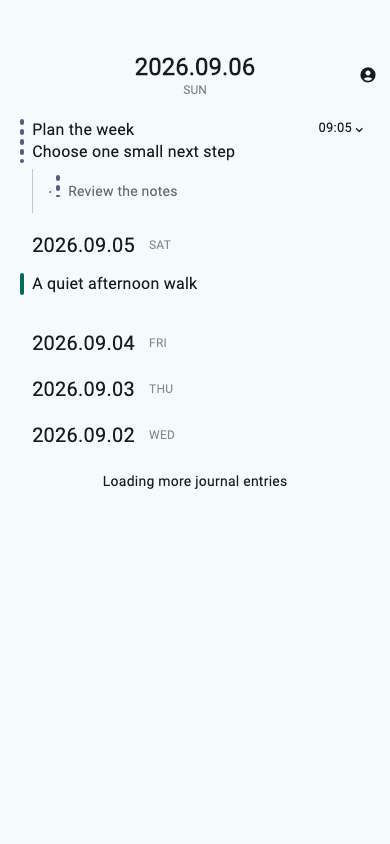
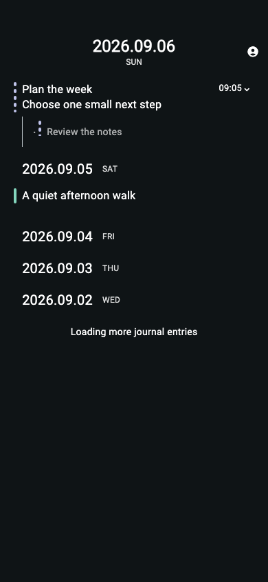
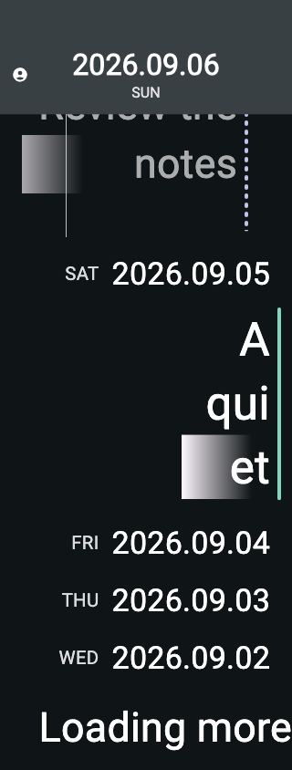

# Proposed Decisions Implementation Validation

## Scope

Implemented the proposed stale Timeline pagination recovery, date typography
hierarchy, and TODO dashed status rail decisions on 2026-09-06. The dashed-rail
decision entered proposed during this implementation and was included.

The user confirmed two implementation adjustments in this task:

- Complete bounded pagination recovery while accepting possible viewport drift.
  The installed public viewport API has no block-key/pixel-offset restoration
  operation; its native correction retains an index.
- Keep numeric dates on one line and limit date enlargement when width is
  insufficient. Body text scaling remains independent. Header geometry respects
  Material's native title-scale clamp and uses the effective date scale.

## Production ownership and regression placement

| Concern | Production owner | Verification boundary |
| --- | --- | --- |
| Pagination lifecycle, staged replacement, terminal failure, Retry, late completions | `Journal_timeline_state` | Public pure state transitions only |
| Empty-heading spacing at virtual and retained boundaries | `Journal_timeline_state` and the visual profile | Public pure geometry/state |
| Projection-bound cursor rejection | `Database.get_structure` and snapshot state | Existing public Database tests with real commits/cursors |
| Worker error serialization | Worker Error contract | Existing error-code serialization coverage |
| Worker-to-Application failure conversion | `Journal_graph_runtime.receive` | Narrow public runtime conversion test |
| Dates, styles, native header geometry, dashed rails | Calendar and production OCaml views, rendered by Flutter | Existing calendar/semantics coverage and rendered view fixtures |

The original pending-request defect was reproduced before implementation using
only the public Timeline interface: authoritative page replacement left the
obsolete pagination request pending. The intended assertion failed, then passed
after invalidation was implemented. Another pure reproduction found that a whole
feed refresh between recovery chunks revived obsolete staging; its assertion also
failed before the corresponding fix and passed afterward.

Added pure Timeline coverage exercises coherent multi-chunk publication,
non-stale terminal failures, one automatic rebuild, repeated staleness, explicit
Retry with fresh ownership, work exhaustion, block-listener invalidation, page
replacement, late completions, graph reset, and empty-heading context after
retention eviction. Existing continuation and expansion tests remain in place.

Worker Core does not own cursor validation or runtime error conversion: it emits
an external read and receives a completion. Injecting a precomputed error there
would not reproduce either defect. No duplicate scrolling regression was added
at effect-runner, persistence, transport, integration, or UI layers. Runtime
conversion coverage supplies valid worker failures to its public `receive` API
and checks only category/message and day/generation preservation. The Application
implementation was not copied or loaded through a private reducer interface.

The existing TODO visual assertion was changed to require segments and observed
failing on the old solid renderer before the shared rail implementation was added.

## Automated validation

- `opam exec -- dune build @all`: passed.
- `opam exec -- dune runtest`: passed, including existing overlay, worker, sync,
  application, calendar, semantics, and pure Timeline suites.
- Flutter tests through the installed `bonsai-flutter exec`: 80 passed, 7 existing
  opt-in runtime/golden cases skipped. The suite includes 32 Header combinations
  and 24 complete Timeline previews across typography presets, themes, contrast,
  narrow enlarged text, and RTL.
- Header checks verify both date parts, a single combined native announcement,
  stable account/error targets, native toolbar geometry, and the fixed 2dp sync
  region across phase changes. Timeline previews use the production native-widget
  registry, including the existing text-fade renderer.
- OCaml and Dart formatting and `git diff --check`: checked for the changed files.
- `flutter analyze --no-pub`: passed with no issues.
- `bonsai-flutter build macos --profile=debug`: passed; the Debug application
  bundle was built successfully.

An initial complete OCaml run hit an intermittent existing transport fixture race:
its Python readiness file was observed before the port contents were written.
The next complete run passed. No transport implementation or test was changed for
that unrelated transient failure.

## Real Database and Worker verification

A disposable public-interface probe reused the earlier investigation fixture. It
read a real continuation, committed an unrelated journal creation with its actual
missing-page precondition, and observed the next read rejecting that cursor.
The original-snapshot control and a fresh cursor-free read both succeeded.
The worker returned `staleReadCursor`; runtime preserved that category with the
request's day and generation. The Timeline owner scheduled a fresh read, then
published the two rebuilt rows and ended with no pending request or day error.

The temporary evidence is `/tmp/logseq-proposed-recovery-probe.log`; its final
lines include:

```text
Worker error: staleReadCursor | The read continuation is no longer current.
Runtime preserved staleReadCursor and day/generation ownership
Real recovery: rows=2 pending=false error=false
Worker fresh-query control: success
TIMELINE_RECOVERY_VERIFIED
```

This was manual implementation validation, not another permanent integration
regression for the pure Timeline lifecycle.

## Visual review

Inspected actual Flutter-rendered date and rail fixtures. The normal fixture
contains a multiline TODO parent, a TODO direct child, a solid DONE row, adjacent
empty days, and an active loading day. Current and historical dates remain on one
line; native semantic merging avoids repeating the parent label.







## Limits

Recovery is deliberately bounded to 16 reads using the existing 64-item request
size and at most 512 staged top-level entries. Continued changes or a journal
range exceeding those limits end in a local Retry state. Exact scroll-offset
restoration is excluded by the user's confirmed scope adjustment.

No dune file or bonsai_flutter OCaml source was changed. Overlay spec interface
changes stay within the explicit stale-cursor authorization. Existing unrelated
working-tree changes were preserved. No commit, push, or live-graph mutation was
performed for delivery; the real mutation probe used disposable fixtures.
