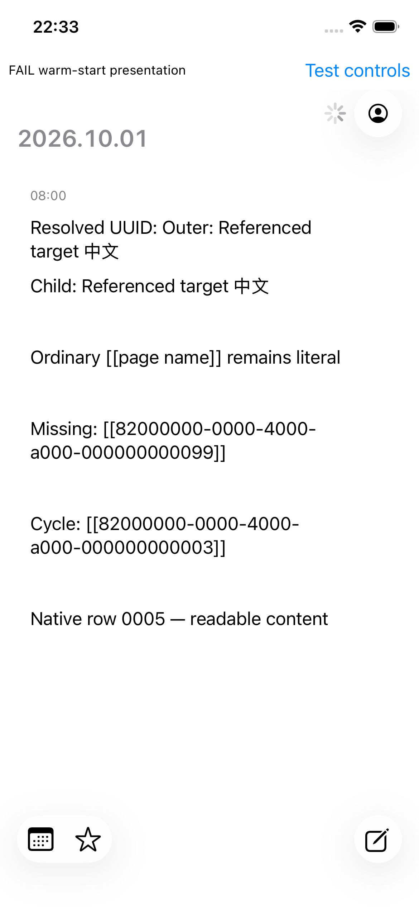
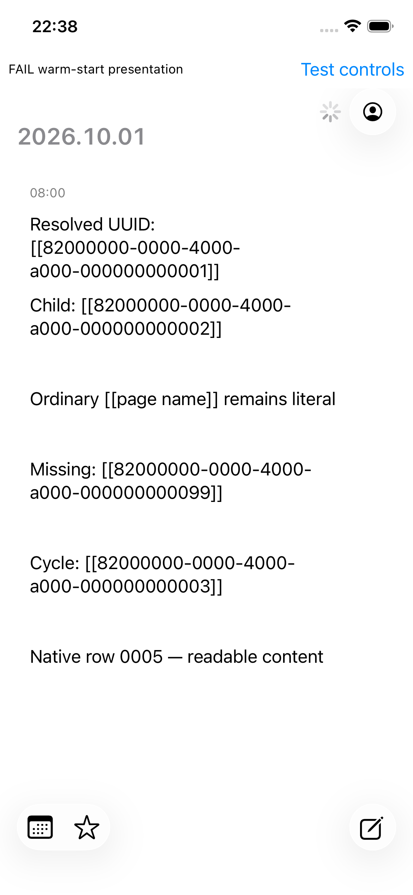

# UUID block reference verification

## Implementation and source

Local branch `codex/uuid-block-references-20261001`, based on freshly fetched GitHub main `badccfd1c68ee80cd40634f6d6d0161b31b0e879`. Main was fetched before each implementation round and checked again before handoff. The original checkout and its unrelated untracked documents are preserved. No push, PR, personal graph mutation, desktop Logseq interaction or physical-device installation occurred.

The existing canonical UUID validator distinguishes `[[uuid]]` tokens from page names. UUIDs are case normalized. Escaped tokens and malformed/page links remain literal. Persistence and editor source remain unchanged. OCaml/LUI timeline roots, child summaries, block favorites and detail labels use a shared resolver. It renders referenced block titles, including nested references and Unicode; missing, failed, cyclic and bounded expansions retain readable tokens. No Swift UI or dune/spec file was changed.

The graph runtime owns discovery, a shared source cache, in-flight deduplication and dirty-read recovery. References use existing `V2_get_block` reads and change-window/resync handling. Loaded targets reuse their existing changed-block reads. Reset and abandonment fence old work. A shorter reference path can discover targets previously outside the depth budget.

## Locality and limits

Rendering scans source bytes and follows only the referenced paths through an immutable map; it never scans the graph. Discovery examines incoming read fragments, not all items per row. The existing Worker path uses `Database.get_blocks`; its authoritative UUID and ident resolution use AVET `find_datom`, and snapshots reuse persistent queryable roots. Relevant code: `logseq_db_worker/lib/effect_runner/effect_runner.ml`, `logseq_overlay_db/lib/authoritative_store.ml`, and `logseq_overlay_db/lib/database.ml`.

- Background reference reads share the existing four-active-read hydration budget.
- Each rendered label allows 16 reference levels and 256 expansions. Expansions must fit a 65,536-byte output budget, preserving the original token and literal suffix otherwise; an already longer original source is preserved rather than truncated.
- A graph session retains at most 4,096 reference targets. The source cache retains up to 8,192 observed sources plus otherwise uncached retained targets. Interests are cleared on graph reset; this change does not introduce per-row subscription lifecycles.
- Full Markdown code-span, alias and embed semantics are outside this literal-text renderer. Block children and attachments are not transcluded by a UUID title reference.

## Test results

Tests were written before behavior changes and observed failing: nested rendering, absent point reads and unresolved mounted labels; additional RED checks caught failure during a dirty read, duplicate loaded-target reads, abandoned requests and deep targets later referenced directly.

| Check | Result |
| --- | --- |
| `dune exec test/journal_model_test.exe` | Pass; normalization, nested/Unicode/empty targets, ordinary/malformed/escaped links, missing/cyclic targets and output/work bounds |
| `dune exec test/journal_graph_runtime_locality_test.exe` | Pass: 48 cases, including seven reference-specific cases |
| `dune exec test/journal_semantics_test.exe` | Pass: 10 mounted-LUI cases, including resolved root/summary and long resolved-text expansion |
| `dune exec test/logseq_db_worker_application_integration_test.exe` | Pass: 14 existing cases |
| `dune build @all app/native_embed.exe.o` | Pass on final code |
| `dune runtest` | Not green: unchanged main source-boundary assertion requires literal `V.progress` in `journal_timeline.ml`, which already uses `V.loading`. No check was suppressed. Other executed tests passed. |
| `spec-dev-tool check --all` | Existing invalid `2026-09-28-bottom-lui-capsules.md` lacks required sections. This feature decision validates. |
| Changed OCaml formatting and `git diff --check` | Pass |

Full logs remain in the parent task directory: `green-runtime.log`, `green-model.log`, `green-ui.log`, `integration.log`, `final-native.log`, `runtest.log`, and `spec-check.log`.

## Actual simulator evidence

Device `F5FD2BE8-0FC1-47CE-AF8E-87A12FBB1E56` (dedicated iPhone 13, iOS 26.1). The Composer QA simulator was untouched. No mouse/keyboard or CUA actions were used.

The existing offline warm-start test host ran the production OCaml application against generated, disposable SQLite mirrors. The target blocks live on an ordinary page outside the journal feed, so nested titles require the real Worker point-read path. The feature screenshot shows the resolved nested title and child summary, while page names, missing targets and cycles remain literal. A clean main native object with the same unchanged host and fixture is the negative control: its UUID tokens remain raw.





These are actual `simctl` screenshots of generated test notes, not ImageGen pictures or user notes. The images intentionally retain the test host's `FAIL warm-start presentation` banner. The same banner occurs on clean main with the same host; observations record `timelinePresented=true` and `requestedBeforeTimeline=true`. This run verifies UUID rendering, not successful warm-start/authentication acceptance.

## Native build provenance

A fresh SwiftPM host build stalled in dependency manifest processing and was stopped only for this task. The working simulator binary was compiled from this checkout's unchanged native Swift host sources plus the existing warm-start test entry point, then linked against previously built dependency objects and the final production OCaml complete object. Exact commands, source hashes, object hash, binary hash and dependency count are in `native-build-record.json`. The dependency cache is the existing September 30 task's simulator build (LUI source `81af8e07f843bad6aa8301d4f2de3c4372fafc86`, datascript source `a5ddac4594d392aef0af1dd9778822beb51f1e28`). OCaml uses a copied local dependency prefix, leaving the global opam switch unchanged.

This follows the repository's host-object `vtool` simulator restamp path; it is not a fresh target-toolchain rebuild of every dependency or a real-device acceptance run. The reproducible manual fallback script is `/Users/rcmerci/Documents/Codex/2026-10-01/task-14/build_cached_sim.py`. Native artifacts remain in the parent task's `cached-simulator/` directory.

The ordinary fixture workflow now has `--references`, data-only bootstrap ordering, current Int64 datoms and preserved `Package.resolved`. Build the current native object, restamp it for the simulator and run:

```sh
python3 tool/test_swiftui_warm_start.py --references --rows 5 --children 1 \
  --platform ios-simulator --native-object <current-restamped-object>
```

Live target edits/deletion/recreation/resync and cancellation are tested through the public runtime boundary. They were not driven through simulator gestures or live cloud peers. Detail and Favorites share production resolver wiring but their UUID interactions were not separately exercised on the simulator. No personal-graph performance benchmark was run.
