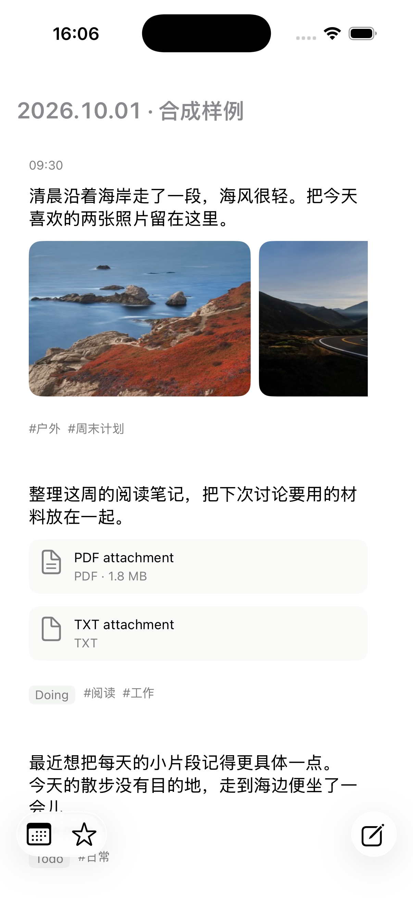
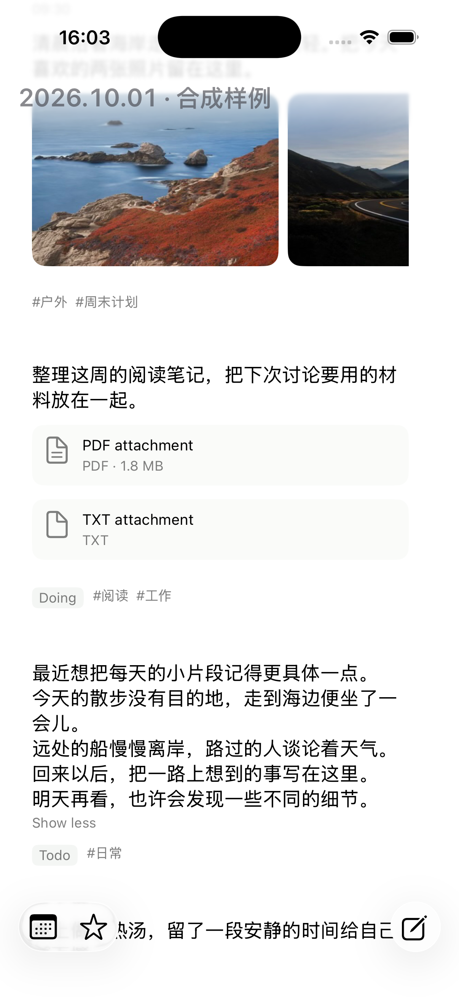

# Journal rich timeline rows

This change targets current main directly. It contains the text-first Journal row design and reliable asset-notice delivery; PR 35 loading-transition changes are excluded. UI implementation uses existing OCaml/LUI components. No Swift, dune, or spec/ OCaml file is changed.

## Result

Rows keep the existing date headers and native navigation and swipe actions, remove the disclosure arrow, and place body text above media and quiet task/tag metadata. Long text clamps to three lines with stable expand/collapse. Single images use a large native preview; galleries use horizontal scrolling with the next image visible. File cards show type icons and actual descriptor sizes when available. Missing metadata produces no extra footer. Native visible-range events release offscreen media demand without new geometry tracking.

Named tags are resolved from the same immutable Worker read snapshot as their block. Optional tagTitles preserves decoding of older responses. Missing tag pages are omitted. Asset descriptors do not guarantee an original filename; inline cards use descriptive type labels instead of presenting cache paths as original filenames. Native Quick Look may show its source cache basename; unsupported types use the system fallback.

## Synthetic screenshots

The screenshots below contain invented Chinese notes, illustrative metadata, and sample landscape photos. They are explicitly marked as synthetic and contain no user graph notes or screenshots.

The source is journal_design_fixture.ml. It uses the production row components with invented data, starts no graph Worker, and never edits notes. Supply sample assets through JOURNAL_DESIGN_ASSETS when running this separate simulator fixture. Its descriptor sizes are illustrative, independent of sample file lengths.

## Asset notice fix

Asset_transfer/Core already emitted Ready followed by demand acceptance. The Worker adapter stored both independent facts in a single latest-value topic; acceptance replaced Ready before the UI drained. Different assets and consumers could erase one another too.

The Worker now supports a pure optional merge callback under the existing mailbox lock. The asset policy retains latest facts separately by full graph scope, consumer/asset, demand admission, upload operation, and capacity. A balanced map gives O(log n) insertion; sorting at delivery restores retained-fact order. At most 4096 distinct facts remain pending. Overflow fails explicitly instead of silently dropping notifications. The newest event envelope retains Worker epoch, generation, and push-sequence fencing. Other snapshot topics keep latest-value replacement.

## Verification and limits

- Five mailbox loss/bound regressions failed before implementation; all eight service checks pass after the fix.
- Nine mounted UI checks cover body expansion, arrow removal, images, file metadata, unavailable-file retry, and native LUI events. Fourteen Worker/application cases include named tag propagation; protocol round trips cover new and legacy responses.
- Full workspace build passes. Tests and native simulator build are rerun on the main-based PR branch before publication.
- The combined-base simulator previously verified real graph file metadata and image rendering, full-image Quick Look, file fallback preview, and return to the timeline. Those private screenshots remain local and are excluded from Git and the PR.
- Full runtest has an existing source_boundary_test failure: unchanged journal_timeline.ml uses V.loading while that check requires literal V.progress. No check is disabled or suppressed.
- spec-dev-tool check --all has one existing invalid decision document, 2026-09-28-bottom-lui-capsules.md. This feature and fix decision validate.
- Horizontal gallery versus row-swipe gesture conflict still needs manual confirmation. Structural/native component checks and visible 1.5-image layout are verified; a computer drag did not establish a reliable movement result.

## Local verification

Use the project's normal opam/dependency environment and run dune build @all, dune exec logseq_db_worker/test/test_lui_service.exe, dune exec test/journal_semantics_test.exe, dune exec test/logseq_db_worker_application_integration_test.exe, dune exec logseq_db_worker/test/test_protocol.exe, and dune runtest. Use tool/build_journal_apple.sh with the existing external LUI checkout for a simulator build. No physical-device installation or merge is part of this PR.
